# 임베디드설계실험 개별 프로젝트

### 1. 주제 - 온도에 따른 쿨러 동작 여부 결정

​	온도 센서를 통해 받은 Analog 값을 ADC 변환을 통해 Digital 값으로 변환하고,
​	MCU에서 설정한 기준 온도값보다 높아지면 모터드라이브를 통해 DC모터를 구동시킨다. 

​	

#### 준비물

- MCU Board STM32F407VGT6 Board
  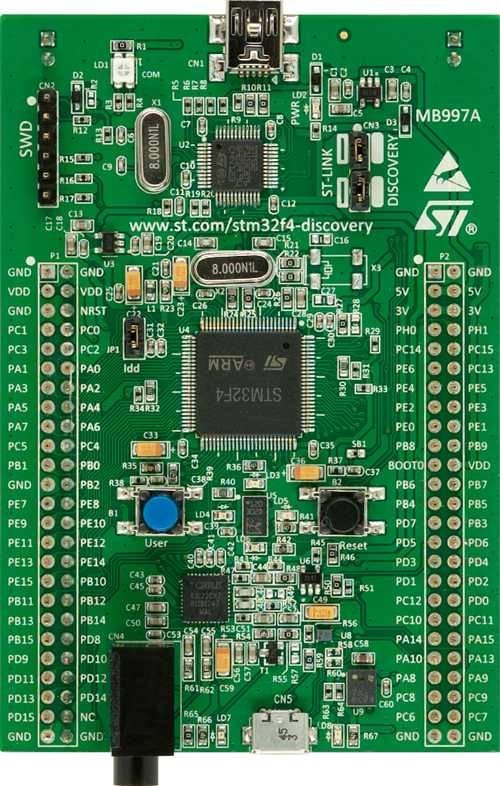

- 온도 센서 LM35DZ 
  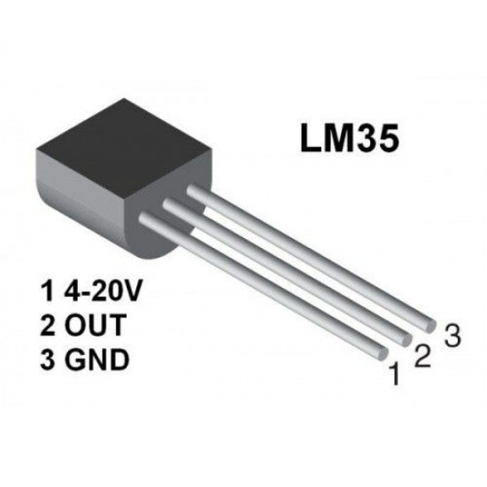

- 모터 드라이브 L298N
  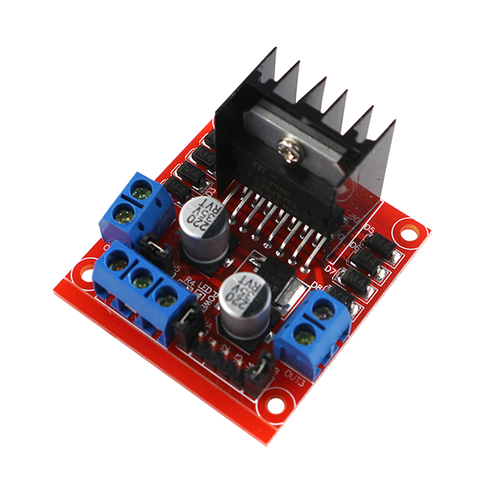

- DC모터 MB2430-0510F
  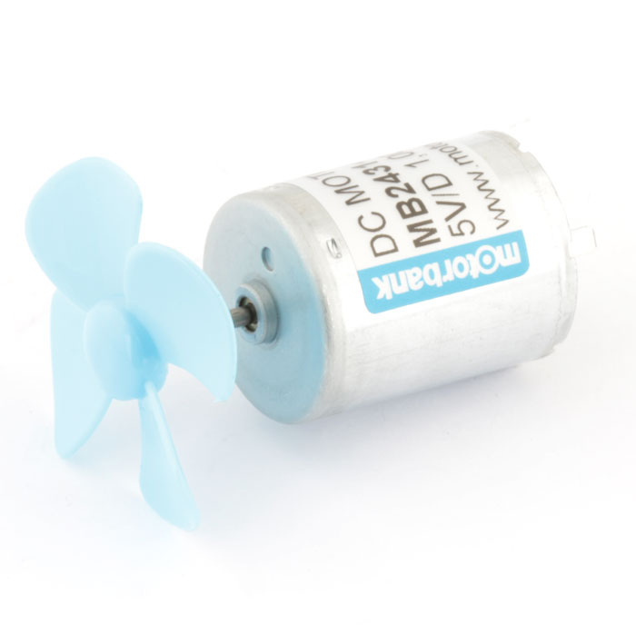

- 배터리 홀더 Snap.E-3
  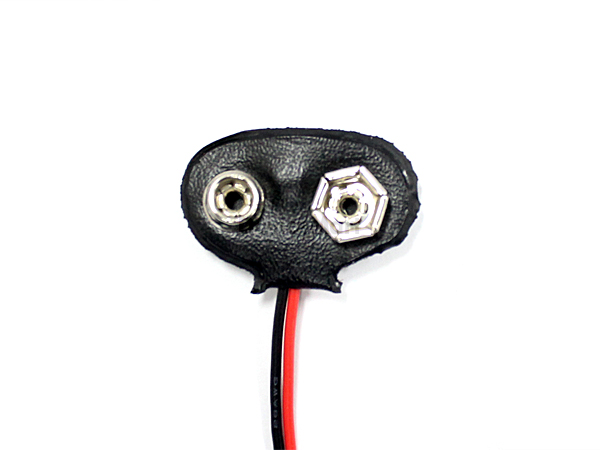

- 배터리 6F22(9V)
  

  


### 2. PID 제어

PID란, 

P : Proportional (비례)

I : Integral (적분)

D : Differential (미분)

의 3가지 조합으로 제어하는 것으로 유연한 제어가 가능하다. 


#### 비례 제어 방식으로는 3가지가 있다.

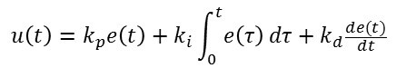


1. **P 제어기 (비례 제어)**
   
   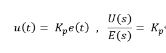
Kp는 비례 Gain이며 설계자가 설정하는 것이다. 비례제어 동작같은 경우는 말 그대로 오차에 상수배를 해서 내보내는 방식으로 어떻게보면 **오차의 증폭기**라고 생각할 수 있다.
   
   Kp↑ 클수록 같은 error에 대한 시스템의 입력 u가 커지므로 출력값이 더 빠르게 reference를 쫓아가게 된다.
   
   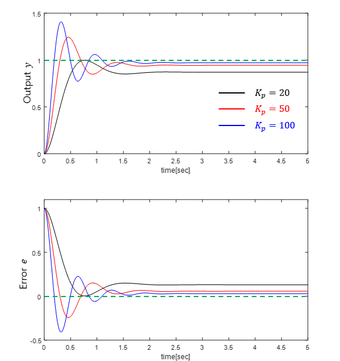
   
실생활 예로는 
   실생활 예로는 에어컨의 설정 온도와 현재 온도의 차이(오차)가 크면 더 찬 바람을 내줘야 빨리 설정 온도에 가까워 질것이다. 
   비례 제어는 이 오차의 크기에 비례하여 제어를 한다.
   

   
2. **PI 제어기 (비례 · 적분 제어)**
   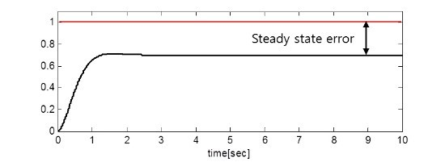
   비례 제어를 하게 된다면 Kp가 아무리 크더라도 reference까지 도달하지 못하고 아주 조금의 오차가 남게 된다. 

   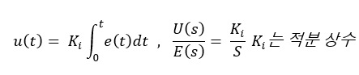
   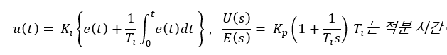

   목표값에 도달할수록 오차가 줄어들어 e(t)가 작아진다. 하지만 kp는 고정값이기 때문에 목표값에 가까워질수록 제어기 출력, u가 작아지는 것이다. 이를 해결하기 위해 고안한 방법이 바로 적분 제어기다. 

   적분제어 동작같은 경우는 오차를 초기시간부터 현재시간까지 적분해서 곱하는 것이다. 이 적분 제어 같은 경우는 **정상상태 오차가 감소 할 수 있는 장점이 있지만. 시스템의 차수가 증가해서 안정도가 악화될 우려**가 있기 때문에 적당히 이득을 조정해야한다.

   

3. **PID 제어기 (비례 · 적분 · 미분 제어)**

   응답속도를 빠르게 하기 위해서 P 게인을 계속 높이다 보면 그림 4의 검은색 곡선과 같이 overshoot가 발생한다. 
   이때 D 게인을 적절하게 반영해주면 파란색 곡선과 같이 overshoot를 제거해주는 역할을 한다.

   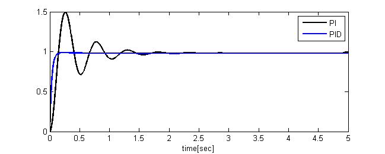
   위에 그림을 보게 된다면 error의 미분값은 음수이다. 특히 error가 가파르게 변화할수록 (응답성이 빠를수록) D 게인의 영향이 커진다. 따라서 D 제어는 식 3에서 급격한 제어기 출력을 완화하는 역할을 한다고 볼 수 있다.

   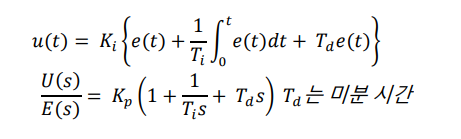
   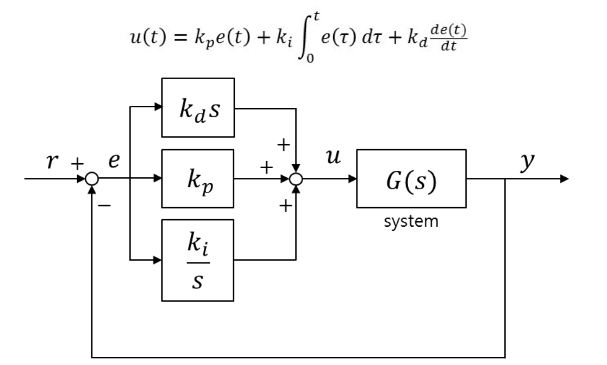

   

   

   

   


   


​	

https://m.blog.naver.com/lagrange0115/220616818649 (그래프, 수식적 해석)


### 3. 프로젝트

1. 첫 번째로 온도 센서의 값이 제대로 들어오고 있는지 확인하기 위해 아두이노를 활용하여 온도 값을 Serial Plotting으로 확인하였다.

   ```c
   float temp;
   int reading;
   int LM35 = A0;
   int LED = 8;
   
   void setup() {
     // put your setup code here, to run once:
     Serial.begin(115200);
   }
   
   void loop() {
     // put your main code here, to run repeatedly:
     reading = analogRead(LM35);
     temp = reading * 0.48828125;
   
     Serial.println(temp);
     delay(500);
   }
   ```

   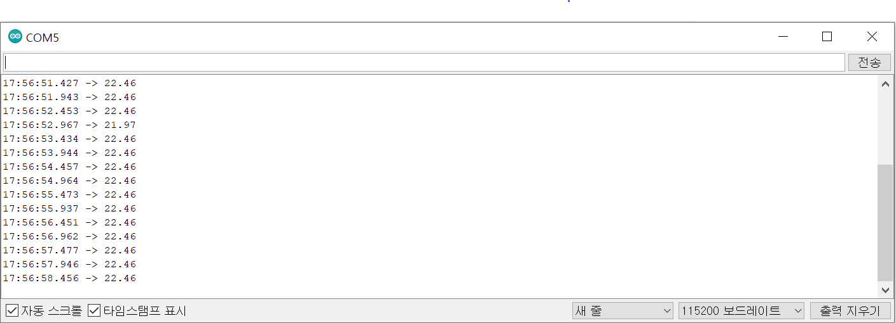

   

   

2. PID제어를 하기위해 온도 센서의 값을 DC모터 FAN을 사용하여 온도를 낮춰보려 했지만 온도가 낮춰지지 않았다.

   

   필자가 사용하는 온도 센서는 LM35DZ인데, 이 온도 센서는 급격한 온도변화를 빠르게 확인 할 수 없을 수 없다. 그리고 필자가 실험하는 환경은 폐쇄되어 있는 공간이 아닌 오픈 공간에서 테스팅했기 때문에 온도를 낮추기 더 어려웠다.
   
3. 그래서 Heat Gun를 활용하여 온도에 따라 비례제어를 통해 모터 속도를 제어하였다. 모터 속도를 제어하기 위해 PWM신호를 아두이노로 생성 시켜 DC모터 속도를 제어해봤다.

   ```c
   const int dc = 3;
   int speed = 0;
   
   void setup()
   {
     Serial.begin(9600);
     pinMode(dc,OUTPUT);
   }
   
   
   void loop()
   {
     analogWrite(dc,speed);            
     Serial.print("speed = ");
     Serial.println(speed);
     speed = speed +85;                // 속도를 0, 85, 170, 255, 0...순으로
     if ( speed > 255 )        speed=0;           // 속도가 255초과되면 0으로 변환
     delay(1000);
   
   }
   ```

   

   

4. heat gun을 통해 열을 전달
   

   온도 센서의  온도 값이 선형적으로 증가한다는 것을 확인하였고, PID제어 중 비례 제어만 써도 충분하다는 것을 알게 되었다. 


### 4. STM32F4 보드를 활용한 온도제어

```c
#include "STM32FDiscovery.h"
#include <stdio.h>
unsigned char adc_val;
unsigned char rec;
unsigned int count = 0;
unsigned int i, a, b, c;

//---------------PID CONTROL Variables--------------------//
unsigned int desired_temp = 19;
unsigned int current_temp;
unsigned int Time = 0;
//double current_temp;

int error;
int error_previous;

int P_control = 0;
int I_control = 0;
int D_control = 0;
int PID_control;

unsigned int Kp = 3;
unsigned int Ki = 0;
unsigned int Kd = 0;

unsigned int tim2tick;
char buf[60];        //Space for ADC string
unsigned int len;   //Space for ADC string len


void sendStr(char buf[], int max);

void clk(void)
{
	RCC_CR = 0;
	RCC_PLLCFGR = 0;
	RCC_CFGR = 0;
		
	RCC_CR |= (1<<16); // HSE set
	while( (RCC_CR & ( 1<<17) ) == 0 ); // wait until HSE ready
	
	RCC_PLLCFGR |= 8;//0x00000008; // set PLLM
	RCC_PLLCFGR |= (336<<6);//|= (336<<6); // 		set PLLN
	RCC_PLLCFGR |= (0<<16); // set PLLP
	RCC_PLLCFGR |= (7<<24);//0x07000000; // set PLLQ

	RCC_PLLCFGR |= (1<<22); // set PLL src HSE
	

	RCC_CR |= (1<<24); // PLL ON
	while( (RCC_CR & (1<<25)) == 0); // wait until PLL ready
	
	FLASH_ACR |= 5;
	RCC_CFGR |= 2; // set PLL to system clock
	
		
	while( (RCC_CFGR & (12) ) != 8); // wait until PLL ready
	
	RCC_CFGR |= (1<<12) | (1<<10); // set APB1 div 4
	RCC_CFGR |= (1<<15); // set APB2 div2	
}

void set_uart2() {
    //USART GPIO PIN PA2(TX), PA3(RX)
    RCC_AHB1ENR     |= 1<<0;                //Clock Enable
    GPIOA_MODER     |= (1<<5) | (1<<7);     //Alternative Function Mode Set
    GPIOA_AFRL      |= (7<<8) | (7<<12);    //

    //SET USART2
    RCC_APB1ENR     |= (1<<17);             //USART2 CLK ENABLE
    USART2_CR1      |= (0<<12);             //CONTROL REGISTER CHARACTER 1BYTE SO 8 BIT USE
    USART2_CR2      |= (0<<13) | (0<<12);   //STOP BIT SET 1

    USART2_BRR      |= (unsigned int)(42000000/115200);     //0x115200 -> 42000000

    USART2_CR1      |= (1<<3) | (1<<2);     //TX,RX ENABLE
    USART2_CR1      |= (1<<5);              //ALSO USART CAN USE PULL UP, PULL DOWN, TXE(DATA FLAG, IS IT IN?) RXNE(RX NOT EMPTY FLAG) WHEN THE BUFFER GET THE VALUE, RXNE BECOME 1
    USART2_CR1      |= (1<<13);

    //USART INTERRUPT ENABLE
    NVIC_ISER1      |= 1<<6;                //BECAUSE WE ADD NEW NVIC_ISER1 AND IT START AT 32, SO 38-32 = 6
    
}

// ADC, channel 1, PA1
void set_adc1() {
    RCC_AHB1ENR |= 0x00000001;          //RCC clock Enable
    GPIOA_MODER |= 3<<2;                //PA1 analog mode
    RCC_APB2ENR |= 1<<8;                //ADC1 Clock Enable
    RCC_CFGR    |= 1<<15 | 1<<13;       // set APB2 div4 = 42MHz (no need to know)

    ADC1_CR2    |= 1<<0;                //ADC1 enable

    ADC1_SMPR2  |= 3<<0;                // channel 1 sampling cycle 56 cycle
    ADC1_CR1    |= 2<<24 | 1<<5;        //8-bit resolution
                                        // end of-conversion interrupt enable

    ADC1_CCR    |= 1<<16;               // PCLK2 div 4 no need to know
    ADC1_SQR1   |= 0<<20;               // channel 1 : 1 conversion
    ADC1_SQR3   |= 1<<0;                // 1st conversion : channel

    NVIC_ISER0  |= 1<<18;               // enable intterupt

}

void set_timer2() {
    RCC_APB1ENR |= 1<<0;
    TIM2_CR1     = 0;                   //Initialize to 0

    TIM2_PSC     = 84-1;
    TIM2_ARR     = 1000-1;
    TIM2_DIER   |= 1<<0;
    TIM2_EGR    |= 1<<0;
    TIM2_CR1    |= 1<<0;

    NVIC_ISER0  |= 1<<28;
}

void TIM2_IRQHandler() {
    TIM2_SR &= 0x00000000;
    tim2tick++;
    ADC1_CR2 |= 1<<30;
    if(tim2tick == 20)            //1000ms = 1s LED Toggle
    {
        GPIOC_ODR |= 1<<6;
        tim2tick = 0; 
    }
    
    if(tim2tick >= PID_control)
    {
        GPIOC_ODR &= ~(1<<6);
    }
}

void USART2_IRQHandler() {
    if( USART2_SR & (1<<5) ) 
    {
        rec = USART2_DR;                //Data Register 
       //after getting the input, we return the data to dr and print 
        USART2_DR = rec;
        while( !(USART2_SR & (1<<7)) );
        while( !(USART2_SR & (1<<6)) );
        //GPIOD_ODR ^= 1<<12;              //To see the data is in

        USART2_CR1 |= (1<<5);           //After interrupt SR be 0 and we need to turn the interrupt on

    }
}

void ADC1_IRQHandler() {
    if(ADC1_SR & 1<<1){
        adc_val = ADC1_DR & 0xFF;
        adc_val = adc_val*3*100/256;
        current_temp = adc_val;
        error = desired_temp - current_temp;

        P_control = Kp * error;
        I_control += Ki * error * Time;
        D_control = Kd * (error - error_previous) / Time;

        PID_control = -P_control + I_control + D_control;   
        error_previous = error;
        
        len = sprintf(buf, "error : %3d PID : %3d adc_val : %3d\n", error, PID_control,adc_val);
        sendStr(buf, len);
    }
    //ADC1_CR2    |= 1<<30;                   //IRQ Start again
}

void EXTI0_IRQHandler() {

    GPIOD_ODR ^= 1 << 13;
    GPIOD_ODR ^= 1 << 14;
    GPIOD_ODR ^= 1 << 15;
    EXTI_PR |= 1<<0;    // clear pending bit for EXTI0
}


int main (void)
{
	
	clk();
	
	RCC_CFGR |= 0x04600000;

    /* PORT A */
	RCC_AHB1ENR  |= 1<<0; //RCC clock enable register	
    GPIOA_MODER  |= 0<<0; // input mode
    GPIOA_OTYPER |= 0<<0; // output push-pull
    GPIOA_PUPDR  |= 0<<0; // no pull-up, pull-down

    /* button intr set */
    SYSCFG_EXTICR1 |= 0<<0; //EXTI0 connect to PA0
    EXTI_IMR       |= 1<<0; //Mask EXTI0
    EXTI_RTSR      |= 1<<0; //risign edge trigger enable
    EXTI_FTSR      |= 0<<0; //falling edge trigger disable
    NVIC_ISER0     |= 1<<6; // enable EXTI0 interrupt
	
	/* PORT D */
	RCC_AHB1ENR  |= 1<<3;		// PORTD enable
	GPIOD_MODER  |= 1<<24;		// PORTD 12 general output mode
	GPIOD_MODER  |= 1<<26;		// PORTD 13 general output mode
	GPIOD_MODER  |= 1<<28;		// PORTD 14 general output mode
	GPIOD_MODER  |= 1<<30;		// PORTD 15 general output mode
	GPIOD_OTYPER |= 0x00000000;
	GPIOD_PUPDR	 |= 0x00000000;

    /* PORT C */
    RCC_AHB1ENR     |=  1<<2;   //  PORTH Enable
    GPIOC_MODER     |=  1<<12;   //  PORTH 1 general output mode
    GPIOC_OTYPER    |=  0<<0;
    GPIOC_PUPDR     |=  0<<0;
	
	GPIOD_ODR |= 1<<12;

    //GPIOC_ODR |= 1<<6;

    set_timer2();
    set_adc1();
    set_uart2();

    ADC1_CR2    |= 1<<30;   //conversion start, because after usart run, we start the ad conversion

	while(1) 
    {
//        if( GPIOA_IDR & 0x00000001 ) {
//            GPIOD_ODR ^= 1 << 13;
//           GPIOD_ODR ^= 1 << 14;
//            GPIOD_ODR ^= 1 << 15;
//        }
	}
}

void sendStr(char buf[], int max) {                        //1byte send
    int cnt = 0;
    while (cnt < max) 
    {
        USART2_DR = buf[cnt++];
        while( !(USART2_SR & (1<<7)) );
        while( !(USART2_SR & (1<<6)) );
    }
}


```

- Timer의 tim2tick를 통해 모터 팬의 Duty Cycle를 조절하였다. 

  ```c
  void TIM2_IRQHandler() {
      TIM2_SR &= 0x00000000;
      tim2tick++;
      ADC1_CR2 |= 1<<30;
      if(tim2tick == 20)            //1000ms = 1s LED Toggle
      {
          GPIOC_ODR |= 1<<6;
          tim2tick = 0; 
      }
      
      //if(tim2tick >= PID_control)
      if(tim2tick == 5)
      {
          GPIOC_ODR &= ~(1<<6);
      }
  }
  ```

  Duty Cycle = 25%

  

  Duty Cycle = 50%

  

  Duty Cycle = 75%

  

  Duty Cycle = 100%

  

  

- 아두이노에서 구현한 PID code를 ADC1_IRQHandler에 넣어줬다.
  그리고 PA1에서 받아온 analog data를 adc 변환 후 adc_val에 넣고, adc_val값을 current_temp라는 전역 변수에 넣어서 PID 연산을 하였다. 

  ```c
  void ADC1_IRQHandler() {
      if(ADC1_SR & 1<<1){
          adc_val = ADC1_DR & 0xFF;
          adc_val = adc_val * 3 * 100 / 256;
          current_temp = adc_val
          error = desired_temp - current_temp;
  
          P_control = Kp * error;
          I_control += Ki * error * Time;
          D_control = Kd * (error - error_previous) / Time;
  
          PID_control = P_control + I_control + D_control;   
          error_previous = error;
          
          len = sprintf(buf, "%3d\n", adc_val);
          sendStr(buf, len); 
      }
      //ADC1_CR2    |= 1<<30;                   //IRQ Start again
  }
  
  ```


  필자는 온도 센서에 3V를 인가해줬고, LM35DZ의 데이터시트를 확인해보면 10mv에 1도인 것을 확인하였다.

  위에서 adc bit resolution을 8(0~255)bit으로 설정하였으니, adc_val * 3 * 100 / 256을 통해 온도값으로 변환해줬다.
  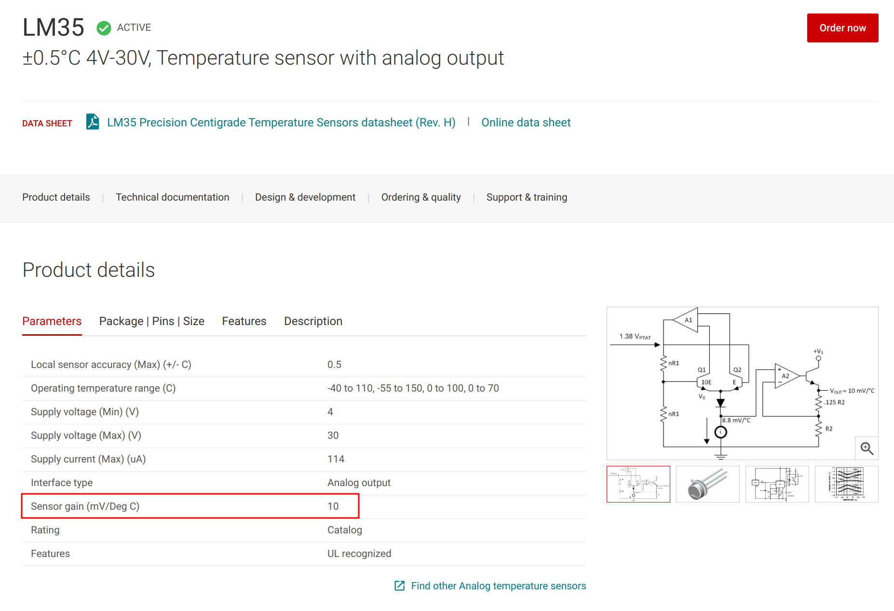

- TIM2_IRQHandler에서 Duty Cycle을 PID_control통해 제어를 하였다. 

  ```c
  void TIM2_IRQHandler() {
      TIM2_SR &= 0x00000000;
      tim2tick++;
      ADC1_CR2 |= 1<<30;
      if(tim2tick == 20)            //1000ms = 1s LED Toggle
      {
          GPIOC_ODR |= 1<<6;
          tim2tick = 0; 
      }
      
      if(tim2tick >= PID_control)
      {
          GPIOC_ODR &= ~(1<<6);
      }
  }
  ```

  

### 5. 아쉬운 점

쿨러를 만들기 위해선 DC모터의 팬만 있으면 된다고 단순하게 생각했었지만, 그게 아니라 팬 크기도 커야하고, 에어컨의 냉매와 같이 차가운 바람을 내 줄수 있었어야 했다. 필자는 dc모터만으로 온도를 내릴수가 없어 어쩔수 없이 P제어만으로 dc모터를 제어했는데, 온도를 내릴수 잇는 컨디션이 된다면 PID제어까지 할 수 있을거라 생각한다. 다음 프로젝트때는 온도 변화에 민감한 온도센서와 밀폐된 공간을 직접 만들어서 실험해 봐야겠다.

