## Week2


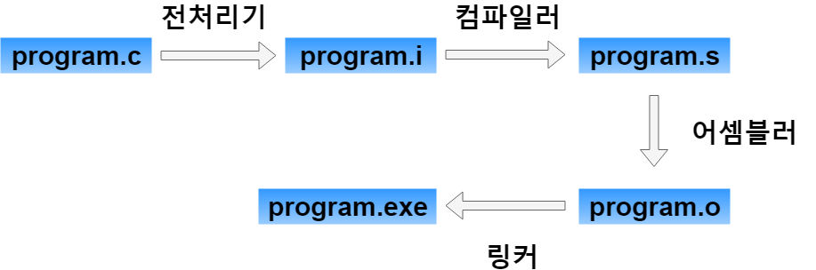


전처리기		 : 		`gcc -E program.c -o program.i`

컴파일러		 : 		`gcc -S program.i -o program.s`  or  
			     				`gcc -S program.c -o program.s`

어셈블러		 :		 `gcc -c program.s -o program.o (ASCII Code로 보임)` 

​								 `gcc -c program.c`

16진수			: 		`hexdump -C program.o`, or `vi :!%xxd`

링커				: 		`gcc -o program program.o ` or 

​								`gcc program.o -o program.exe`


### 1. 전처리 과정

​	전처리 과정은 크게 두 부분으로 나눌 수 있다. 

	1. **헤더 파일 삽입**
	2. **매크로 치환 및 적용**


**헤더 파일 삽입**

​	C 소스 내에 헤더파일을 include 하는 것은 C 언어의 문법적 특성과 관련된 것으로, 

C 언어에서는 함수를 사용하기 전에 함수의 원형을 먼저 선언 해야 한다. 

대표적인 예로는 printf함수를 사용하기 위해서 #include <stdio.h> 하는 것과 같다.

<u>전처리기는 #include 구문을 만나면 해당하는 헤더파일을 찾아서 그 파일의 내용을</u> 

<u>순차적으로 삽입한다.</u> 


**매크로 치환 및 적용**

헤더 파일을 다 삽입하면 이제 매크로 치환 작업이 들어간다. 

<u>**#define** 된 부분은 심볼 테이블에 저장</u>되고, 심볼 테이블에 들어 있는 문자열과 같은 문

자열을 만나면 #define 된 내용으로 치환한다.  

이때 **#ifdef**와 같은 다른 전처리기 매크로들도 같이 처리된다. 


### 2. 컴파일 과정 

​	전처리 과정이 끝나면 컴파일 과정으로 들어간다. (Front-end, Middle-end, Back-end 추가 예정)


### 3. 어셈블 과정

​	컴파일이 끝난 어셈블리 코드는 어셈블러에 의해 기계어로 어셈블이 된다. 

어셈블러에 의해 생성되는 목적코드(helloworld.o) 파일은 어셈블된 프로그램의 **명령어(instruction)**과 **데이터(Data)**가 

들어있는 ***ELF(Executable and Linkable Format) 바이너리 포멧(Binary format) 구조**를 갖는다. 

다음 단계인 링킹에서 링커가 여러 개의 바이너리 파일을 하나의 실행 파일로 묶기 위해서 각 바이너리의 정보를

효과적으로 파악하기 위해서 (명령어와 데이터의 범위 등) 일정한 규칙을 갖게 형식화 해놓은 것입니다. 


### 4. 링킹 과정

​	어셈블리에 의해 **ELF포맷**의 목적코드 파일들이 만들어지면 이제 링커가 나설 차례이다. 

링커는 **오브젝트 파일들**과 여러분의 프로그램에서 사용된 **표준 C 라이브러리, 사용자 라이브러리들을 링크(Link)**를 한다.

printf() 함수나 scanf() 등의 표준 C 라이브러리 함수들은 직접 구현하지 않아도 미리 컴파일이 되어 있기 때문에 

링크하는 과정만 거치면 사용할 수 있습니다. 링킹 과정이 끝나면 실행 가능한 **실행파일**이 만들어지게 된다. 


# 수업 실습


### 복습 내용

 - Embedded 같은 경우 윈도우 업데이트를 함부로 하면 안된다. 

 - `cd .. ` or `cd ../` 를 통해 상위 폴더 접근 가능

 - `:sp main.c` 는 창을 horizontal split하는 것이고, `:vs main.c` 는 창을 Vertical Split하는 것이다. 

 - `: 시작행,끝행s/원래문자열/변경문자열/옵션 ` 은 문자열 치환하는 것이다.

   ex) `:5,7s/word/words/g` 5행에서 7행 사이에서 word를 words로 치환 

   옵션 g(globally) : 한 행에서 '원래 문자열'에 입력한 패턴이 여러번 나오면 전체를 변경

   ​		i : 대소문자 구분 X

   ​		c : 치환 시 사용자 확인 


## 1. makefile Dependency

```
target ... : dependencies ...
        command
        ...
        ...
```

왼쪽 gvim 화면은 첫 시간에 만든 makefile이고, 오른쪽 gvim 화면은 이번 수업 시간에 만든 것이다. 

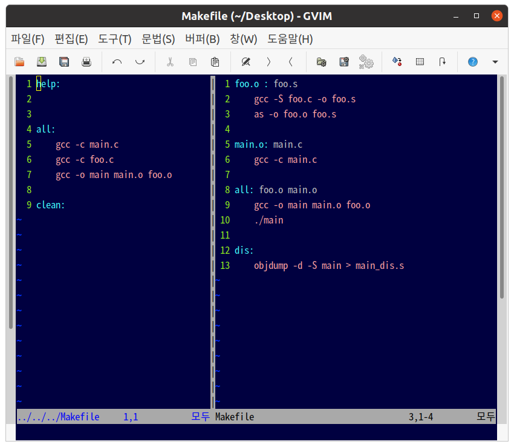

원래는 all이라는 target에 모든 컴파일 옵션을 넣어서 make all을 통해 command가 실행되었다. 

이번 수업의 Makefile에는  `all` 과 `dis` 라는 실행 파일을 만들었고 

`all`이라는 실행 파일에는 `foo.o` 와 `main.o` 라는 오브젝트 파일들을 포함한다. 

**dependencies**는 `foo.s` , `main.c` 가 있다. 

`foo.o` 와 `main.o`는 **target**이면서 동시에 **dependency**이다. 


이전에는 all에 아무런 dependency가 없었기 때문에 c파일이 변경되지 않아도 강제로 모든 command가 실행되었는데, 

이번 Makefile은 main.c만 바꼈으면 main.c만 컴파일 후 바로 all command를 실행한다. 

target이 파일일 때, 어떤 dependencies 들 중 하나가 변경되었을 때 재컴파일되거나 재링크되어야 한다. 

게다가 스스로 자동적으로 생성된 어떤 dependencies는 맨먼저 업데이트되어야 한다. 

이 예제에서 `main.o`는 main.c에 의존하고, `foo.o`는 foo.c에 의존한다. 


## 2. Hex Diassembling 방법

- `2진수(binary) -> 16진수(Hex) -> 어셈블리(Assembly) `

 1. 첫번째로, 실행 파일(2진수로 구성되어 있다.) 을 어셈블리로 바로 바꾸는 방법이 있다.
     `objdump -d -S main > main_dis.s` 터미널에 입력하게 된다면, 실행파일에서 어셈블리 파일이 생성된다. 
    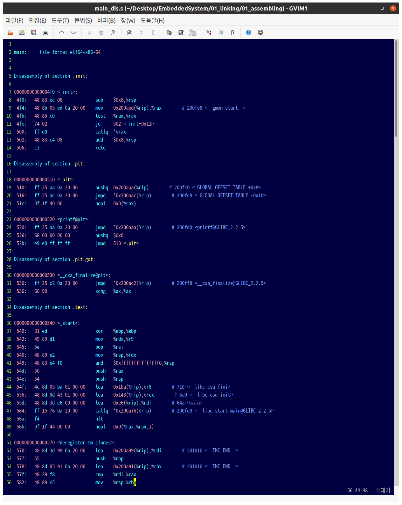

 2. 두번째 방법으로는 실행 파일을 `gvim main.c`를 열면 아래와 같은 ASCII Code 형태로 나타난다.

    

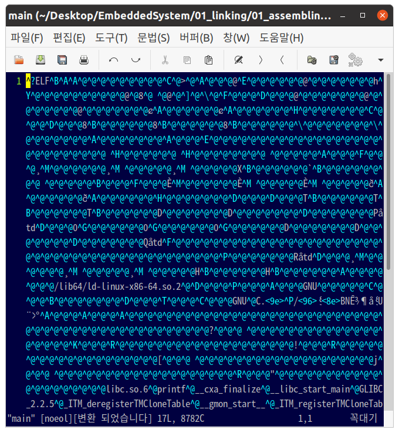

​		

​		`:%!xxd`를 통해 ASCII Code를 Hex Code로 변환하였다.

​		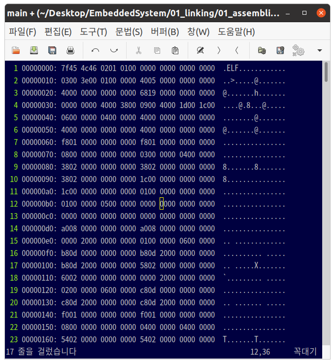


## 3. Binary Executable 코드를 hex editing하여 

## 함수 호출 흐름 변경


**increment.c**

```
int increment(int i){
	return i+1;
}
```

**decrement.c**

```
int decrement(int i){
	return i-1;
}
```

**main.c**

```
#include "increment.h"
#include "decrement.h"
#include <stdio.h>

int main(){
	int y = increment(10);
	printf("y is %d\n", y);
}
```

**Makefile**

```
increment.o : increment.c
	gcc -c increment.c

decrement.o : decrement.c
	gcc -c decrement.c

main.s : main.c
	#gcc -S main.c -o main.s

main.o: main.c
	as -o main.o main.s

all: increment.o decrement.o main.o
	gcc -o main main.o increment.o decrement.o
	./main

dis:
	objdump -d -S main > main_dis.s
```

실습에서 사용한 코드와 Makefile이다. `make all` 을 통해 main실행파일을 만들었다. 

실행 결과는 


main.c 문 안에서  코드 동작`int y = increment(10)`을 `int y = decrement(10)`로 동작할 수 있게

실행 파일 Hex Code를 변경해 보겠다. 


1. `objdump -d -S main > main_dis.s` 를 통해 실행 파일을 disassemble하였다. (main_dis.s) 

   

   

2.  `gvim main_dis.s`를 통해 어셈블리 코드를 확인할 수 있다. 

   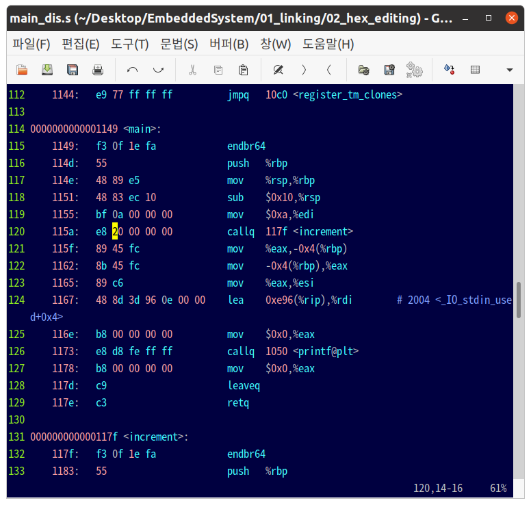

   - 현재 callq는 c언어에서 함수를 호출하는 기능과 같은 것이다. 

   - `115a: e8 20 00 00 00		callq 117f <increment>`

   - e8 20에서 20이 의미하는 것은 20만큼 jump한다는 것이다. increment의 주소 117f와 callq의 다음 주소 115f를 

   - 빼면 `117f - 115f = 20`이다. 

   - `decrement 첫주소(1192) - 115f = 33` 

   - e8 20 자리에 e8 33으로 변경하면 increment 함수로 가지 않고 decrement 함수로 갈 것이다.

   `115a: e8 33 00 00 00		callq 1192 <decrement>`

3. `gvim main` -> `:%!xxd` 통해서 아스키 to Hex ->  /e8 20 or /e820를 통해 Search

   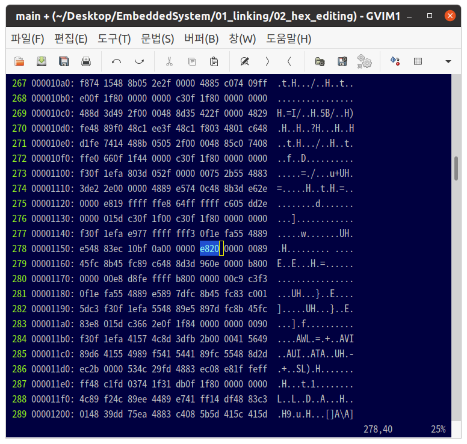

4. e820 -> e833으로 변경

   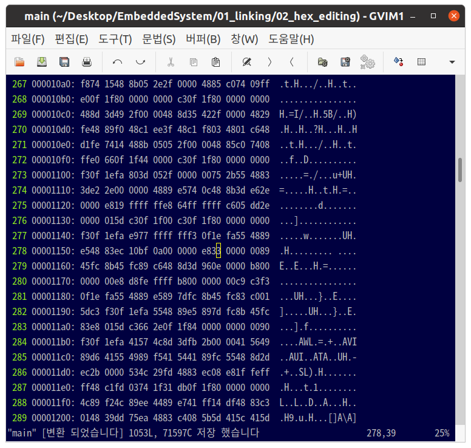

5.  `%!xxd -r `을 통해 원래 파일 형식대로 바꿔주고 저장한다. Hex 그대로 저장하면 오류가 난다. 
   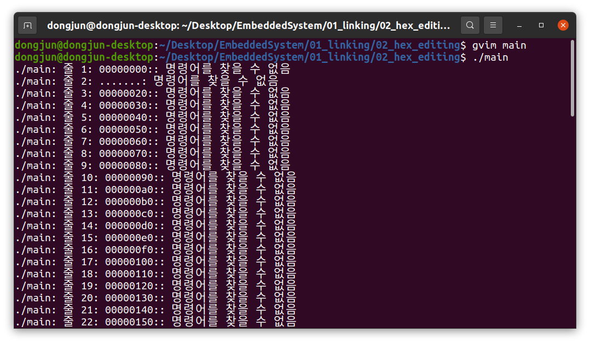

6. 원래 파일 형식대로 바꿔주고 main 실행 파일을 실행하면 y is 9, 즉 decrese되었다. main_dis.s로 다시 만들고 확
   인하였다.
   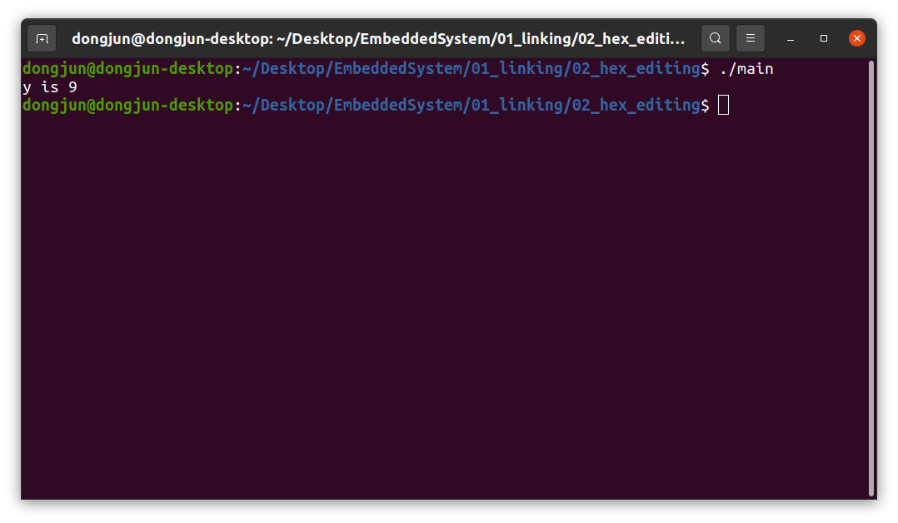

7. 생각한대로 바꼈다.
   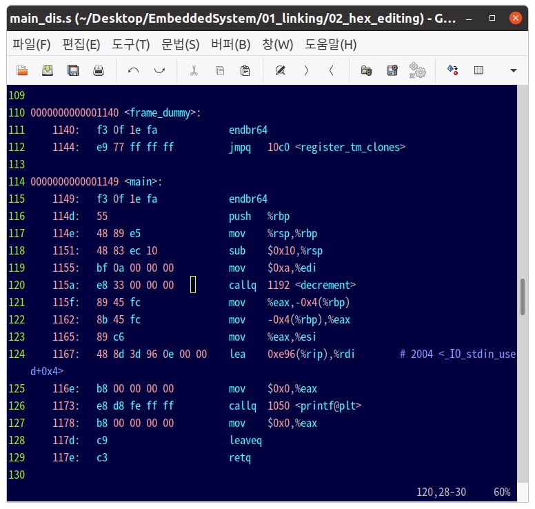

   

   
   


## 4. 첨부의 자료를 다운 받아, 소스가 제공되지 않는, 암호를 요구하는 원 프로그램의 기능을 무력화시키기(hex editing을 통해)


1. 실행파일 foo를 다운로드하여 실행시켜 볼려했지만 실행되지 않았다.

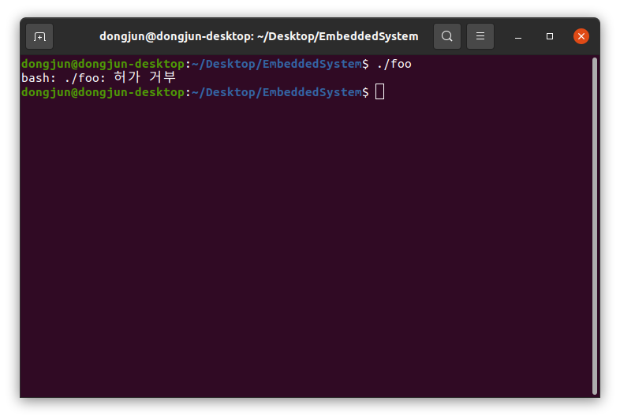


2. foo 실행파일 권한을 확인해보니 실행 권한이 없다. 
   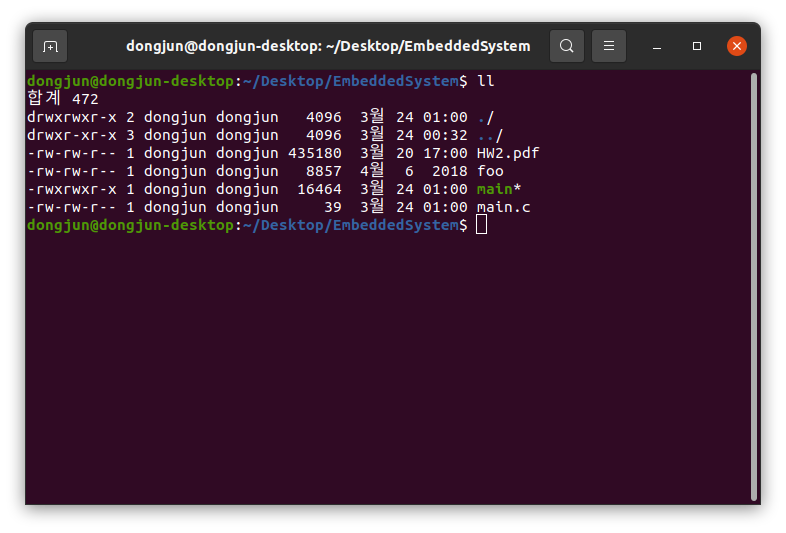

3. foo실행파일에 대해 실행 권한을 추가 부여하였다. 

   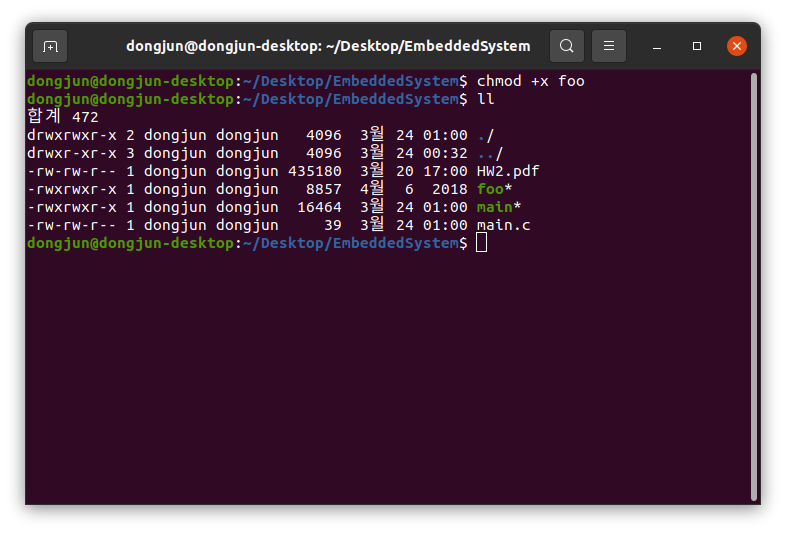

4. foo 실행파일이 실행되는 것을 확인하였다.

   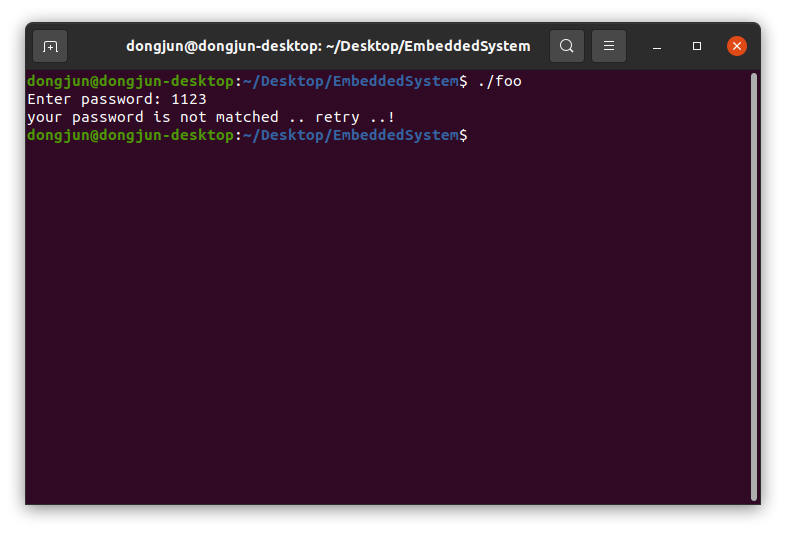

   

   필자는 암호를 요구하는 원 프로그램의 기능을 무력화시키려고 한다.

   1. objdump을 활용하여 실행파일을 disassemble 하였다(어셈블리 파일).

      `objdump -d -S foo > foo_dis.s`

      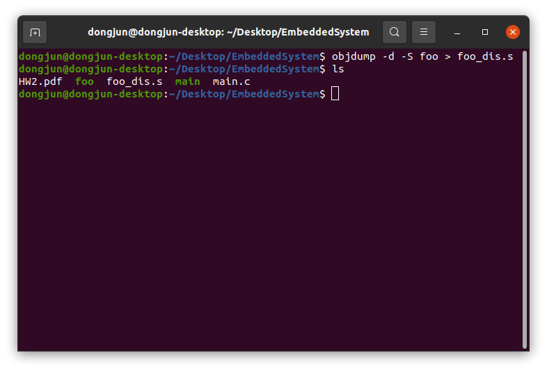

   2. `gvim foo_dis.s `를 통해 어셈블리 코드를 확인해봤다.
      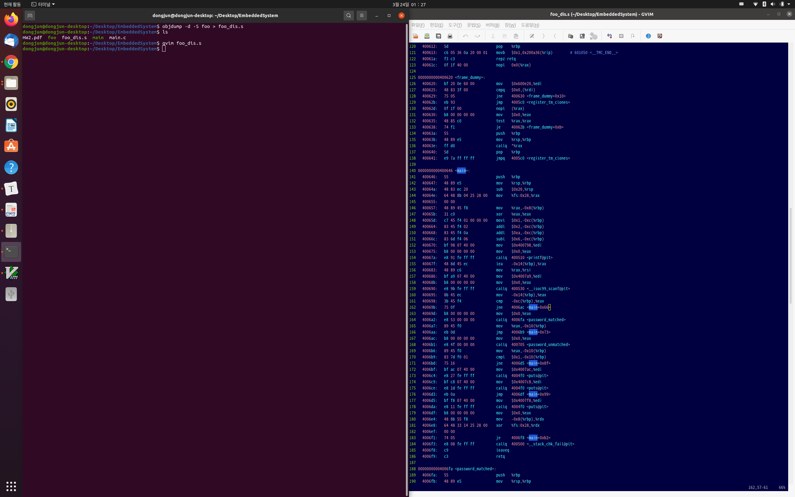

      main문 구조를 보게 된다면 

      ```
      printf("Enter password:");				<- callq 400510 <printf@plt>
      scanf("%(?)", &password);				<- callq 400530 <__isoc99_scanf@plt>
      if(password != 0){						<- cmp -0xc(%rbp), %eax
      	return password_unmatched();		<- jne 4006ac <main+0x66>
      }
      ```

      위의 구조와 비슷하다. 첫번째 task로는 암호를 몰라도 실행될 수 있도록 암호 체크 루틴 우회하도록 프로그램을 

      변경하는 것인데, 결국 cmp에서 rbp와 eax에 있는 값들이 같다면 FLAG Z=1이기 때문에 점프를 하지 않는다. 하지만 값이 다르면 FLAG Z=0이 되서 4006ac주소로 가서 

      password_unmatched가 뜨게 되는 것이다. 그럼 결국 jne주소를 password_matched 주소로 가게 하면 된

      다. 그것을 하기 위해선 실행파일을 binary파일로 변경해서 실행해야 한다. 

      40069b : e8 0f	jne 4006ac <main+0x66>는 만약 0이 아니면 0f주소로 가라는 거니 0f주소가 아닌 00으로 

      바꿔준다면 바로 밑에 있는 명령어로 갈 것이다.  

      

   3. ㅇ`gvim foo` -> :%!xxd를 통해 ASCII Code to Hex Editing으로 바꿨고, /75 0f를 통해 찾았다.
      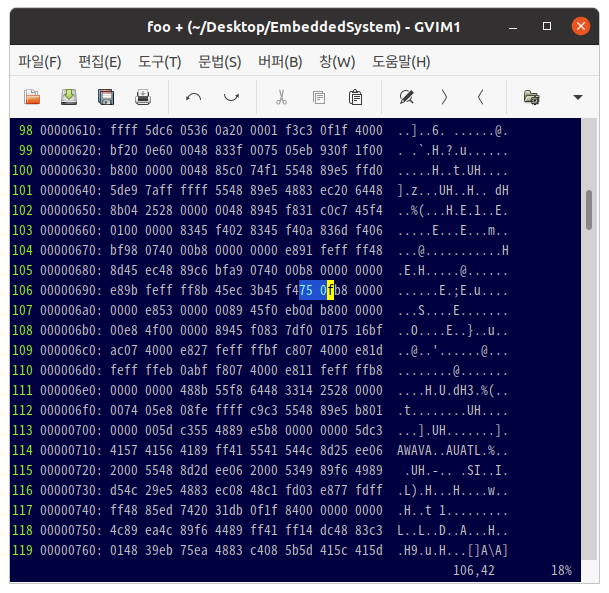

   4. 75 0f -> 75 00으로 변경하였다.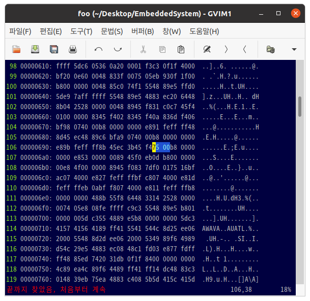

   5. ㅇ:%!xxd -r를 통해 ASCII Code로 변경해주고 저장하였다.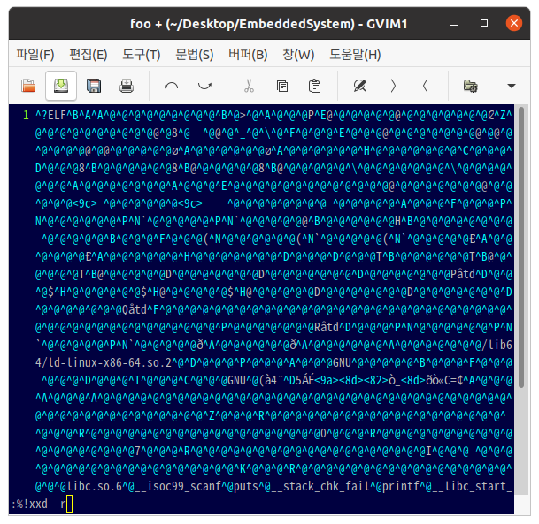

   6.  암호를 요구하는 원 프로그램의 기능을 무력화시키는데 성공하였다.

      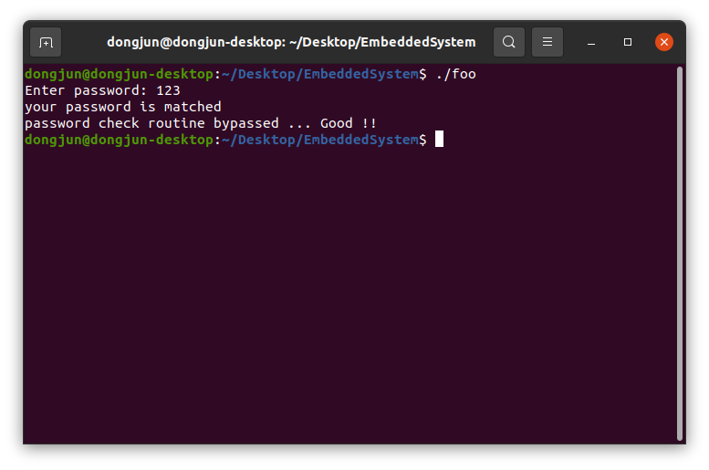

   

   ## 5. 비밀번호 알아내기

   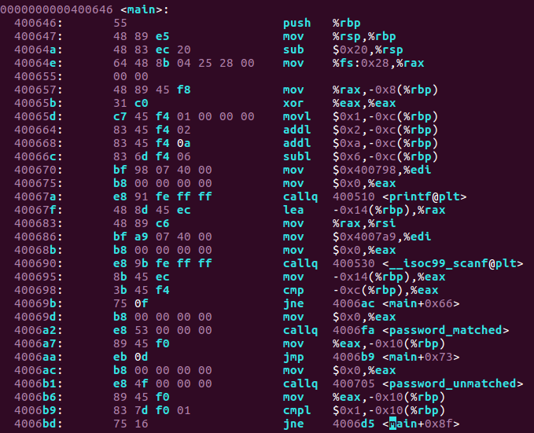

   

- 현재 main문에서 결국 scanf에서 받은 값과 main문 처음에 설정한 값이랑 비교해서 같으면
  FLAG값 (Z=1, C=0, N=0, O=0)이 나온다. 결국 비교하는 레지스터의 값은 rbp와 eax이다. 
- /home/dongjun그래서 위에 40065d에서 부터 mov를 통해 rbp레지스터에 1을 추가해줬고, 그 이후로
  1+2+a-6 = 13 - 6 = 7이 나온다. 결국 scanf와 비교하는 값은 7이라는 것이다. 
- 정답을 확인하였다. 맞췄다.
  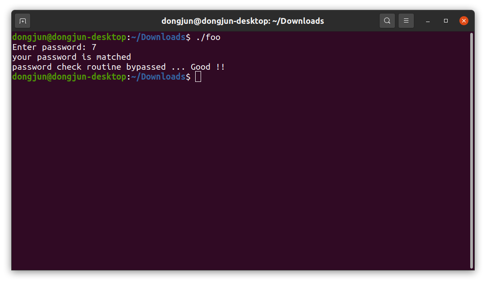
