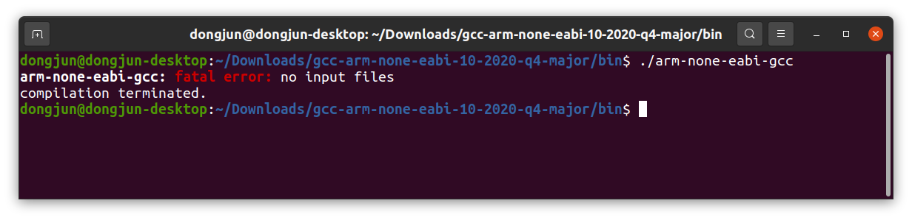
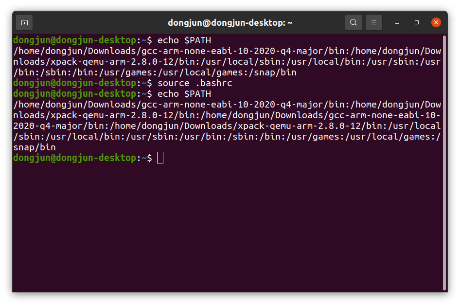
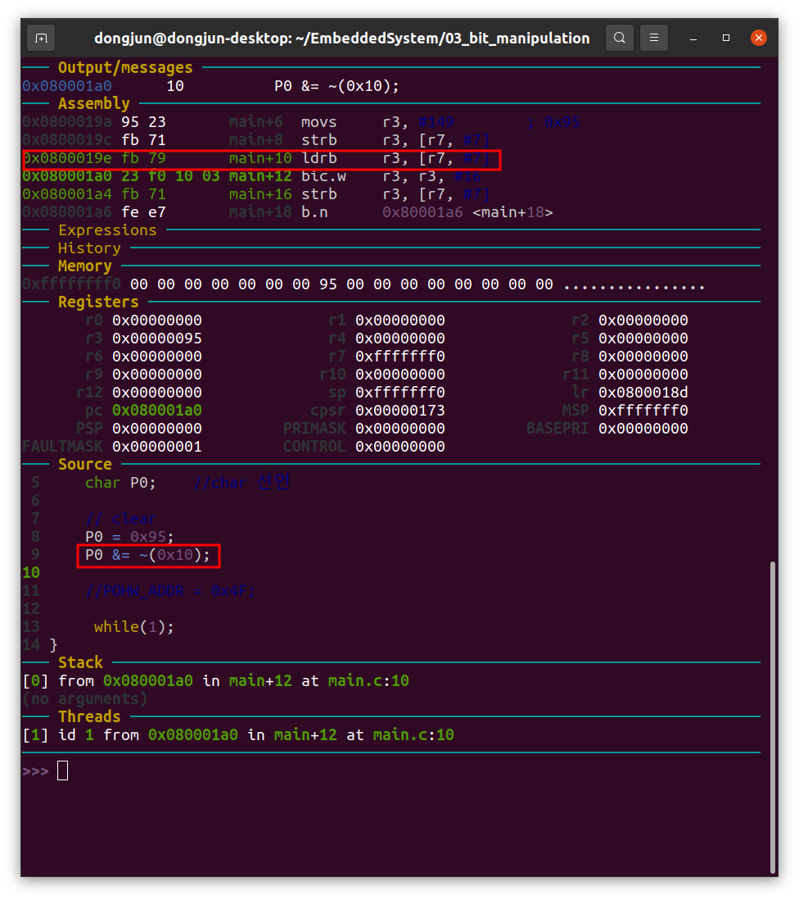

## WEEK3

### 1. ISA(Instruction Set Architecture)

 1. #### 전반적인 개념

    - 마이크로프로세서가 인식해서 기능을 이해하고 실행할 수 있는 기계어로 된 명령어 구조

    - 최하위 레벨의 프로그래밍 인터페이스, 프로세서가 실행할 수 있는 모든 명령어를 포함한다.

    - 마이크로프로세서 종류에 따라 기계어

    - 기계어 명령어의 각 비트는 기능적으로 분할되어 의미가 부여되고 이진 숫자화된다.

	2. #### ISA의 유형

    	1. **CISC : Complex Instruction Set Computer** 

        - 복잡한 명령어 집합을 갖는 CPU Architecture

        - CISC 설계의 주요 목적은  프로그램의 명령어 수를 줄이는 것이다.

        - CISC를 사용하여 적은 수의 명령어로 수행 할 수 있다. (주로 Laptop or Desktop computer에 쓰임)

        - **장점**

          - **작지만 고밀도의 코드를 사용한다.** 

            CISC를 사용하면 프로그램의 용량을 줄일 수 있고 메모리 접근 횟수를 크게 줄일 수 있다. 적은 지시로 많은 작업을 처리할 수 있다는 것이다. 옛날에는 메모리 용량이 매우 한정적이라 메모리 관련 비용을 절감하고 메모리 용량을 아끼면서 사용할 수 있는 CISC가 매우 유리하다 보니 CISC가 제일 먼저 탄생해 현장에서 이용됐다.

          - **생산성이 높다(마이크로코드 작성이 쉽다)**

            코드 단위당 작업량이 매우 많다. CISC는 가변 길이 마이크로코드를 사용하므로, 16 = 4 X 4와 같이 CISC로 단 하나의 코드로 해결할 수 있는 작업을, RISC로는 2+2+2+2+2+2+2+2의 코드를 입력해야 해 마이크로코드 작성자 입장에선 CISC가 매우 편리하고 생산성이 높다. 

          - **호환 명령어**

            RISC는 CPU 구조가 바뀌어 처리 비트 단위에 변화가 생기면 기존의 명령어를 사용할 수 없어 호환성의 문제를 일으킨다. 

        - **단점**

          - **구조가 복잡해 프로세서 설계가 힘들다.**

            RISC를 탄생시킨 결정적인 이유이다. 마이크로코드를 받으면 이를 해독해야 하는데, 해독 자체도 어려워 디코더 설계가 까다로우며 해독한 뒤에는 버퍼를 거쳐 명령어를 재정렬하는 등 시퀀싱도 복잡하다. 

          - **파이프라이닝 구현이 매우 어렵다**.

          - **디코더가 비대해짐**

          - **특정 환경에서 RISC보다 비효율적**

            코드의 과대포장의 문제이다. RISC로 절제해 입력할 수 있는 마이크로코드를, 그것도 CISC에서는 이상적으로만 작성한다면 더 간단하게 입력할 수 있는 코드를 인적인 문제 때문에 과도하게 크게 만들어 성능을 저하시키는 문제이다. 프로그래머의 실력이 덜어지면 코드를 필요 이상으로 길게 작성하여 큰 퍼포먼서 저하를 유발할 수 있다. 

          - **기술의 발전으로 의미를 잃은 장점들**

            코드 밀도가 높아 메모리 사용량을 줄일 수 있는 장점은 메모리가 보급되면서 큰 의미는 아니게 되었다. GUI 환경에서 가장 큰 용량을 차지하는 부분은 데이터이기 때문이기도 하다.
            또한 RISC 구조 CPU에서 가변 길이 명령어를 도입하기도 했으며, 이는 가변 길이 명령어가 더 이상 CISC만의 전유물이 아니게 되었음을 나타낸다. 대표적으로 ARM의 Thumb-2 명령어 세트와 RISC-V가 있다.일부 제품군을 제외한 ARM 아키텍처 제품군의 경우 이는 완벽한 가변길이 명령어 체계가 아니며 중간에 모드 변환 명령어를 실행해야 한다. x86은 완벽한 가변 길이 명령어 체계를 가지므로 RISC CPU들과는 동작이 다르다.

            

            [**(짜잘한 팁)**](https://m.blog.naver.com/PostView.nhn?blogId=mumasa&logNo=221049608979&proxyReferer=https:%2F%2Fwww.google.com%2F) 

            인텔은 8->16->32->64비트 CPU로 발전되고 있다. x86은 인텔(INTEL)의 CPU 시리즈 이름이자 그 CPU의 명령체계 아키텍쳐 이름이다. 

            x86이란 이름의 기원은 1978년 인텔이 최초의 16bit CPU인 8086을 발표했다. 이후에 발표되는 인텔의 후속 32bit CPU들 - 인텔  80486, 80586(펜티엄), 펜티엄프로, 셀러론 등 뿐 아니라 경쟁사의 CPU들 모두 역시 이 x86-IA32 명령체계를 호환하여 표준으로 채택하였다. 

            따라서 이런 80386기반의 CPU들을 통틀어 x86 Architecture CPU라고 부른다. 

            그리고 인텔은 기존의 32bit x86 호환체계를 버리고 새로운 설계를 하기로 결정했다. 즉 기존 32bit 80386 CPU x86-IA32와 호환되지 않는 완전히 새로운 64bit CPU 명령세트 구조를 만들고 IA-64 아키텍쳐라고 호칭한다. 

    	2. RISC-V

        

### [2. 일반적인 CPU의 동작](https://udteam.tistory.com/57) 

 1. "데이터/명령어를 읽고, 읽은 것을 수행하고, 결과를 쓴다."

    - 저장 장치
    - ALU (Arithmetic and Logic Unit, 산술 논리 유닛)
    - 버스 (데이터/명령어가 저장 장치와 ALU 사이를 오가는 통로이다.)

    저장 장치에 있는 데이터와 명령어를 버스를 통해 읽어 와서 ALU가 연산을 수행하는 것이다. 빨간 화살표는 버스, CPU라고 묶인 부분은 ALU, L1,L2,L3 캐시 및 RAM은 저장 장치를 의미한다. 위에서 CPU라고 표시한 부분은 크게 프론트엔드와 백엔드라는 두 부분으로 구분된다. 
    CPU가 읽은 명령어를 연산장치가 해석할 수 있는 더 간단한 코드로 전환해주는 부분을 프론트엔드라 하고
    프론트엔드가 해석해 준 코드와 데이터를 받아 실제로 연산을 수행하는 부분을 백엔드라고 한다.

	

​		첫 번째로 Non-volatile Memory인 Flash나 HDD에 저장되어 있다가, 

​		


gdb 명령어 및 개요. 캐시도 공부하기

### 3. ARM Compile를 위한 Cross Compiler Installation

 1. **Cross Compiler란?**
- 크로스 컴파일러는 컴파일러가 실행되는 플랫폼이 아닌 다른 플랫폼에서 실행 가능한 코드를 생성할 수 있는 컴파일러이다. 크로스 컴파일러 툴은 임베디드 시스템 혹은 여러 플랫폼에서 실행파일을 생성하는데 사용된다. 이것은 운영체제를 지원하지 않는 마이크로컨트롤러와 같이 컴파일이 실현 불가능한 플랫폼에 컴파일하는데 사용된다. 이것은 시스템이 사용하는데 하나 이상의 플랫폼을 쓰는 반가상화에 이 도구를 사용하는 것이 더 일반적이게되었다.
    - 예를 들어 Android .apk파일을 만들고자 할 때 흔히 사용하는 소프트웨어가 있다. Android Studio 소프트웨어를 실행시킨 후 컴파일하면 실행파일이 만들어 진다. 
- 이 실행 파일은 windows에서 .exe파일만 실행가기 때문이다. 하지만 windows에서 스마트폰을 가상으로 띄우거나 직접 스마트폰에 apk파일을 넣은 후 직접 스마트폰으로 실행하면 어플리케이션은 실행이 잘 된다. 
    - 즉, 다른 플랫폼인 windows에서 다른 플랫폼에서 작동되는 .apk파일을 만들어 냈다 이를 '크로스 컴파일'이라고 한다. 다른 플렛폼에서 작동되는 실행파일을 만들 때 사용하는 녀석이다. 
- 임베디드 시스템을 개발하기 위해선 반드시 크로스 컴파일러가 있어야 한다. 크로스 컴파일러는 c언어로 작성된 소스를 개발하고자 하는 CPU에 맞게 컴파일해서 바이너리로 만들어주는 역할을 한다. 
    - 호스트 피시에서 사용되는 씨 언어 컴파일러는 크로스 컴파일러라고 표현하지는 않는다. 호스트 피시 같은 경우, 개발자가 씨 프로그램을 만들어서 컴파일을 하고 나면 프로그램 실행 결과를 바로 확인 할 수가 있다. 그 이유는 호스트 피시에 설치된 씨 컴파일러는 호스트 피시의 CPU에 맞게 실행 바이너리가 만들어지기 때문이다. 


  2. **Cross Compiler "GNU ARM Embedded Toolchain"란**

     - ARM Embedded Toolchain은 ARM Embedded GCC Compiler, ARM Cortex-M과 Cortex-R 프로세스 기반의 bare-metal 소프트웨어 개발을 위한 다른 GNU 도구와의 특징을 담고 있는 통합되고 적합한 패키지이다.

     - Toolchain은 windows, linux, mac os x 호스트 동작 시스템에서 cross-compilation으로 이용가능하다. 

     - https://developer.arm.com/tools-and-software/open-source-software/developer-tools/gnu-toolchain/gnu-rm/downloads 접속하여 클릭하여 다운로드 한다. 

     - 컴퓨터가 x86_64라고 되어 있어서 x86이라고 생각 할 수 있지만 x86_64는 64비트 컴퓨터에서 동작하는 것을 의미한다.

       

     - `bzip2 -d gcc-arm-none-eabi-10-2020-q4-major-x86_64-linux.tar.bz2` 를 통해 파일 압축 해제

       

     - `tar xvf gcc-arm-none-eabi-10-2020-q4-major-x86_64-linux.tar`를 통해 파일 압축 해제
       폴더가 생성된다. 

     

     - gcc-arm-none-eabi-10-2020-q4-major폴더 안에 있는 bin에 arm-none-eabi-gcc를 하면 정상적으로 실행되는 것을 확인 할 수 있다.

       

       

       

  3. **ARM Emulator, QEMU(Quick Emulator)란**

     - 하드웨어 가상화의 기능을 갖춘, 무료이자 오픈 소스 CPU Emulator이다.

     - VirtualBox처럼 ARM CPU를 Emulate해준다. CPU없이도 사용할 수 있게 만들어 준다.

     - 설치 과정은 이러하다. 

     1. github.com/xpack-dev-tools/qemu-arm-xpack/releases 페이지로 들어가서 

        xpack-qemu-arm-2.8.0-12-linux-x64.tar.gz 클릭하여 다운로드 한다.

        

     2. 위에서 압축했던 것처럼 풀면 폴더가 나온다. 

     

     

     ### [4. 환경변수 설정 원리](http://blog.naver.com/PostView.nhn?blogId=koromoon&logNo=220793570727)

     1. **환경변수란?**
        환경 변수란 프로세스가 컴퓨터에서 동작하는 방식에 영향을 미치는 동적인 값들의 모임으로 쉘에서 정의되고 실행하는 동안 프로그램에 필요한 변수를 나타낸다.

        

     2. **동작 범위에 따른 환경 변수**

        1. 로컬 환경 변수
           - 현재 세션에서만 동작하는 환경 변수이다.
        2. 사용자 환경 변수
           - 특정 사용자에 대해서만 정의된 환경 변수로 로컬 터미널 세션 또는 원격 로그인 세션을 사용하여 로그인할 때마다 로드된다. 관리자 계정만.
           - 관련 파일은 특정 사용자의 홈 디렉토리에 존재하는 파일로 .bashrc, .bash_profile, .bash_login
        3. 시스템 전체 환경 변수
           - 해당 시스템에 존재하는 모든 사용자가 사용할 수 있는 환경 변수로 시스템 전원이 켜져 있고 모든 사용자가 로컬또는 원격으로 로그인할 때마다 로드된다. 일반 계정또한 가능.
           - 관련 파일은 /etc/environment, /etc/profile, /etc/profile.d/, /etc/bash.bashrc

        
        
     3. **환경 변수 구성 파일**

        1. **.bashrc**
           - 특정 사용자가 새로운 로컬 세션을 생성할 때마다 로드되는 파일로 별칭(alias)과 bash가 실행될 때 실행되는 함수 등으로 구성된다. 
           - 이 파일은 전역적인 설정 파일인 /etc/bashrc이 수행된 다음 바로 수행된다.
           - 모든 사용자에게 영향을 주는 /etc/bashrc와 달리 ~/.bashrc는 오직 bash를 실행하는 그 사용자에게만 영향을 준다.
           
        2. **.bash_profile**
           - 특정 사용자의 원격 로그인 파일로 이 파일에 있는 환경 변수는 사용자가 원격 로그인 세션이 이루어질 시에 호출된다.
           - 이 파일이 존재하지 않으면 시스템은 .bash_login 이나 .profile파일을 검색한다. 
           - 모든 사용자에게 영향을 주는 /etc/profile과는 달리 ~./bash_profile는 오직 bash를 실행하는 그 사용자에게만 영향을 준다. 
           
        3. **/etc/environment**
           - 전반적인 시스템을 제어하는 파일로 필요한 환경 변수를 작성하거나 편집 또는 제거한다.
           - 이 파일에서 만든 환경 변수는 로컬 및 원격으로 접속한 모든 사용자가 액세스할 수 있다.
           
        4. **/etc/bash.bashrc**
           - 시스템 전체의 bashrc 파일로 모든 사용자가 로컬 터미널 세션을 열 때마다 로드됨
           - 이 파일에서 만든 환경 변수는 모든 사용자가 엑세스할 수 있지만 로컬 터미널 세션에서만 가능하다. 
           
        5. **/etc/profile**
           - 시스템 전체의 profile 파일로 모든 사용자가 원격 로그인 세션이 이루어질 시에 호출된다.
           - 이 파일에서 만든 환경 변수는 모든 사용자가 엑세스할 수 있지만 원격 로그인 세션에서만 가능하다. 
        
        ​    파일 내용을 수정 후에 재부팅/재실행 없이 즉시 적용하고자 한다면 아래 명령어와 같이 입력한다. 
        
        ​    **source[파일 이름]**
        
     4. **환경 변수 구성 파일 위치**
        파일명 앞에 점(.)이 붙어서 히든 파일이 된 설정파일들은 자신의 홈 디렉토리에 있다.
        `ls -a`를 통해 .bashrc 사용자 환경 변수 파일을 찾았다.시스템 전체 환경 변수 위치 찾기
        `whereis /etc/bash.bashrc`를 통해 위치를 찾았다. 
        
     
5. **사용자 환경 변수 설정**
   
   1. gcc-arm-none-eabi-10-2020-q4-major 환경 변수를 추가하기 위해 .bashrc에 path 추가했다.
           
        2. 추가로 alias vi = "gvim"을 통해 vi를 치면 gvim이 나오게 할 수 있게 한다. 
           
        3. $PATH를 통해 echo로 PATH의 값을 출력한다. ($를 통해 $는 변수의 값을 나타낸다)
           그리고 잘 추가 되었다.
           
        4. terminal이 실행될 때 bash파일이 실행된다. source .bashrc를 통해 강제로 bashrc를 한번 더 실행을 하면 PATH가 더 추가가 되서 나온다. 
           


6. **일반적으로 사용되는 환경변수 목록**


​      ​

### 5. ARM firmware project file 분석

**Makefile**

```
CC= arm-none-eabi-gcc
LD= arm-none-eabi-gcc
OBJCOPY = arm-none-eabi-objcopy

 
CFLAGS= -mcpu=cortex-m4 -mthumb -mfloat-abi=hard -mfpu=fpv4-sp-d16 -DSTM32 -DSTM32F4 -DSTM32F411VETx -DSTM32F411E_DISCO
CFLAGS += -DDEBUG -DSTM32F411xE -DUSE_STDPERIPH_DRIVER -O0 -g3 -Wall -fmessage-length=0 -ffunction-sections -c -MMD -MP


LFLAGS= -mcpu=cortex-m4 -mthumb -mfloat-abi=hard -mfpu=fpv4-sp-d16 -T"LinkerScript.ld" -Wl,-Map=out.map -Wl,--gc-sections

all:
	$(CC) $(CFLAGS) main.c
	$(CC) $(CFLAGS) startup.s
	$(LD) $(LFLAGS) -o out.elf main.o startup.o

bin: 
	$(OBJCOPY) -O binary "out.elf" "out.bin"

gdb:
	arm-none-eabi-gdb

qemu:
	qemu-system-gnuarmeclipse --verbose --verbose --board STM32F4-Discovery --mcu STM32F407VG --gdb tcp::1234 -d unimp,guest_errors --semihosting-config enable=on,target=native --semihosting-cmdline out

```

**main.c**

```
int main(void) {

    unsigned int on = 0;
    //unsigned int off = 0;

    while (1);      //To make the Embedded Not to Turn OFF
}
```

**startup.s**

```
	.syntax unified
	.cpu cortex-m4
	.thumb

.global g_vectors		// g_vectors 

.global Reset_Handler

	.section	.isr_vector, "a", %progbits
	.type		g_vectors, %object
	.size		g_vectors, .-g_vectors

g_vectors:				// 
	.word	_estack		// Stack pointer
	.word	Reset_Handler	// HW 
	.word	0			// NMI_Handler
	.word	0			// HardFault_Handler
	.word	0			// MemManage_Handler
	.word	0			// BusFault_Handler
	.word	0			// UsageFault_Handler
	.word	0			
	.word	0			
	.word	0			
	.word	0			
	.word	0			// SVC_Handler
	.word	0			// DebugMon_Handler
	.word	0
	.word	0			// PendSV_Handler
	.word	SysTick_Handler                 //TickTime
	.word	0
	.word	0
	.word	0
	.word	0
	.word	0
	.word	0
	.word	0
	.word	0
	.word	0
	.word	0
	.word	0
	.word	0
	.word	0
	.word	0
	.word	0
	.word	0
	.word	0
	.word	0
	.word	0
	.word	0
	.word	0
	.word	0
	.word	0
	.word	0
	.word	0
	.word	0
	.word	0
	.word	0
	.word	0
	.word	0
	.word	0
	.word	0
	.word	0
	.word	0
	.word	0
	.word	0
	.word	0
	.word	0
	.word	0
	.word	0
	.word	0
	.word	0
	.word	0
	.word	0
	.word	0
	.word	0
	.word	0
	.word	0
	.word	0
	.word	0
	.word	0
	.word	0
	.word	0
	.word	0
	.word	0
	.word	0
	.word	0
	.word	0
	.word	0
	.word	0
	.word	0
	.word	0
	.word	0
	.word	0
	.word	0
	.word	0
	.word	0
	.word	0
	.word	0
	.word	0
	.word	0
	.word	0
	.word	0
	.word	0
	.word	0
	.word	0
	.word	0
	.word	0
	.word	0
	.word	0
	.word	0
	.word	0


Reset_Handler:			// 
	bl main				// Reset main 

	
SysTick_Handler:


/*
NMI_Handler:
subroutines here
*/

```

**LinkerScript.ld**

```
ENTRY(Reset_Handler)

_estack = 0x20020000; /* end of RAM, ·¥¿¡¼­ °¡Àå Å« ÁÖ¼Ò */

MEMORY
{
	RAM (xrw)	: ORIGIN = 0x20000000, LENGTH = 128k /* SRAM ¿µ¿ª ¸Þ¸ð¸® ÁÖ¼Ò 20000000ºÎÅÍ 128k */
	ROM (rx)	: ORIGIN = 0x08000000,  LENGTH = 512k	 /* code ¿µ¿ª ³»ÀÇ flash ÁÖ¼Ò 8000000ºÎÅÍ 512k */
}

SECTIONS
{
	.isr_vector	: 
	{
		. = ALIGN(4);
		KEEP(*(.isr_vector))
		. = ALIGN(4);
	} >ROM

	.text :
	{
		. = ALIGN(4);	
		*(.text)
		. = ALIGN(4);	
	} >ROM

}

						
```


2. **Makefile**

   ```
   CC= arm-none-eabi-gcc
   LD= arm-none-eabi-gcc
   OBJCOPY = arm-none-eabi-objcopy
   
    
   CFLAGS= -mcpu=cortex-m4 -mthumb -mfloat-abi=hard -mfpu=fpv4-sp-d16 -DSTM32 -DSTM32F4 -DSTM32F411VETx -DSTM32F411E_DISCO
   CFLAGS += -DDEBUG -DSTM32F411xE -DUSE_STDPERIPH_DRIVER -O0 -g3 -Wall -fmessage-length=0 -ffunction-sections -c -MMD -MP
   
   
   
   LFLAGS= -mcpu=cortex-m4 -mthumb -mfloat-abi=hard -mfpu=fpv4-sp-d16 -T"LinkerScript.ld" -Wl,-Map=out.map -Wl,--gc-sections
   
   all:
   	$(CC) $(CFLAGS) main.c
   	$(CC) $(CFLAGS) startup.s
   	$(LD) $(LFLAGS) -o out.elf main.o startup.o
   
   bin: 
   	$(OBJCOPY) -O binary "out.elf" "out.bin"
   
   gdb:
   	arm-none-eabi-gdb
   
   qemu:
   	qemu-system-gnuarmeclipse --verbose --verbose --board STM32F4-Discovery --mcu STM32F407VG --gdb tcp::1234 -d unimp,guest_errors --semihosting-config enable=on,target=native --semihosting-cmdline out
   
   ```

   

   ```
   CC= arm-none-eabi-gcc
   LD= arm-none-eabi-gcc
   OBJCOPY = arm-none-eabi-objcopy
   ```

   이 부분은 매크로, 즉 변수를 설정해준 것이다. 변수를 사용하면 Makefile을 보다 깔끔하고 확장성 있게 작성할 수 있다. 밑은 Makefile 내장 변수이다.

   - **CC**: 컴파일러

   - **CFLAGS**: 컴파일 옵션

   - **OBJS** : 중간 산물 Object 파일 목록

   - **TARGET** : 빌드 대상 (실행 파일) 이름

   - **LDFLAGS** : 링커 옵션

     

   ```
   CFLAGS= -mcpu=cortex-m4 -mthumb -mfloat-abi=hard -mfpu=fpv4-sp-d16 -DSTM32 -DSTM32F4 -DSTM32F411VETx -DSTM32F411E_DISCO
   CFLAGS += -DDEBUG -DSTM32F411xE -DUSE_STDPERIPH_DRIVER -O0 -g3 -Wall -fmessage-length=0 -ffunction-sections -c -MMD -MP
   
   
   
   LFLAGS= -mcpu=cortex-m4 -mthumb -mfloat-abi=hard -mfpu=fpv4-sp-d16 -T"LinkerScript.ld" -Wl,-Map=out.map -Wl,--gc-sections
   ```

   컴파일 옵션 및 링커 옵션을 설정해줬다.

   

   - **mcpu :** cpu 계열을 입력하는 것이다.

   - [mthumb](https://kwangyulseo.com/2006/09/23/arm-thumb-%EB%AA%A8%EB%93%9C/) **:** ARM은 32bit RISC machine이다. 

     - ARM 프로세서는 일반적으로 32bit Instruction Set을 제공하는 
       ARM모드와 16bit Instruction Set을 제공하는 Thumb 모드가 있다. 
     - ARM7TDMI처럼 프로세서 이름에 T가 들어 있는 제품군이 Thumb 모드를 지원한다.  (공부 더 해보기)
       결국 16bit Instruction Set을 활용한다는 것이다. 

   - **[mfloat-abi = hard](http://jake.dothome.co.kr/vfp-fpe/)** : float 연산을 software로 하기 위해서 설정한 것이다. 
   - **soft** : floating-point 연산을 위한 라이브러리 콜을 포함하도록 gcc 가 컴파일 결과를 만들어낸다.
     
   - **softfp** : hardware floating-point instruction 을 생성하도록 하지만, 여전히 soft-float 호출 규약(calling convention)을 사용한다.
     - **hard** : floating-point instructions 을 생성하고 FPU 특화된 호출 규약(calling convention)을 사용한다.
     
   - **mfpu = fpv4-sp-d16** : VFP(Vector Floating Point)를 설정해줬다. VFPP는 반정도(half percision), 단정도(single precision) 및 배정도(double precision) 고정 소수점 연산을 지원하는 보조 연산 장치이다. 

   - ㅇ
     

   ```
   all:
   	$(CC) $(CFLAGS) main.c
   	$(CC) $(CFLAGS) startup.s
   	$(LD) $(LFLAGS) -o out.elf main.o startup.o
   
   bin: 
   	$(OBJCOPY) -O binary "out.elf" "out.bin"
   
   gdb:
   	arm-none-eabi-gdb
   ```

   - $표시는 변수를 호출해서 쓰기 위해 사용한다. 
   - ELF(Executable and Linkable Format)은 ARM이 정리한 포멧이다. ARM CPU 실행파일 형식이다. 
     ELF는 헤더, 바이너리, 심볼 3개의 파트로 나누어진다.
     - 헤더 : 파일의 구성을 나타내는 로더맵 역할
     - 바이너리 : 실제 타켓 플래시 메모리에 올라가는 실행할 수 있는 코드로 구성
     - 심볼 : 디버깅을 위한 정보로 개발자가 정의한 함수나 변수들이 실제 메모리 주소와 일치가 되도록 매핑
   - bin파일을 만드는 이유는 flash memory에 저장하기 위해서 순수 binary만 들어가야 하기 때문에 OBJCOPY를 통해 ELF를 binary로 만들어준다. 
   - ELF는 여러가지 디버그 옵션까지 다 들어가 있는 것이고(주소+바이너리), binary는 순수하게 바이너리만 들어가 있는 것이다. 

   

   ```
   qemu:
   	qemu-system-gnuarmeclipse --verbose --verbose --board STM32F4-Discovery --mcu STM32F407VG --gdb tcp::1234 -d unimp,guest_errors --semihosting-config enable=on,target=native --semihosting-cmdline out
   ```

   [qemu](https://xpack.github.io/qemu-arm/options/#mcu) 홈페이지에 들어가게 된다면 ARM Command Line Option들이 나열되어 있다.

   - `--verbose`:

     - --verbose 옵션을 주지 않을 경우 Makefile에 있는 command만 나온다. 
       
     - --verbose가 한번이면 qemu가 어떻게 돌아가고 있는지 진행상황을 알려주고

     

     - --verbose가 두 번 들어간다면 보드의 하드웨어 Confiiguration과 Memory sections loaded by GDB를 보여준다. 
       

   - `--board STM32F4-Discovery`: 보드의 이름을 넣어주면 된다.

   - `--mcu STM32F407VG`: 보드 마다 MCU 타입이 있는데 그것을 입력해주면 된다. 

   - `--gdb tcp::1234`: 디버거와 함께 사용될 때, QEMU는 GDB 클라이언트가 그것에 연결할 수 있도록 GDB 서버 
     프로토콜을 구현해야 한다. 디버거의 기본 포트는 1234이다. 

   - `-d unimp,guest-errors`: Default QEMU는 quite 하고 secretive하다. Emulation중 문제가 발생해도 문제를 확인할 수 없다. 그래서 `-d`옵션으로 디버그 옵션을 활성화 해준다. 

   - `semihosting-config enable=on,target=native` 

     - semihosting이란 현재 활성화 되어 있는 디버거를 통하여 `printf()`를 실행하는 방법
     - 위의 command를 통해 semihosting을 enable 시킨다.

   - `--semihosting-cmdline out`: 세미 호스팅을 완전히 사용하기 위해 명령 중 옵션을 에뮬레이트 된 응용 프로그램에 전달하기 위해 사용된다. 
     

3. **startup.s**

   - 부팅 과정 중 가장 첫번째 단계를 맡고 있는 파일로 *.s로 만든 소스

     어셈블리어로 만든 이유

   - 인터럽트 처리는 개발자 몫인데, 인터럽트는 자주 발생되니까 최대한 빨리 적게 개발하는 방법으로 실행 코드 수를 줄이는 방법으로 선택

   - 메모리 컨트롤러 레지스터 설정과 스택 주소 할당을 위해서. main 함수도 C언어로 만들었기에 스택 영역이 필요하고, 스택 할당 전 SDRAM이 읽고 쓰기가 가능해야하기 때문에 스택 영역 할당 전 메모리 컨트롤러 레지스터에 데이터 값을 넣어 초기화

   - 

     ```
     	.syntax unified
     	.cpu cortex-m4
     	.thumb
     
     .global g_vectors		// g_vectors 
     
     .global Reset_Handler
     
     	.section	.isr_vector, "a", %progbits
     	.type		g_vectors, %object
     	.size		g_vectors, .-g_vectors
     
     g_vectors:				// 
     	.word	_estack		// Stack pointer
     	.word	Reset_Handler	// HW 
     	.word	0			// NMI_Handler
     	.word	0			// HardFault_Handler
     	.word	0			// MemManage_Handler
     	.word	0			// BusFault_Handler
     	.word	0			// UsageFault_Handler
     	.word	0			
     	.word	0			
     	.word	0			
     	.word	0			
     	.word	0			// SVC_Handler
     	.word	0			// DebugMon_Handler
     	.word	0
     	.word	0			// PendSV_Handler
     	.word	SysTick_Handler                 //TickTime
     
     Reset_Handler:			// 
     	bl main				// Reset main 
     
     	
     SysTick_Handler:	
     
     /*
        NMI_Handler:
     subroutines here
        */
     
     ```

   - g_vectors 부분을 보게 되면 .word라고 되어 있는데 이 부분들은 메모리를 visualize한 것이라고 생각하면 된다.

   - 위의 벡터테이블 그림을 보면 Stack Pointer값 다음으로 Reset 주소가 있다. 하드웨어 Reset 주소값으로 Program Counter를 초기화한다. 즉 Reset 주소로 점프한다고 보면 된다. 그래서 스타트업 코드 어셈블리 파일에 Reset_Handler라는 함수가 있어서 MCU가 Power ON된 이후에 가장 먼저 실행되는 함수가 Reset_Handler가 되는 것이다. 

   - 


4. **LinkerScript.ld**

   - 임베디드 프로그래머는 CPU에 따른 메모리 맵이 어떻게 생겼는지 알아야 하고, 이러한 메모리 맵에 맞도록 실행파일을 만들어야 한다. 오브젝트 파일은 4개의 독립된 영역인 코드, 데이터, 힙, 스택으로 나뉜다. 

   - 링커 스크립트는 섹션 영역의 start와 end 영역을 지정한다. 개발자가 링크 스크립트를 만들 때 임베디드 제품의 메모리 맵을 확인한 다음 각 섹션 영역을 어떻게 나눌 것인지 결정한 후 만든다.

   - 

   - 위의 그림은 두개의 오브젝트 파일을 가지고 링커가 실행 파일을 생성하는 것을 보여주고 있는데, 실행파일을 이루는 각각의 섹션들의 주소를 지정해 주는것도 링커의 주요 기능중 하나이다.  이때 각 섹션들의 주소값이 얼마인지 알려주기 위하여 링커 스크립트 파일을 작성하여 링커가 참고하도록 해준다.  

   - 실제로는 오브젝트 파일뿐만 아니라 컴파일러나 C라이브러리에서 제공하는 라이브러리 파일들도 함께 링크 과정에 넣어주게 된다.

   - 위의 그림에서 foo1.o와 foo2.o 파일을 input file이라고 부르고, input file안에 있는 섹션들을 input section 이라고 부른다.

   - 링크 과정을 거치면 input section들을 합쳐서 같은 종류의 섹션들을 하나의 섹션으로 만드는데 이렇게 만들어진 섹션들을 output section이라고 부른다.

     

   - 위의 그림은 일반적인 임베디드 시스템의 메모리 맵의 예를 보여주고 있다.

   - 읽기 전용 메모리인 ROM에 해당되는 64Kbyte 크기의 Flash 메모리는 0x08000000부터 시작되고 그 안에는 ISR Vector, Text, ROdata, Data 섹션들이 포함되어 있다.

   - 읽기와 쓰기가 가능한 RAM 메모리는 0x20000000에서부터 시작되고 그 크기는 8Kbyte이다.  RAM영역에는 Data, BSS, Heap, Stack이 포함되어 있다.  

   - 그런데 Data 섹션은 ROM과 RAM 영역 모두에 포함되어 있다.  단지 다른것은 Flash에는 LMA라고 표시되어 있고, RAM에는 VMA라고 표시되어 있다.  

   - LMA는 링커에 의해서 실행 파일이 만들어 질 때 결정되어 지는 주소

   - VMA는 프로그램이 실행되고 있을 때 참조하는 주소이다. 

   - 프로그램이 reset 벡터에서 처음 시작 되는 시점에는 data 섹션의 내용들은 LMA주소에 존재하게 되고, VMA 주소에는 아무런 데이터가 없다.  main() 함수가 시작되기 전에 누군가 LMA주소에 있는 data 섹션의 내용들을 VMA 주소로 복사해 주어야 한다.  또한 BSS 섹션은 main() 함수가 시작될 때에는 모두 0으로 초기화 되어 있어야 한다.

   - ```
   ENTRY(Reset_Handler)
     
     _estack = 0x20020000; /* end of RAM, ·¥¿¡¼­ °¡Àå Å« ÁÖ¼Ò */
     
     MEMORY
     {
     	RAM (xrw)	: ORIGIN = 0x20000000, LENGTH = 128k /* SRAM ¿µ¿ª ¸Þ¸ð¸® ÁÖ¼Ò 20000000ºÎÅÍ 128k */
     	ROM (rx)	: ORIGIN = 0x08000000,  LENGTH = 512k	 /* code ¿µ¿ª ³»ÀÇ flash ÁÖ¼Ò 8000000ºÎÅÍ 512k */
     }
     
     SECTIONS
     {
     	.isr_vector	: 
     	{
     		. = ALIGN(4);
     		KEEP(*(.isr_vector))
     		. = ALIGN(4);
     	} >ROM
     
     	.text :
     	{
     		. = ALIGN(4);	
     		*(.text)
     		. = ALIGN(4);	
     	} >ROM
     
     }
     ```
     
     
   
   - LinkerScript.ld파일을 보게 되면`_estack = 0x20020000`으로 설정해놨다. 이 좌표로 stack Pointer가 지정이 되고, RAM과 ROM의 주소와 길이를 설정해줬다. 이 부분은 Chip마다 추천하는 주소가 있기 때문에 Chip Manual를 보고 Setting해야한다. 
   - 'SECTIONS' 명령어는 강력한 명령어이며, 'SECTIONS' 명령어는 출력파일의 메모리 구조를 기술한다. output section `'.isr_vector'`를 define한다. `':'`이 필요하다. `'{'`, `'}'` 안에, output section name 뒤에 이 output section에 두어야 할 input section들의 이름을 나열한다. `'*'`는 모든 파일 이름에 매치되는 wildcard이다. 표현식 `'*(.isr_vector)'` 는 모든 input file들 안의 `'.isr_vector'` input section을 뜻한다. 
   - 링크 시 garbage collection을 (--gc-sections') (역주; 참조되지 않는 섹션을 자동으로 출력파일에서 제거) 한다면, 제거되면 안되는 섹션을 표시하는 것이 필요할 수 있다. 입력 섹션의 와일드카드를 KEEP()으로 둘러싸면 된다??
   - 다음 align boundary로 aligned된 location counter (.)나 임의의 expression을 return. operand가 하나인 ALIGN은 location counter의 값을 바꾸지 않는다. 그 값에 arithmetic을 할 뿐이다. operand가 둘인 ALIGN은 임의의 expression이 위로 aligned되도록 할 수 있다. (ALIGN(align)은 ALIGN(ABSOLUTE(.), align)과 동등하다). output .data section을 다음 4byte boundary로 align하고, 저장후, 또 4바이트를 align하라는 것이다.
   - `>ROM`은 ROM에 저장하라는 뜻이다. 

   

   

   만드는 방법

   1. MCU 데이터 시트를 열어서 메모리 맵 확인 : 플래시 메모리 시작 주소와 사이즈, SDRAM 시작 주소와 사이즈 확인
   2. 메모리 영역을 어떻게 나눌 것인지 결정 : 플래시 메모리에는 코드영역과 데이터영역 지정, SDRAM 영역은 주로 BSS(Block Started Segment)의 시작 주소 지정

   - 힙 영역은 링크 스크립트에서 따로 지정하지 않아도 됨. malloc 함수 자체가 자동으로 .bss_end+4 주소 이후로 잡아준다.

   - ARM 프로세서에서 스택은 상위주소에서 하위주소로 증가, Heap은 하위 주소에서 상위 주소로 증가.

   - 스택 영역 시작 주소 지정은 LinkerScript.ld에서 하지 않고 startup.s에서 지정


### 6. QEMU에 펌웨어 로딩 및 gdb를 이용하여 타켓보드 코드 실행 및 Tracing

1. 두개의 Terminal를 띄운 후 한 쪽은 `make qemu` 를 입력한다. 그럼 Emulator가 실행이 된다. 
   

   
   
2. 또 다른 Terminal에서 make gdb를 사용할려 하니 에러가 났다.  해결하기 위해 ./arm-none-eabi-gdb로 실행해보니 libncurses 라이브러리가 없어서 64-bit binary 인 sudo apt-get install libncurses5를 설치하여 해결하였다. 
   

3. TCP 연결하기 위해 target remote :1234 또는 target remote 127.0.0.1:1234를 통해서 연결한다.  

4. file out.elf를 통해 가상 보드에다가 실행 파일을 업로드 한다. 업로드 후 b main을  통해 breakpoint를 설정을 하고 continue(c)를 통해 디버그 다음 줄로 넘어 간다. 

5. info register를 통해 데이터가 저장되어 있음을 확인하였다. 


### 7. 칩 내부의 동작 확인

**main.c**

```c
int main(){
    char P0;    //char 선언 
   
    // clear
    P0 = 0x95;
    P0 &= ~(0x10);
    
    //POHW_ADDR = 0x4F;
    
	while(1);
}
```

**Makefile**

```makefile
CC= arm-none-eabi-gcc
LD= arm-none-eabi-gcc
OBJCOPY= arm-none-eabi-objcopy
OBJDUMP= arm-none-eabi-objdump

CFLAGS= -mcpu=cortex-m4 -mthumb -mfloat-abi=hard -mfpu=fpv4-sp-d16 -DSTM32 -DSTM32F4 -DSTM32F411VETx -DSTM32F411E_DISCO
CFLAGS+= -DDEBUG -DSTM32F411xE -DUSE_STDPERIPH_DRIVER -O0 -g3 -Wall -fmessage-length=0 -ffunction-sections -c -MMD -MP

LDFLAGS= -mcpu=cortex-m4 -mthumb -mfloat-abi=hard -mfpu=fpv4-sp-d16 -T"LinkerScript.ld" -Wl,-Map=out.map -Wl,--gc-sections

all:
	$(CC) $(CFLAGS) main.c
	$(CC) $(CFLAGS) startup.s

	$(LD) $(LDFLAGS) -o out.elf main.o startup.o

bin:
	$(OBJCOPY) -O binary "out.elf" "out.bin"
	$(OBJDUMP) -d -s out.elf > out_dis.s

gdb:
	cp .gdbinit ~/
	gdb-multiarch

qemu:
	qemu-system-gnuarmeclipse --verbose --verbose --board STM32F4-Discovery --mcu STM32F407VG --gdb tcp::1234 -d unimp,guest_errors --semihosting-config enable=on,target=native --semihosting-cmdline out

clean:
	del *.d *.o *.bin *.elf *_dis.s *.map
```

- 위에서 사용했던 `arm-none-eabi-gdb` 대신 더 좋은 툴인 `gdb-multiarch` 를 사용한다. 

- `cp .gdbinit ~/`를 사용하지 않으면 밑에와 같은 에러가 뜬다.

  

```gdb
target remote :1234
file out.elf
load
b main
c
```

- 위와 같은 순서를 따라하게 되면, 밑에와 같은 화면이 뜬다.

  

- 위의 그림을 보게 되면 현재 9번 줄까지 실행되었고, c코드에서 실행하였던 P0 = 0x95가 ISA mov라는 명령어를 통해 r3 register에 들어가기 전인걸 볼 수 있다. 

- `add r7, sp, #0` : r7 레지스터 sp 주소 값을 넣어줬다. 

- 다음 디버그로 넘어갈때 `n`으로 넘어갔었는데 n를 사용하면 2개의 Instruction Set이 넘어가서 디테일하게 못 본다.

- 그래서 `si`를 사용하면 1개의 Instruction Set씩 넘어가서 디테일하게 쓸 수 있다.
  

- 위의 그림을 확인하면 `movs r3, #149` 명령어가 완료되고 r3번에 0x95가 저장되었는 걸 알 수 있다. 

- PC(Program Counter)를 확인을 하면 현재 실행되고 있는 Instruction의 주소를 가지고 있다는 걸 알 수 있다. 

  

- `strb r3, [r7, #7]` : strb(store byte)이고, r3에 있는 데이터 값을 [r7, #7] (r7의 주소값에서 7번째 내려가서) 저장하라는 것이다. [,] 형태는 Indirect Addressing이다. 간접적으로 접근하는 것이고 r7에다가 주소만 적어놓고 요청하는 것이다. 
  

- 위의 그림을 보게 되면 `ldrb r3, [r7, #7]` 는 코드 `P0 &= ~(0x10)`에서 P0를 먼저 읽어 들이는 것이다. 

  

- `bic.w r3, r3, #16`
  - bic는 Logical AND not or bit clear이다. r3 = r3 & ~(0x10)이다. 그래서 앞에서 r3를 load한 것이다. 
  - 그래서 r3 레지스터에 0x85가 저장된 것을 확인 할 수 있다. 
  - 뒤에 bic.w는 bic word라는 뜻이다."
  
  
  
- `b.n 0x80001a6 <main+18>` : branch 인 것 같은데 금요일에 물어보겠습니다. 


잡다한 지식 .config은 설정이나 프로그램의 실행 일부 등을 저장해둔 파일이다. ls