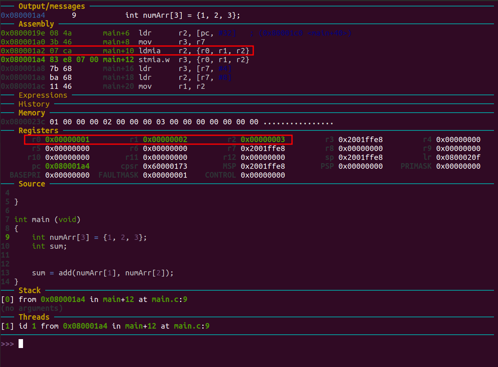

# Week6 : 함수 실행흐름 정리 및 polling 기반 GPIO, 입출력 처리 분석

질문 

1. port a가 input으로 설정을 했는데, 왜 output설정도 해주고 있는것인가?
2. pull-up pull-down을 왜 설정을 안하는지?
3. WEEK5와 WEEK6의 makefile이 다른데, week5같은 경우에는 linkerscript가 제대로 적용이 안된거 같은게 스택포인터 값 자체가 안바꼈다. 왜?

​		

main.c

```c
int main()
{
    int numArr[10] = {11, 22, 33, 44, 55, 66, 77, 88, 99, 110};
    int add;
    int sub;
    int multiply;


    add = numArr[0] + numArr[1];
    sub = numArr[3] - numArr[2];
    multiply = numArr[4] * numArr[5];
}
```


1. Main문 BreakPoint 설정 후 시작
   

   - `push {r7, lr}`

     - push를 통해 현재 lr, r7를 백업한다. 백업해놓는 이유는 레지스터 백업을 해놓으면 다시 데이터 값을 사용할 수 있다. 레지스터 개수가 한정적이기 때문에 이 방법을 사용한다. 이 후에는 pop을 통해 fp로 돌아와서 데이터 값을 복구한다. lr은 코드 메모리 우ㅟ치이다. 

   - `sub sp, #16` 

     - stack pointer의 주소에 -16를 하는 이유는 원래 저장되어 있던 값들을 건들지 않고 사용하겠다는 것이다. 
     - LinkerScript.ld 0x20020000로 설정해놨고, 0x2001f9 - 0x11 = 0x2001ffe8이 나온것이다. 

   - `add r7, sp, #0`

     - add를 통해 레지스터 r7에 -16을 한 값을 저장해줬다.

     

2. 초기 stack 세팅
   
   - `ldr r2, [pc, #32]`
     - r2에 현재 PC값 + 32 한 값을 저장하였다. 
     - 왜?
   - `mov r3, r7`
     - mov를 한 이유는 레지스터의 개수가 충분하지 않으면 이렇게 data memory에 백업을 해야 된다.
       
3. ldmia를 통해 레지스터에 값 저장 (use for popping data from Full Descending stacks)
   

4. stmia.w를 통해 레지스터에 있는 값을 Stack에 저장했다.
   
5. 

## GPIO Blink Example

### 1. Clock이란?

- Clock은 내부/외부 또는 Low/High Speed의 분류에 따라 HSE, HSI, 또는 LSE, LSI로 구분할 수 있다.

- External 오실레이터의 필요성

  - HSI보다 높은 정밀도, 외기 온도 변화에 적은 오차율을 지원한다.
  - 높은 Frequency를 필요로 하는 경우

- HSI/HSE 는 시스템 Clock 소스로 사용하며, LSI/LSE 는 RTC 와 Independent Watchdog 용으로 사용된다. 

  HSI/HSE 는 바로 사용되는 것이 아니라 Clock Tree 를 통해서 PLL 이나 Prescaler 를 통해서 필요한 주파수로 변경 후 사용된다. 

  - |        Clock 종류        |                             정의                             |
    | :----------------------: | :----------------------------------------------------------: |
    | HSE(High Speed External) | STM32의 외부에서 입력되는 높은 주파수의 Clock으로 PLL을 거쳐 System Clock으로 입력된다. Crystal, Resonator와 같은 발진 소자를 사용하거나 외부 Clock Source 또는 Oscillator를 사용한다. |
    | HSI(High Speed External) | STM32에 내장되어 있는 RC발진 회로로 전원 인가 시 처음 동작하는 Clock이다. 8Mhz 또는 16Mhz의 주파수를 가지고 있으며 출하 시 1% 오차율을 가지도록 Calibration된다. 그러나 RC발진회로의 특성 상 온도에 따라 오차가 발생할 수 있다. 높은 정확성을 필요로 하지  않는 제품 개발 시 Main Clock으로 사용하면 외부 Crystal을 사용하지 않아도 되기 때문에 단가를 낮출 수 있다. |
    | LSE(Low Speed External)  | RTC에 사용되는 Clock으로 정확한 시간을 맞추기 위한 용도로 사용된다. 일반적으로 32.768kHz의 Crystal을 사용한다. |
    | LSI(Low Speed Internal)  | LSI는 내장된 RC발진 회로의 Clock으로 저전력 모드에서 동작할 수 있기 때문에 Independent Watchdog와 AWU(Auto Wakeup)의 Clock으로 사용될 수 있다. 또한 RTC의Clock으로 사용될 수 있다.  HSI와 달리 오차율이 크기 때문에 RTC Clock으로 사용할 경우 정확한 시간을 맞출 수 없다. 따라서 대략적인 시간을 확인하는 용도로만 사용해야 한다. |


### 2. Code 분석	

main.c

```c
#include "STM32FDiscovery.h"
	
void clk(void)
{
	RCC_CR = 0;
	RCC_PLLCFGR = 0;
	RCC_CFGR = 0;
		
	RCC_CR |= (1<<16); // HSE set
	while( (RCC_CR & ( 1<<17) ) == 0 ); // wait until HSE ready
	
	RCC_PLLCFGR |= 8;//0x00000008; // set PLLM
	RCC_PLLCFGR |= (336<<6);//|= (336<<6); // 		set PLLN
	RCC_PLLCFGR |= (0<<16); // set PLLP
	RCC_PLLCFGR |= (7<<24);//0x07000000; // set PLLQ

	RCC_PLLCFGR |= (1<<22); // set PLL src HSE
	

	RCC_CR |= (1<<24); // PLL ON
	while( (RCC_CR & (1<<25)) == 0); // wait until PLL ready
	
	FLASH_ACR |= 5;
	RCC_CFGR |= 2; // set PLL to system clock
	
		
	while( (RCC_CFGR & (12) ) != 8); // wait until PLL ready
	
	RCC_CFGR |= (1<<12) | (1<<10); // set APB1 div 4
	RCC_CFGR |= (1<<15); // set APB2 div2	
}

void TIM2_IRQHandler() {

}

int main (void)
{
	
	clk();
	
	RCC_CFGR |= 0x04600000;

    /* PORT A */
	RCC_AHB1ENR  |= 1<<0; //RCC clock enable register	
    GPIOA_MODER  |= 0<<0; // input mode
    GPIOA_OTYPER |= 0<<0; // output push-pull
    GPIOA_PUPDR  |= 0<<0; // no pull-up, pull-down
	
	/* PORT D */
	RCC_AHB1ENR  |= 1<<3;		// PORTD enable
	GPIOD_MODER  |= 1<<24;		// PORTD 12 general output mode
	GPIOD_MODER  |= 1<<26;		// PORTD 13 general output mode
	GPIOD_MODER  |= 1<<28;		// PORTD 14 general output mode
	GPIOD_MODER  |= 1<<30;		// PORTD 15 general output mode
	GPIOD_OTYPER |= 0x00000000;
	GPIOD_PUPDR	 |= 0x00000000;
	
	GPIOD_ODR |= 1<<12;

	while(1) {
        if( GPIOA_IDR & 0x00000001 ) {
            GPIOD_ODR ^= 1 << 13;
            GPIOD_ODR ^= 1 << 14;
            GPIOD_ODR ^= 1 << 15;
        }
	}
}
```


- ```c
  RCC_CFGR |= 0x04600000
  ```


  

  - 0000 0100 0110 0000 0000 0000 0000 0000 -> 26 22 21

  - MCO1 PRE[2:0] = 100
    - 0xx: no division
      100: division by 2
      101: division by 3
      110: division by 4
      111: division by 5
    - 100이 설정되었다. 
      - MCO1PRE는 클럭을 나눠쓸 때 사용된다. 클럭 스피드가 너무 빠른 경우 나눠서 사용한다. Hardware 타이머 속도가 너무 빨라서 prescaler를 사용하여 클럭 스피드를 낮춰서 사용.
  - MCO1(Microcontroller clock output) = 11
    - 00: HSI clock selected
      01: LSE oscillator selected
      10: HSE oscillator clock selected
      11: PLL(Phase-Locked Loop) clock selected
    - PLL clock(위상 고정 회로)로 선택을 하였다. 현재 우리가 사용하고 있는 모든 프로세서들은 클럭을 기준으로 동작하게 되어 있다. 따라서 프로세서 동작에 있어서 클럭의 품질은 상당히 중요한 부분이 된다. 

- ```c
      /* PORT A */
  	RCC_AHB1ENR  |= 1<<0; //RCC clock enable register	
      GPIOA_MODER  |= 0<<0; // input mode
      GPIOA_OTYPER |= 0<<0; // output push-pull
      GPIOA_PUPDR  |= 0<<0; // no pull-up, pull-down
  ```

  - **RCC_AHB1ENR(RCC AHB1 peripheral clock register)**

    - 
    - **GPIOAEN :** IO port A clock enable
      This bit is set and cleared by software.
      0 : IO port A clock disabled
      1 : IO port A clock enabled
    - RCC_AHB1ENR LSB bit를 0에서 1로 바꿔줌으로써 IO port A의 clock을 enable 시켜 줬다. 
      

  - **GPIOx_MODER (GPIO Port Mode Register)**

    - 

    - **MODERy[1:0]:** Port x configuration bits (y = 0..15)
      These bits are written by software to configure the I/O direction mode.
      00: Input (reset state)
      01: General purpose output mode
      10: Alternate function mode
      11: Analog mode
    - GPIOA_MODER LSB bit를 0으로 설정함으로써 GPIO A 모드를 Input 모드로 설정
      

  - **GPIOA_OTYPER(GPIO port output type register)**

    - 

    - **OTy :** Port x configuration bits (y = 0..15)
      These bits are written by software to configure the output type of the I/O port.
      0: Output push-pull (reset state)
      1: Output open-drain

    - GPIOA_OTYPER LSB bit를 0으로 설정함으로써 Port A output type를 push-pull 모드로 설정(

    - [push는 1, pull는 0](https://irmus.tistory.com/76)

      - 
      - 두개의 스위치 중 아래쪽 스위치를 ON 시키면 output port는 GND와 바로 연결된다. 즉, Output port를 GND쪽으로 끌어내린 것으로 0V가 출력된다. 반면 위쪽 스위치를 ON 시키면 VCC와 연결되어 high가 출력된다. VCC쪽으로 밀어 올린 것이다.

    - open-drain Output 여러 개의 Output를 묶어서 사용할 때 사용한다. 여러 개의 다바이스를 하나의 연결선으로 양방향 통신할 수 있도록 하는 회로 기술이다. 

      - 
      - 그림과 같이 drain부분에 아무것도 연결되지 않을 것을 open drain이라고 한다. 모스펫을 스위치 역할로 생각을 하면 gate 버튼을 눌러서 트랜지스터가 on상태가 되면 drain과 source가 붙고, 트랜지스터가 off가 되면 drain과 source가 떨어지게 된다.
      - 따라서 입력으로 High 신호가 들어오면 트랜지스터는 On 상태가 되면서 출력이 그라운드와 연결되기 때문에 Low가 출력된다. 반대로 입력으로 Low 신호가 들어오면 트랜지스터는 Off 상태가 되고 출력은 저항값이 높은 Hi-Impidence 상태가 되는데 Hi-Impidence상태는 Low나 High값을 가지지 않는 끊어진 회로를 의미한다.
      - 
      - 그래서 달아주는게 바로 풀업저항(Pull-up Resistor)이다. 위 회로에서 보시다시피 출력에 풀업저항을 달아주면 출력을 High값이 나오도록 해서 트랜지스터가 OFF시에 High를 유지할 수 있도록 도와준다.
      - **오픈컬렉터의 경우 풀업저항으로 인해 입력이 Low이더라도 High값을 가지고 트랜지스터에 의해 연결이 끊어진 상태**가 됩니다. 이러한 이유때문에 여러개의 디바이스가 연결되어도 신호의 충돌이 생기지 않고 여러개의 디바이스를 연결하여 양방향 Data 전송이 가능해진다.

      

  - **GPIOA_PUPDR(GPIO port pull-up/pull-down register)**

    - 

    - 

    - **PUPDRy[1:0] :** Port x configuration bits (y = 0..15)
      These bits are written by software to configure the I/O pull-up or pull-down
      00: No pull-up, pull-down
      01: Pull-up
      10: Pull-down
      11: Reserved

    - GPIOA_PUPDR LSB bit를 0으로 설정함으로써 GPIO에 pull-up과 pull-down를 사용하지 않겠다고 설정하였다.

    - 왜 사용하지 않는 것인가?

      

- ```c
  GPIOD_ODR |= 1<<12;
  ```

  - **GPIOx_ODR(GPIO port output data register)**

    - 

    - PORTD의 12번을 1로 설정해줌으로써 LED 초록색을 계속 점등해 준다.

      - 

        
        

- ```c
  while(1) {
      if( GPIOA_IDR & 0x00000001 ) {
          GPIOD_ODR ^= 1 << 13;
          GPIOD_ODR ^= 1 << 14;
          GPIOD_ODR ^= 1 << 15;
      }
  }
  ```
  - **GPIOx_IDR(GPIO port input data register)**
    - 
      
    - GPIOA_IDR & 0x00000001 -> PORTA의 0번이 버튼인데, 버튼이 눌리게 되면 GPIOA 레지스터 값이 0x00000001이 되기 때문에 밑에 있는 GPIO_ODR가 실행이 된다.

- ```c
  GPIOD_ODR ^= 1 << 13;
  GPIOD_ODR ^= 1 << 14;
  GPIOD_ODR ^= 1 << 15;
  ```

  - 주황색(13), 적색(14), 파란색(15)를 XOR(^=) 연산을 통해 켜준다.
    
  - 버튼을 한번 더 누르고 진행하면 XOR 연산이기 때문에 차례대로 꺼진다.

