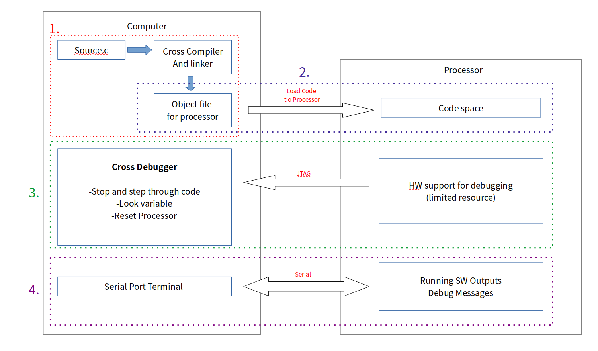

# WEEK7

### 1. 디버그(Debug)란?

#### [**디버그(debug)란**](http://www.ktechno.co.kr/embedded/embedded03.html)

------

- 소프트웨어를 작성하는 데, 반드시 발생하는 것은 버그이다. 
- 사람이 개발을 하고 있기 때문에 프로그램의 오류는 무조건 발생한다 생각하면 된다.
- 고급언어의 구문기술 오류 같은 경우 컴파일 단계에서 오류를 확인 할 수 있지만 프로그램의 구조상의 오류는 눈치를 챌 수가 없다. 
- 개발자는 분명 자기가 짠 대로 코드를 실행하면 하드웨어적으로 생각했던 것처럼 구동해야 된다고 생각을하고 개발을 하지만
  프로그램 안에 하드웨어가 어떻게 동작하는 것을 확인하기 위해 디버거를 사용한다.

#### **디버거(debugger)의 기본 기능**

------

- 일반적으로 임베디드용 CPU는 아무리 느려도 수 MHz의 클록 주파수로 동작한다. 
- 기계어 레벨로 기계어 레벨로 1초 동안에 수만 명령은 실행해 버린다. "어? 지금 무언가 이상한 동작을 하지 않았는가?" 하고 생각해도, 눈 깜짝할 순간에 실행되어 버린다.
- 그래서 보통 디버거를 사용할 때 세팅은 break point 설정 -> continue -> si(instruction마다 실행), n(c 코드 한 줄씩 실행)
- 이렇게 강제적으로 break point를 설정하고 프로그램의 실행을 멈추고 값을 확인하려는 변수를 지정하면 그 값을 표시하는 기능을 워치 기능이라 부른다.
- 어셈블리어도 확인 할수 있다.
- 변수 안에 있는 값을 볼 수 있다. 
- Register가 어떻게 활용되는 지 확인할 수 있다. 

#### **임베디드 기기 개발용 디버거 종류**

------

**ICE(In Circuit Emulator) 디버거**

- CPU 자체를 치환하고, CPU의 동작을 흉내내어(에뮬레이션) 프로그램의 동작을 조사할 수 있는 툴이다. 
- ICE 본체와 호스트 사이는 전용 인터페이스나 Ethernet, 최근에는 USB 등을 사용하여 접속한다. **(우리 실습때는 USB)**
- 또, CPU의 동작을 흉내낼 뿐만 아니라, 타겟 CPU 보드상의 ROM이나 RAM도 ICE 본체에 내장(에뮬레이션 메모리)하거나 CPU가 명령을 실행한 주소를 유지하고(트레이스 메모리), 그것을 표시하는 기능 등을 실장한 ICE를, CPU 동작의 모든 기능을 서포트할 있는 ICE 라고 하는 의미로 풀 ICE라고 부르는 경우 있다. 그림 8에 ICE의 구성을, 사진 1에 풀 ICE 디버거의 예를 나타낸다.

Computer로 Processor가 동작하는 것을 확인하기 위해선 Debugger를 사용해야 한다. 

Debugger를 쓰지 않고 Processor를 동작시킨다는 것은 블랙박스와 같다고 생각하면 된다. 동작을 시켰지만 내부에서 어떤 형식으로 구동이 되는지 모르는 것이다. 

Debugging를 하기 위해선 다음과 같은 순서를 따라야 한다. 

1. Cross Compilation
   - Code Memory에 넣어야 하는 object file를 Compile를 통해 만들어 준다. 
   - 코드에서 int a[100]를 선언하면 Code memory 공간에 자리를 잡는 것이 아닌 Stack, 즉 Data Memory에 100개 정도의 word자리를 만들어 주는 것이다.
2. Programming
   - object file을 첫번째 단계를 통해 만든 후 Processor의 Code Space에 적재
3. Debugging
   - HW support for debugging은 ICE(In-Circuit Emulator)를 얘기한다.
   - ICE가 잇는 경우 
4. Communication