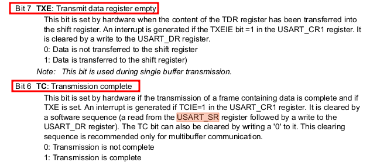

# WEEK7

질문

1. 왜 CR1, CR2를 설정하는 것인가? CR2에서는 
2. NVIC_ISER1      |= 1<<6; , #define NVIC_ISER1 *(volatile unsigned *)0xE000E104
3. 

### 1. 디버그(Debug)란?


#### [**디버그(debug)란**](http://www.ktechno.co.kr/embedded/embedded03.html)

------


- 소프트웨어를 작성하는 데, 반드시 발생하는 것은 버그이다. 
- 사람이 개발을 하고 있기 때문에 프로그램의 오류는 무조건 발생한다 생각하면 된다.
- 고급언어의 구문기술 오류 같은 경우 컴파일 단계에서 오류를 확인 할 수 있지만 프로그램의 구조상의 오류는 눈치를 챌 수가 없다. 
- 개발자는 분명 자기가 짠 대로 코드를 실행하면 하드웨어적으로 생각했던 것처럼 구동해야 된다고 생각을하고 개발을 하지만
  프로그램 안에 하드웨어가 어떻게 동작하는 것을 확인하기 위해 디버거를 사용한다.


#### **디버거(debugger)의 기본 기능**

------


- 일반적으로 임베디드용 CPU는 아무리 느려도 수 MHz의 클록 주파수로 동작한다. 
- 기계어 레벨로 기계어 레벨로 1초 동안에 수만 명령은 실행해 버린다. "어? 지금 무언가 이상한 동작을 하지 않았는가?" 하고 생각해도, 눈 깜짝할 순간에 실행되어 버린다.
- 그래서 보통 디버거를 사용할 때 세팅은 break point 설정 -> continue -> si(instruction마다 실행), n(c 코드 한 줄씩 실행)
- 이렇게 강제적으로 break point를 설정하고 프로그램의 실행을 멈추고 값을 확인하려는 변수를 지정하면 그 값을 표시하는 기능을 워치 기능이라 부른다.
- 어셈블리어도 확인 할수 있다.
- 변수 안에 있는 값을 볼 수 있다. 
- Register가 어떻게 활용되는 지 확인할 수 있다. 


#### **임베디드 기기 개발용 디버거 종류**

------

**ICE(In Circuit Emulator) 디버거**

- In-circuit emulation(ICE)은 하드웨어 장치 또는 in-circuit emulator를 사용하여 소프트웨어를 디버그하는 데 사용된다. 
- ICE 본체와 호스트 사이는 전용 인터페이스나 Ethernet, 최근에는 USB 등을 사용하여 접속한다. **(우리 실습때는 USB)**
- 에뮬레이터는 임베디드 시스템 컴퓨터의 중앙 처리 장치 (CPU)를 Emulator(모방)하기 때문에 이름을 얻는다. 전통적으로 CPU 통합 회로 칩이 배치되는 소켓에 삽입되는 플러그가 있었다. 대부분의 최신 시스템은 특수 JTAG 기반 디버그 액세스와 함께 대상 시스템의 CPU를 직접 사용합니다. 프로세서를 에뮬레이션하거나 JTAG에 직접 액세스하면 ICE가 프로세서가 할 수있는 모든 작업을 수행 할 수 있지만 소프트웨어 개발자의 통제하에 있습니다.
- 

**JTAG**

- 


#### Programming MCU using ICE(In-circuit Emulator)

------


Computer로 Processor가 동작하는 것을 확인하기 위해선 Debugger를 사용해야 한다. 

Debugger를 쓰지 않고 Processor를 동작시킨다는 것은 블랙박스와 같다고 생각하면 된다. 동작을 시켰지만 내부에서 어떤 형식으로 구동이 되는지 모르는 것이다. 

Debugging를 하기 위해선 다음과 같은 순서를 따라야 한다. 


1. Cross Compilation
   - Code Memory에 넣어야 하는 object file를 Compile를 통해 만들어 준다. 
   - 코드에서 int a[100]를 선언하면 Code memory 공간에 자리를 잡는 것이 아닌 Stack, 즉 Data Memory에 100개 정도의 word자리를 만들어 주는 것이다.
2. Programming
   - object file을 첫번째 단계를 통해 만든 후 Processor의 Code Space에 적재
3. Debugging
   - HW support for debugging은 ICE(In-Circuit Emulator)를 얘기한다.
   - ICE가 있는 경우 Processor
   - openocd가 
4. Communication
   -  Processor의 SW output message를 Serial 통신을 통해 컴퓨터에서 확인한다.  

| 이름             | 기능                                                         |
| ---------------- | ------------------------------------------------------------ |
| Application      | - printf, scanf, malloc 등 System API Call 이용<br />- window에서나 OS에서만 구동된다. <br />- System fuction 사용한다.<br />- 실행파일 다른 OS에 넣으면 안된다. <br />- 다른 OS에 넣을 경우 C로 짠거 Recompile 해주면 된다. |
| Operating System | - Firmware에서 제공하는 기계함수를 호출 (display 제어, 입력 키보드 제어)<br />- Function API (win32, POSIX(Portable Operating System Interface)) |
| Firmware         | - 실제로 하드웨어 존재하는 자원에 접근하여 하드웨어 동작 시킨다. <br />- Device Driver |
| Hardware         | - 마지막은 Circuit으로 구현된 시스템<br />- SW가 1,0을 회로에 전달하게 되고 그것에 따라 출력을 생성 |


### 2. UART(USART)

#### 1. UART(USART)란?

- 직렬 통신 프로토콜

- 시리얼 통신을 사용하기 위해서는 보내는 쪽(Tx)와 받는 쪽(Rx)에서 약속을 정해야 하는데, 이를 프로토콜(Protocol)이라고 한다.

- MCU에서는 0과 1의 값만을 처리할 수 있으므로 0은 GND, 1은 VCC로 데이터를 전송하고,

- 받는 쪽에서는 GND와 VCC를 다시 0과 1의 이진값으로 변환하여 사용한다. 

- 보내는 쪽(TX)와 받는 쪽(RX)이 원할하게 데이터를 교류하려면, 데이터를 보내는 속도에 대하여

  약속(프로토콜, Protocol)이 정해져 있어야 한다.

- UART에서는 보내는 쪽(TX)와 받는 쪽(RX)에서 데이터를 보내는 속도를 **보율(baud rate)**로 정하고 있다.

- 

- UART에서는 **'0'의 시작 비트 (Start bit)**와 **'1'의 정지 비트(Stop bit)**를 사용한다. 

- UART는 바이트 단위 통신을 주로 사용하며, 시작 비트(start bit)와 정지 비트(stop bit)가 추가되어,

  **10비트 데이터를 전송**하는것이 일반적이다. (**패리티 비트를 사용하지 않을 경우에**)

- 

- UART 통신은 **전이중 방식(full duplex)** 통신으로 송신과 수신을 동시에 진행할 수 있으며, 이를 위해서

  2개의 범용 입출력 핀이 필요하다.(시리얼포트 -> TX, RX)


#### 2. USART 실습

```c
#include "STM32FDiscovery.h"

unsigned char rec;
unsigned int count = 0;

unsigned int uart_data[423]= {
32, 32, 32, 32, 32, 32, 32, 32, 32, 32, 
32, 95, 95, 95, 95, 95, 32, 32, 32, 32, 
32, 32, 95, 95, 95, 95, 95, 32, 95, 95, 
95, 32, 32, 32, 32, 32, 32, 32, 32, 95, 
95, 95, 95, 95, 32, 32, 32, 95, 32, 32, 
32, 32, 32, 32, 32, 32, 32, 32, 32, 32, 
32, 32, 32, 95, 95, 95, 95, 32, 32, 10, 
32, 32, 32, 32, 32, 47, 92, 32, 32, 32, 
124, 95, 32, 32, 32, 95, 124, 32, 32, 32, 
32, 47, 32, 95, 95, 95, 95, 124, 95, 95, 
32, 92, 32, 32, 32, 32, 32, 32, 47, 32,
95, 95, 95, 95, 124, 32, 124, 32, 124, 32, 
32, 32, 32, 32, 32, 32, 32, 47, 92, 32,
32, 32, 124, 32, 32, 95, 32, 92, 32, 10, 
32, 32, 32, 32, 47, 32, 32, 92, 32, 32,
32, 32, 124, 32, 124, 95, 95, 95, 95, 95,
124, 32, 40, 95, 95, 95, 32, 32, 32, 32,
41, 32, 124, 95, 95, 95, 32, 124, 32, 124, 
32, 32, 32, 32, 32, 32, 124, 32, 124, 32, 
32, 32, 32, 32, 32, 32, 47, 32, 32, 92, 
32, 32, 124, 32, 124, 95, 41, 32, 124, 10, 
32, 32, 32, 47, 32, 47, 92, 32, 92, 32, 
32, 32, 124, 32, 124, 95, 95, 95, 95, 95,
95, 92, 95, 95, 95, 32, 92, 32, 32, 47, 
32, 47, 47, 32, 95, 32, 92, 124, 32, 124, 
32, 32, 32, 32, 32, 32, 124, 32, 124, 32, 
32, 32, 32, 32, 32, 47, 32, 47, 92, 32, 
92, 32, 124, 32, 32, 95, 32, 60, 32, 10, 
32, 32, 47, 32, 95, 95, 95, 95, 32, 92, 
32, 95, 124, 32, 124, 95, 32, 32, 32, 32, 
32, 95, 95, 95, 95, 41, 32, 124, 47, 32, 
47, 124, 32, 40, 95, 41, 32, 124, 32, 124, 
95, 95, 95, 95, 32, 32, 124, 32, 124, 95, 
95, 95, 95, 32, 47, 32, 95, 95, 95, 95, 
32, 92, 124, 32, 124, 95, 41, 32, 124, 10, 
32, 47, 95, 47, 32, 32, 32, 32, 92, 95, 
92, 95, 95, 95, 95, 95, 124, 32, 32, 32, 
124, 95, 95, 95, 95, 95, 47, 124, 95, 95, 
95, 95, 92, 95, 95, 95, 47, 32, 92, 95, 
95, 95, 95, 95, 124, 32, 124, 95, 95, 95, 
95, 95, 95, 47, 95, 47, 32, 32, 32, 32, 
92, 95, 92, 95, 95, 95, 95, 47, 32, 10,
10, 10, 10};                                //to Send data to computer


void clk(void)
{
	RCC_CR = 0;
	RCC_PLLCFGR = 0;
	RCC_CFGR = 0;
		
	RCC_CR |= (1<<16); // HSE set
	while( (RCC_CR & ( 1<<17) ) == 0 ); // wait until HSE ready
	
	RCC_PLLCFGR |= 8;//0x00000008; // set PLLM
	RCC_PLLCFGR |= (336<<6);//|= (336<<6); // 		set PLLN
	RCC_PLLCFGR |= (0<<16); // set PLLP
	RCC_PLLCFGR |= (7<<24);//0x07000000; // set PLLQ

	RCC_PLLCFGR |= (1<<22); // set PLL src HSE
	

	RCC_CR |= (1<<24); // PLL ON
	while( (RCC_CR & (1<<25)) == 0); // wait until PLL ready
	
	FLASH_ACR |= 5;
	RCC_CFGR |= 2; // set PLL to system clock
	
		
	while( (RCC_CFGR & (12) ) != 8); // wait until PLL ready
	
	RCC_CFGR |= (1<<12) | (1<<10); // set APB1 div 4
	RCC_CFGR |= (1<<15); // set APB2 div2	
}

void set_uart2() {
    //USART GPIO PIN PA2(TX), PA3(RX)
    RCC_AHB1ENR     |= 1<<0;                //Clock Enable
    GPIOA_MODER     |= (1<<5) | (1<<7);     //Alternative Function Mode Set
    GPIOA_AFRL      |= (7<<8) | (7<<12);    //

    //SET USART2
    RCC_APB1ENR     |= (1<<17);             //USART2 CLK ENABLE
    USART2_CR1      |= (0<<12);             //CONTROL REGISTER CHARACTER 1BYTE SO 8 BIT USE
    USART2_CR2      |= (0<<13) | (0<<12);   //STOP BIT SET 1

    USART2_BRR      |= (unsigned int)(42000000/115200);     //0x115200 -> 42000000

    USART2_CR1      |= (1<<3) | (1<<2);     //TX,RX ENABLE
    USART2_CR1      |= (1<<5);              //ALSO USART CAN USE PULL UP, PULL DOWN, TXE(DATA FLAG, IS IT IN?) RXNE(RX NOT EMPTY FLAG) WHEN THE BUFFER GET THE VALUE, RXNE BECOME 1
    USART2_CR1      |= (1<<13);

    //USART INTERRUPT ENABLE
    NVIC_ISER1      |= 1<<6;                //BECAUSE WE ADD NEW NVIC_ISER1 AND IT START AT 32, SO 38-32 = 6
    
}

void USART2_IRQHandler() {
    if( USART2_SR & (1<<5) ) 
    {
        rec = USART2_DR;                //Data Register 
       //after getting the input, we return the data to dr and print 
        USART2_DR = rec;
        while( !(USART2_SR & (1<<7)) );
        while( !(USART2_SR & (1<<6)) );
        GPIOD_ODR ^= 1<<12;              //To see the data is in

        USART2_CR1 |= (1<<5);           //After interrupt SR be 0 and we need to turn the interrupt on

    }
}

void EXTI0_IRQHandler() {

    GPIOD_ODR ^= 1 << 13;
    GPIOD_ODR ^= 1 << 14;
    GPIOD_ODR ^= 1 << 15;

    EXTI_PR |= 1<<0;    // clear pending bit for EXTI0
}


int main (void)
{
	
	clk();
	
	RCC_CFGR |= 0x04600000;

    /* PORT A */
	RCC_AHB1ENR  |= 1<<0; //RCC clock enable register	
    GPIOA_MODER  |= 0<<0; // input mode
    GPIOA_OTYPER |= 0<<0; // output push-pull
    GPIOA_PUPDR  |= 0<<0; // no pull-up, pull-down

    /* button intr set */
    SYSCFG_EXTICR1 |= 0<<0; //EXTI0 connect to PA0
    EXTI_IMR       |= 1<<0; //Mask EXTI0
    EXTI_RTSR      |= 1<<0; //risign edge trigger enable
    EXTI_FTSR      |= 0<<0; //falling edge trigger disable
    NVIC_ISER0     |= 1<<6; // enable EXTI0 interrupt
	
	/* PORT D */
	RCC_AHB1ENR  |= 1<<3;		// PORTD enable
	GPIOD_MODER  |= 1<<24;		// PORTD 12 general output mode
	GPIOD_MODER  |= 1<<26;		// PORTD 13 general output mode
	GPIOD_MODER  |= 1<<28;		// PORTD 14 general output mode
	GPIOD_MODER  |= 1<<30;		// PORTD 15 general output mode
	GPIOD_OTYPER |= 0x00000000;
	GPIOD_PUPDR	 |= 0x00000000;
	
	GPIOD_ODR |= 1<<12;

    set_uart2();
    while(count < 423)
    {
        USART2_DR = uart_data[count++];
        while( !(USART2_SR & (1<<7)) );
        while( !(USART2_SR & (1<<6)) );
    }                                   //1byte send, when 

	while(1) 
    {
//        if( GPIOA_IDR & 0x00000001 ) {
//            GPIOD_ODR ^= 1 << 13;
//           GPIOD_ODR ^= 1 << 14;
//            GPIOD_ODR ^= 1 << 15;
//        }
	}
}
```


```c
void set_uart2() {
    //USART GPIO PIN PA2(TX), PA3(RX)
    RCC_AHB1ENR     |= 1<<0;                //Clock Enable
    GPIOA_MODER     |= (1<<5) | (1<<7);     //Alternative Function Mode Set
    GPIOA_AFRL      |= (7<<8) | (7<<12);    //

    //SET USART2
    RCC_APB1ENR     |= (1<<17);             //USART2 CLK ENABLE
    USART2_CR1      |= (0<<12);             //CONTROL REGISTER CHARACTER 1BYTE SO 8 BIT USE
    USART2_CR2      |= (0<<13) | (0<<12);   //STOP BIT SET 1

    USART2_BRR      |= (unsigned int)(42000000/115200);     //0x115200 -> 42000000

    USART2_CR1      |= (1<<3) | (1<<2);     //TX,RX ENABLE
    USART2_CR1      |= (1<<5);              //ALSO USART CAN USE PULL UP, PULL DOWN, TXE(DATA FLAG, IS IT IN?) RXNE(RX NOT EMPTY FLAG) WHEN THE BUFFER GET THE VALUE, RXNE BECOME 1
    USART2_CR1      |= (1<<13);

    //USART INTERRUPT ENABLE
    NVIC_ISER1      |= 1<<6;                //BECAUSE WE ADD NEW NVIC_ISER1 AND IT START AT 32, SO 38-32 = 6
    
}
```


1. USART Interrupt를 구현하기 위해 3 Pinouts and pin description의 **STM32F40xxx pin and ball definitions (47pages)**에 들어가서 USART2 Tx,Rx를 찾았다.

   

2. Port A에 Clock를 Enable하기 위해 RCC_AHB1ENR의 맨 마지막 비트를 1로 shift해줬다. 
   (PAGE 180, **6.3.10 RCC AHB1 peripheral clock register (RCC_AHB1EDNR)**)

   `RCC_AHB1ENR     |= 1<<0 `

   

3.  MODER2, MODER3(PA2, PA3) 10으로 Bit Setting해줌으로써, Alternative Function Mode Set 해준다.

   (PAGE 281, **8.4.1 GPIO port mode register (GPIOx_MODER) (x=A..I/J/K)**)
   `GPIOA_MODER     |= (1<<5) | (1<<7)`

   

   

4. GPIOA_AFRL
   (PAGE 285, **8.4.9 GPIO alternate function low register (GPIOx_AFRL) (x = A..I/J/K)**)

   `GPIOA_AFRL      |= (7<<8) | (7<<12)`
   

5. USART Clock이 Sleep Mode일때도 Enable되게 하기 위해 1를 17번 shift해줬다.
   (PAGE 193, **6.3.18 RCC APB1 peripheral clock enable in low power mode register (RCC_APB1LPENR)**)
   `RCC_APB1ENR     |= (1<<17)`

   

6.  USART의 Control Register Bit12번을 0으로 Setting함으로써 USART Data Bit 길이를 8bit로 설정하였다.

   `USART2_CR1      |= (0<<12)`
   
   
   

7. USART의 통신 속도를 지정하였다. 
   `USART2_BRR      |= (unsigned int)(42000000/115200) `
   

   

8. CR1(Control Register)의 Bit 2(Transmitter Enable), 3(Receiver Enable)를 1로 enable하여 수신과 송신을 가능하게 하였다.  Bit 5번 (RX Not Empty interrupt Enable)을 enable하여 버퍼에 값을 수신하면 RXNE는 1이 된다. Bit 13번을 1로 Enable 하여 USART를 Enable하였다. 

   ```c
   USART2_CR1      |= (1<<3) | (1<<2);     //TX,RX ENABLE
   USART2_CR1      |= (1<<5);
   USART2_CR1      |= (1<<13);
   ```

   

9. STM32FDiscovery.h에 `#define NVIC_ISER1 *(volatile unsigned *)0xE000E104` 설정하였다. (이유). 
   `NVIC_ISER1      |= 1<<6 `

   

   ```c
   void USART2_IRQHandler() 
   {
       if( USART2_SR & (1<<5) ) 
       {
           rec = USART2_DR;                //Data Register 
          //after getting the input, we return the data to dr and print 
           USART2_DR = rec;
           while( !(USART2_SR & (1<<7)) );
           while( !(USART2_SR & (1<<6)) );
           GPIOD_ODR ^= 1<<12;              //To see the data is in
   
           USART2_CR1 |= (1<<5);           //After interrupt SR be 0 and we need to 		 turn the interrupt on
       }
   }
   ```

   

10. USART2_SR의 5번 bit RXNE가 1이 된다면 data가 읽는 준비가 되었다는 것이다. 
    `if( USART2_SR & (1<<5) )`

    

11. data를 읽을 준비가 되어서 rec이라는 unsigned char를 만들어서(stack공간)
    USART2_DR[8:0], 8bit만큼 데이터 값을 받았다. 
    데이터시트를 참고하면 USART2_SR 비트 5번이 바로 0이 된다. 
    "It is  cleared by a read to the USART_DR register" 
    5번이 0이 되서 USART2_DR의 데이터 값이 사라진다????????
    사라진 DR의 데이터값을 다시 USART2_DR에 넣어 주고,

    

    ```c
    rec = USART2_DR;   //Data Register 
    USART2_DR = rec;   //after getting the input, we return the data to dr and print 
    ```

    

12. USART2_SR의 Bit 7번과 6번은 데이터 전송이 완료되면 1이 되면서 무한루프를 나가게 된다.
     LED를 XOR를 통해 데이터를 송신할때 마다 껐다켰다 한다. 

    ```c
    while( !(USART2_SR & (1<<7)) );
    while( !(USART2_SR & (1<<6)) );
    GPIOD_ODR ^= 1<<12;              //To see the data is in
    USART2_CR1 |= (1<<5);
    ```

    

13. main문에서 위에서 선언한 set_uart2()를 불러옴으로써 USART2의 기본 세팅을 완료하였고, while문을 통해 uart_data[count]에 있는 데이터들을 USART2_DR에 넣어주고 Serial Monitor에 출력되게 만들었다.

    ```c
    set_uart2();
    while(count < 423)
    {
        USART2_DR = uart_data[count++];
        while( !(USART2_SR & (1<<7)) );
        while( !(USART2_SR & (1<<6)) );
    }
    ```

    

### 2. 구현 미션

처음 해준 작업은 Makefile에 쉽게 serial monitoring하기 위해 명령어를 추가해줬다.

```c
serial:
	gtkterm -p /dev/ttyUSB0 -s 115200
```


```
/*********************************/
/* LED CONTROL SHELL FOR STM32F4 */
/*********************************/
```

1. 위에 있는 텍스트 문자를 ASCII코드로 변환하여 uart_data에 입력하였는데 에러가 떴다. 그래서 공백을 줄바꿈으로 바꿔 보겠다. 줄바꿈을 하여도 에러가 떴다. 
   


2. 배열을 0으로 다 초기화했는데도 불구하고 이러한 에러가 발생하였다.  
   

3. 확인해보니 main문에서의 `while(count < 숫자) `부분을 고치지 않았다. 멍청했다..
   

4. help라는 명령어를 치면 메뉴얼이 나올 수 있게 만들었다. 