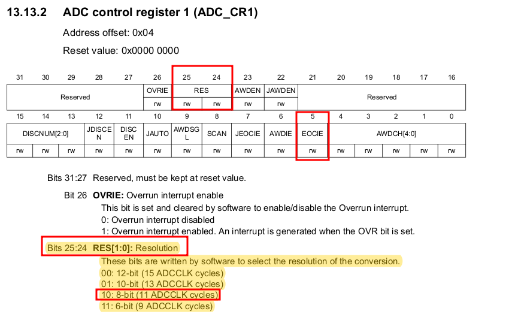
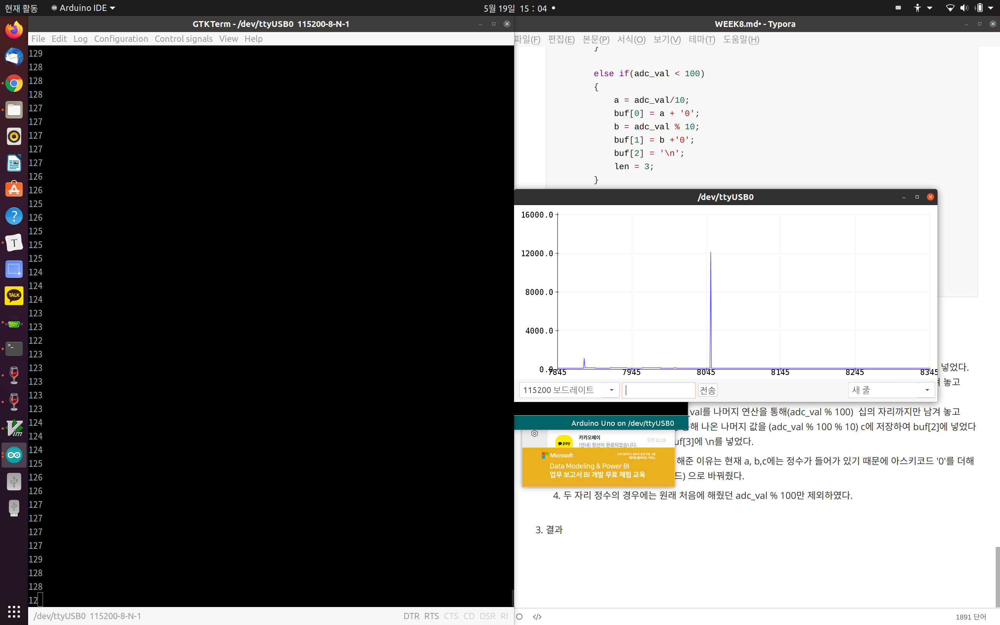

## 1. ADC 구동 과정

1. STM32f4.h 헤더파일에 reference에 따라 ADC 구조체 선언했다.
   
   

   

2. 주소를 설정해줬다.

   
   

3. ```c
   void set_adc1() {
       RCC_AHB1ENR |= 0x00000001;          //RCC clock Enable
       GPIOA_MODER |= 3<<2;                //PA1 analog mode
       RCC_APB2ENR |= 1<<8;                //ADC1 Clock Enable
       RCC_CFGR    |= 1<<15 | 1<<13;       // set APB2 div4 = 42MHz (no need to know)
   
       ADC1_CR2    |= 1<<0;                //ADC1 enable
   
       ADC1_SMPR2  |= 3<<0;                // channel 1 sampling cycle 56 cycle
       ADC1_CR1    |= 2<<24 | 1<<5;        //8-bit resolution
                                           // end of-conversion interrupt enable
   
       ADC1_CCR    |= 1<<16;               // PCLK2 div 4 no need to know
       ADC1_SQR1   |= 0<<20;               // channel 1 : 1 conversion
       ADC1_SQR3   |= 1<<0;                // 1st conversion : channel
   
       NVIC_ISER0  |= 1<<18;               // enable intterupt
   
   }
   
   ```

   1. PA1를 사용할 것이기 때문에 OR 연산자를 통해 마지막 비트를 Enable시켜준다. 
      `RCC_AHB1ENR |= 0x00000001`

      

   2. PA1을 통해 ADC 전압을 받아오기 위해 mode를 아날로그로 세팅하였다.
      `GPIOA_MODER |= 3<<2`
      

   3. ADC1의 Clock를 Enable 해줬다. 
      `RCC_APB2ENR |= 1<<8`
      

   4. 이 부분에 대해서는 디테일 하게 알 필요 없다고 했지만 위에서 설정했던 clk의 속도를 나누기 4하였다. 
      `RCC_CFGR    |= 1<<15 | 1<<13`
      
      

   5. Enable ADC
      `ADC1_CR2    |= 1<<0`
      

   6. 자세하게 알 필요가 없다고 했지만 ADC sample time를 channel 0의 cycle를 56으로 설정하였다.
      `ADC1_SMPR2  |= 3<<0`
      

   7. ADC1_CR1 8비트 resolution은 양자화에서 y값이 [7:0] 표현, 더 디테일하게 보기 위해선 비트를 올리면 더 
      정밀해지고 하드웨어 더 일한다.

      5번 비트를 1로 Masking 하는 것은 Interrupt enable for EOC이다. 
      ADC도 interrupt가 있다. 변환이 완료 되었을 때 Interrupt 발생, 데이터가 변환 완료된 것을 확인하기 위해 사용. EOC bit가 set이 되면 interrupt가 생성된다. 
      `ADC1_CR1    |= 2<<24 | 1<<5`
      

   8. ADC prescaler를 01로 설정하여 PCLK2를 4로 나눴다.
      `ADC1_CCR    |= 1<<16`
      

   9. d

      `ADC1_SQR1   |= 0<<20`

      

   10. d
       `ADC1_SQR3   |= 1<<0`

       

   11. d
       ``
       


9. ADC_SQR1 |= 0<<20 를 통해 ADC1에도 여러가지 채널이 있다. 이번 예제에서는 하나의 채널만 사용한다.
10. ADC_SQR3 변환 순서를 설정해주는 건데 우리는 한 채널만 사용하니 중요하지 않다.
11. 최종적으로 interrupt 사용할 수 잇게 하기 위해 인터럽트 셋업 


메인문에 가서 

set_adc1(); 호출하고 `ADC1_CR2	|= 1<<30`이것을 통해 conversion start


ADC_IRQHandler 세팅

1. ADC1_SR의 1번이 1이면 (EOC) 비트를 확인하여 1이면 인터럽트 발생

2. 0x800~~ stack메모리에 변수를 가져와야하니 변환이 완료된 데이터를 받을 걸 만든다. 
   unsigned char adc_val; 선언

3. 읽은 데이터는 숫자로 받았는데 usart로 보낼라면 문자로 보내야 한다. 8bit로 나타낼수 있는 큰 수가 255.
   이 수를 문자로 바꿔줘야 한다. usart에서는 문자밖에 안되서.
   `len = sprintf(buf, "%3d\n", adc_val)` sprintf는 문자 길이 반환
   adcval = 177이면 -> buf = '1', '7', '7' 이런식으로 문자로 저장이 된다.

4. 문자열, USART22_DR = rec 1바이트 보내는 건데, 우리는 문자가 3개가 있고 \n도 있으니 총 4개가 필요하다. 
   
5. 함수를 만들었다. 인자로는 문자열과 문자열 길이 (반복 횟수)
   문자열 인자로 받아온 길이 만큼 받아오고 while (cnt < max), 그만큼 usart에 보내준다. 

6. 다시 IRQHandler로 돌아가서 받은다음 바로 함수 호출

7. adc중에서도 계속 도는것과 한번 변화하고 끝나는 것이 있다. 우리는 한번 변화하고 끝나는것이니 다시 스타트 해준다. main함수 끝에 있던 ADC1_CR2 |= 1<<30; ADC변환 다시하라는거 넣어준다 IRQ에

8. 임베디드에서 stdio.h사용한다면 binary가 너무 커져서 되도록이면 안 쓰는 방향으로 해야한다. 

9. ADC_Interrupt사용한다 했는데 ISR추가 안해줫음. 추가. NVIC_ISER0 1<<6 6번. 다시보기

10. 에러가 떴는데 stdio.h arm에서 추가하는데 문제가 있따. 그래서 make파일 19줄에 링킹할때
    `-specs=nano.specs -specs=nosys.specs` 추가해야 한다. $(LD) 와 $(LFLAGS) 사이에 추가

11. 추가해도에러 뜬다. linkerscript파일도 추가해줘야한다. sprintf도 힙과 stack 용량 줘야한다. sprintf가 malloc처럼 공간을 차지하는 것 같다. 그래서 추가.

    ```c
    _Min_Heap_Size = 0x200;     /* required amount of heap for sprintf */
    _Min_Stack_Size = 0x400;    /* required amount of stack for sprintf */
    
    ```

    shift+g 맨끝으로 가서 메모리 공간 할당. .user_heap.stack

    

12. make flash해서 보면 adc 전압 측정중 

13. 그래프를 보기 위해 아두이노 설치 -> 아두이노 PORT ttyUSB0 세팅

14. Tools에 SerialPlotter (아두이노에서 폰트 깨짐을 sudo apt-get install nanum 명령어를 통해 해결)


```c
#include "STM32FDiscovery.h"
#include <stdio.h>

unsigned char adc_val;
unsigned char rec;
unsigned int count = 0;

char buf[5];        //Space for ADC string
unsigned int len;   //Space for ADC string len

unsigned int uart_data[423]= {
32, 32, 32, 32, 32, 32, 32, 32, 32, 32, 
32, 95, 95, 95, 95, 95, 32, 32, 32, 32, 
32, 32, 95, 95, 95, 95, 95, 32, 95, 95, 
95, 32, 32, 32, 32, 32, 32, 32, 32, 95, 
95, 95, 95, 95, 32, 32, 32, 95, 32, 32, 
32, 32, 32, 32, 32, 32, 32, 32, 32, 32, 
32, 32, 32, 95, 95, 95, 95, 32, 32, 10, 
32, 32, 32, 32, 32, 47, 92, 32, 32, 32, 
124, 95, 32, 32, 32, 95, 124, 32, 32, 32, 
32, 47, 32, 95, 95, 95, 95, 124, 95, 95, 
32, 92, 32, 32, 32, 32, 32, 32, 47, 32,
95, 95, 95, 95, 124, 32, 124, 32, 124, 32, 
32, 32, 32, 32, 32, 32, 32, 47, 92, 32,
32, 32, 124, 32, 32, 95, 32, 92, 32, 10, 
32, 32, 32, 32, 47, 32, 32, 92, 32, 32,
32, 32, 124, 32, 124, 95, 95, 95, 95, 95,
124, 32, 40, 95, 95, 95, 32, 32, 32, 32,
41, 32, 124, 95, 95, 95, 32, 124, 32, 124, 
32, 32, 32, 32, 32, 32, 124, 32, 124, 32, 
32, 32, 32, 32, 32, 32, 47, 32, 32, 92, 
32, 32, 124, 32, 124, 95, 41, 32, 124, 10, 
32, 32, 32, 47, 32, 47, 92, 32, 92, 32, 
32, 32, 124, 32, 124, 95, 95, 95, 95, 95,
95, 92, 95, 95, 95, 32, 92, 32, 32, 47, 
32, 47, 47, 32, 95, 32, 92, 124, 32, 124, 
32, 32, 32, 32, 32, 32, 124, 32, 124, 32, 
32, 32, 32, 32, 32, 47, 32, 47, 92, 32, 
92, 32, 124, 32, 32, 95, 32, 60, 32, 10, 
32, 32, 47, 32, 95, 95, 95, 95, 32, 92, 
32, 95, 124, 32, 124, 95, 32, 32, 32, 32, 
32, 95, 95, 95, 95, 41, 32, 124, 47, 32, 
47, 124, 32, 40, 95, 41, 32, 124, 32, 124, 
95, 95, 95, 95, 32, 32, 124, 32, 124, 95, 
95, 95, 95, 32, 47, 32, 95, 95, 95, 95, 
32, 92, 124, 32, 124, 95, 41, 32, 124, 10, 
32, 47, 95, 47, 32, 32, 32, 32, 92, 95, 
92, 95, 95, 95, 95, 95, 124, 32, 32, 32, 
124, 95, 95, 95, 95, 95, 47, 124, 95, 95, 
95, 95, 92, 95, 95, 95, 47, 32, 92, 95, 
95, 95, 95, 95, 124, 32, 124, 95, 95, 95, 
95, 95, 95, 47, 95, 47, 32, 32, 32, 32, 
92, 95, 92, 95, 95, 95, 95, 47, 32, 10,
10, 10, 10};                                //to Send data to computer


void sendStr(char buf[], int max);

void clk(void)
{
	RCC_CR = 0;
	RCC_PLLCFGR = 0;
	RCC_CFGR = 0;
		
	RCC_CR |= (1<<16); // HSE set
	while( (RCC_CR & ( 1<<17) ) == 0 ); // wait until HSE ready
	
	RCC_PLLCFGR |= 8;//0x00000008; // set PLLM
	RCC_PLLCFGR |= (336<<6);//|= (336<<6); // 		set PLLN
	RCC_PLLCFGR |= (0<<16); // set PLLP
	RCC_PLLCFGR |= (7<<24);//0x07000000; // set PLLQ

	RCC_PLLCFGR |= (1<<22); // set PLL src HSE
	

	RCC_CR |= (1<<24); // PLL ON
	while( (RCC_CR & (1<<25)) == 0); // wait until PLL ready
	
	FLASH_ACR |= 5;
	RCC_CFGR |= 2; // set PLL to system clock
	
		
	while( (RCC_CFGR & (12) ) != 8); // wait until PLL ready
	
	RCC_CFGR |= (1<<12) | (1<<10); // set APB1 div 4
	RCC_CFGR |= (1<<15); // set APB2 div2	
}

void set_uart2() {
    //USART GPIO PIN PA2(TX), PA3(RX)
    RCC_AHB1ENR     |= 1<<0;                //Clock Enable
    GPIOA_MODER     |= (1<<5) | (1<<7);     //Alternative Function Mode Set
    GPIOA_AFRL      |= (7<<8) | (7<<12);    //

    //SET USART2
    RCC_APB1ENR     |= (1<<17);             //USART2 CLK ENABLE
    USART2_CR1      |= (0<<12);             //CONTROL REGISTER CHARACTER 1BYTE SO 8 BIT USE
    USART2_CR2      |= (0<<13) | (0<<12);   //STOP BIT SET 1

    USART2_BRR      |= (unsigned int)(42000000/115200);     //0x115200 -> 42000000

    USART2_CR1      |= (1<<3) | (1<<2);     //TX,RX ENABLE
    USART2_CR1      |= (1<<5);              //ALSO USART CAN USE PULL UP, PULL DOWN, TXE(DATA FLAG, IS IT IN?) RXNE(RX NOT EMPTY FLAG) WHEN THE BUFFER GET THE VALUE, RXNE BECOME 1
    USART2_CR1      |= (1<<13);

    //USART INTERRUPT ENABLE
    NVIC_ISER1      |= 1<<6;                //BECAUSE WE ADD NEW NVIC_ISER1 AND IT START AT 32, SO 38-32 = 6
    
}

// ADC, channel 1, PA1
void set_adc1() {
    RCC_AHB1ENR |= 0x00000001;          //RCC clock Enable
    GPIOA_MODER |= 3<<2;                //PA1 analog mode
    RCC_APB2ENR |= 1<<8;                //ADC1 Clock Enable
    RCC_CFGR    |= 1<<15 | 1<<13;       // set APB2 div4 = 42MHz (no need to know)

    ADC1_CR2    |= 1<<0;                //ADC1 enable

    ADC1_SMPR2  |= 3<<0;                // channel 1 sampling cycle 56 cycle
    ADC1_CR1    |= 2<<24 | 1<<5;        //8-bit resolution
                                        // end of-conversion interrupt enable

    ADC1_CCR    |= 1<<16;               // PCLK2 div 4 no need to know
    ADC1_SQR1   |= 0<<20;               // channel 1 : 1 conversion
    ADC1_SQR3   |= 1<<0;                // 1st conversion : channel

    NVIC_ISER0  |= 1<<18;               // enable intterupt

}

void USART2_IRQHandler() {
    if( USART2_SR & (1<<5) ) 
    {
        rec = USART2_DR;                //Data Register 
       //after getting the input, we return the data to dr and print 
        USART2_DR = rec;
        while( !(USART2_SR & (1<<7)) );
        while( !(USART2_SR & (1<<6)) );
        GPIOD_ODR ^= 1<<12;              //To see the data is in

        USART2_CR1 |= (1<<5);           //After interrupt SR be 0 and we need to turn the interrupt on

    }
}

void ADC1_IRQHandler() {
    if(ADC1_SR & 1<<1){
        adc_val = ADC1_DR & 0xFF;

        len = sprintf(buf, "%3d\n", adc_val);
        sendStr(buf, len); 
    }
    ADC1_CR2    |= 1<<30;                   //IRQ Start again
}

void EXTI0_IRQHandler() {

    GPIOD_ODR ^= 1 << 13;
    GPIOD_ODR ^= 1 << 14;
    GPIOD_ODR ^= 1 << 15;
    EXTI_PR |= 1<<0;    // clear pending bit for EXTI0
}


int main (void)
{
	
	clk();
	
	RCC_CFGR |= 0x04600000;

    /* PORT A */
	RCC_AHB1ENR  |= 1<<0; //RCC clock enable register	
    GPIOA_MODER  |= 0<<0; // input mode
    GPIOA_OTYPER |= 0<<0; // output push-pull
    GPIOA_PUPDR  |= 0<<0; // no pull-up, pull-down

    /* button intr set */
    SYSCFG_EXTICR1 |= 0<<0; //EXTI0 connect to PA0
    EXTI_IMR       |= 1<<0; //Mask EXTI0
    EXTI_RTSR      |= 1<<0; //risign edge trigger enable
    EXTI_FTSR      |= 0<<0; //falling edge trigger disable
    NVIC_ISER0     |= 1<<6; // enable EXTI0 interrupt
	
	/* PORT D */
	RCC_AHB1ENR  |= 1<<3;		// PORTD enable
	GPIOD_MODER  |= 1<<24;		// PORTD 12 general output mode
	GPIOD_MODER  |= 1<<26;		// PORTD 13 general output mode
	GPIOD_MODER  |= 1<<28;		// PORTD 14 general output mode
	GPIOD_MODER  |= 1<<30;		// PORTD 15 general output mode
	GPIOD_OTYPER |= 0x00000000;
	GPIOD_PUPDR	 |= 0x00000000;
	
	GPIOD_ODR |= 1<<12;
    
    set_adc1();
    set_uart2();
    while(count < 423)
    {
        USART2_DR = uart_data[count++];
        while( !(USART2_SR & (1<<7)) );
        while( !(USART2_SR & (1<<6)) );
    }                                   //1byte send, when i

    ADC1_CR2    |= 1<<30;   //conversion start, because after usart run, we start the ad conversion

	while(1) 
    {
//        if( GPIOA_IDR & 0x00000001 ) {
//            GPIOD_ODR ^= 1 << 13;
//           GPIOD_ODR ^= 1 << 14;
//            GPIOD_ODR ^= 1 << 15;
//        }
	}
}

void sendStr(char buf[], int max) {                        //1byte send
    int cnt = 0;
    while (cnt < max) 
    {
        USART2_DR = buf[cnt++];
        while( !(USART2_SR & (1<<7)) );
        while( !(USART2_SR & (1<<6)) );
    }
}

```


## 2. Stdio.h와 같은 standard library 사용하지 않고, ADC 변환 값을 USART로 plotting 하는 프로그램 구현


1. 처음에 ADC값을 저장하여 UART를 통해 PC Monitor에 표현하기 위해 ADC1_DR 값을 adc_val에 넣어줬다. sprintf를 사용하는 이유는 adc_val값 자체는 integer인데, PC에 표현하기 위해선 char 형태로 보내야 하기 때문이다. 그리고 sprintf의 리턴 값은 문자열 변수에 쓰기가 성공한 문자 개수가 반환된다. 리턴 값을 len에 받아서 len를 통해 몇 번을 Monitor에 올리게 지정해줬다. 
   

   ```c
   len = sprintf(buf, "%3d\n", adc_val);
   sendStr(buf, len);
   ```


2. 

   ```c
   void ADC1_IRQHandler() {
       if(ADC1_SR & 1<<1){
           adc_val = ADC1_DR & 0xFF;
   
           if(adc_val > 100)
           {
               a = adc_val/100;
               buf[0] = a + '0';
               b = (adc_val % 100)/10;
               buf[1] = b +'0';
               c = (adc_val % 100) % 10;
               buf[2] = c +'0';
               buf[3] = '\n';
               len = 4;
           }
   
           else if(adc_val < 100)
           {
               a = adc_val/10;
               buf[0] = a + '0';
               b = adc_val % 10;
               buf[1] = b +'0';
               buf[2] = '\n';
               len = 3;
           }
   
           //len = sprintf(buf, "%3d\n", adc_val);
           sendStr(buf, len); 
       }
       ADC1_CR2    |= 1<<30;                   //IRQ Start again
   }
   
   
   ```

   sprintf대신하여 코드를 만들어 봤다. 

   1. adc_val의 값이 2자리 정수인지 3자리 정수인지 판단을 하기 위해 if문과 else if문을 사용 했다.
   2. 세 자리 정수의 경우, 
      백의 자리 숫자를 얻기 위해 adc_val를 100으로 나눈 몫(adc_val / 100)을 a에 저장하여 buf[0]에 넣었다.
      십의 자리 숫자를 얻기 위해 adc_val를  나머지 연산을 통해(adc_val % 100) 십의 자리까지만 남겨 놓고 
      그 값에 10를 나눈 값(adc_val % 100 / 10)을 b에 저장하여 buf[1]에 넣었다.
      일의 자리 숫자를 얻기 위해 adc_val를 나머지 연산을 통해(adc_val % 100)  십의 자리까지만 남겨 놓고 
      그 값에 한 번더 나머지 연산을 통해 나온 나머지 값을 (adc_val % 100 % 10) c에 저장하여 buf[2]에 넣었다모니터의 줄을 바꿈을 위해 buf[3]에 \n를 넣었다. 
   3. buf에 값을 넣기 전에 + '0'를 해준 이유는 현재 a, b,c에는 정수가 들어가 있기 때문에 아스키코드 '0'를 더해줌으로써 char형식(아스키코드) 으로 바꿔줬다.
   4. 두 자리 정수의 경우에는 원래 처음에 해줬던 adc_val % 100만 제외하였다.
      

3. 결과
   
   만족스럽게 값들이 잘 나왔다. 

