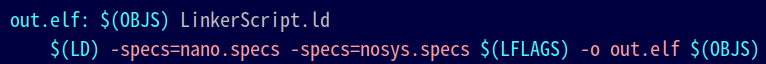

# WEEK8


## 1. ADC 구동 과정

1. STM32f4.h 헤더파일에 reference에 따라 ADC 구조체 선언했다.
   
   

   

2. 주소를 설정해줬다.

   
   

3. ```c
   void set_adc1() {
       RCC_AHB1ENR |= 0x00000001;          //RCC clock Enable
       GPIOA_MODER |= 3<<2;                //PA1 analog mode
       RCC_APB2ENR |= 1<<8;                //ADC1 Clock Enable
       RCC_CFGR    |= 1<<15 | 1<<13;       // set APB2 div4 = 42MHz (no need to know)
   
       ADC1_CR2    |= 1<<0;                //ADC1 enable
   
       ADC1_SMPR2  |= 3<<0;                // channel 1 sampling cycle 56 cycle
       ADC1_CR1    |= 2<<24 | 1<<5;        //8-bit resolution
                                           // end of-conversion interrupt enable
   
       ADC1_CCR    |= 1<<16;               // PCLK2 div 4 no need to know
       ADC1_SQR1   |= 0<<20;               // channel 1 : 1 conversion
       ADC1_SQR3   |= 1<<0;                // 1st conversion : channel
   
       NVIC_ISER0  |= 1<<18;               // enable intterupt
   
   }
   
   ```

   1. PA1를 사용할 것이기 때문에 OR 연산자를 통해 마지막 비트를 Enable시켜준다. 
      `RCC_AHB1ENR |= 0x00000001`

      

   2. PA1을 통해 ADC 전압을 받아오기 위해 mode를 아날로그로 세팅하였다.
      `GPIOA_MODER |= 3<<2`
      

   3. ADC1의 Clock를 Enable 해줬다. 
      `RCC_APB2ENR |= 1<<8`
      

   4. 이 부분에 대해서는 디테일 하게 알 필요 없다고 했지만 위에서 설정했던 clk의 속도를 나누기 4하였다. 
      `RCC_CFGR    |= 1<<15 | 1<<13`
      
      

   5. Enable ADC
      `ADC1_CR2    |= 1<<0`
      

   6. 자세하게 알 필요가 없다고 했지만 ADC sample time를 channel 0의 cycle를 56으로 설정하였다.
      `ADC1_SMPR2  |= 3<<0`
      

   7. ADC1_CR1 8비트 resolution은 양자화에서 y값이 [7:0] 표현, 더 디테일하게 보기 위해선 비트를 올리면 더 
      정밀해지고 하드웨어 더 일한다.

      5번 비트를 1로 Masking 하는 것은 Interrupt enable for EOC이다. 
      ADC도 interrupt가 있다. 변환이 완료 되었을 때 Interrupt 발생, 데이터가 변환 완료된 것을 확인하기 위해 사용. EOC bit가 set이 되면 interrupt가 생성된다. 
      `ADC1_CR1    |= 2<<24 | 1<<5`
      

   8. ADC prescaler를 01로 설정하여 PCLK2를 4로 나눴다.
      `ADC1_CCR    |= 1<<16`
      

   9. channel 1개에 1 conversion한다고 설정하였다. ADC1에도 여러 채널이 있는 데 본 예제에서는 하나의 채널만 사용하기 때문에 상관이 없다.

      `ADC1_SQR1   |= 0<<20`

      

   10. 1st conversion : channel, SQR3은 변환 순서를 설정해주는 건데 우리는 한 채널만 사용하니 중요하지 않다. 
       `ADC1_SQR3   |= 1<<0`

       

   11. 최종적으로 interrupt 사용할 수 잇게 하기 위해 인터럽트 셋업 
       `NVIC_ISER0  |= 1<<18`
       


4. 메인문에서 set_adc1(); 호출하고 `ADC1_CR2	|= 1<<30`이것을 통해 conversion start한다.

5. ADC_IRQHandler, sendStr함수 세팅

   ```c
   void ADC1_IRQHandler() {
       if(ADC1_SR & 1<<1){
           adc_val = ADC1_DR & 0xFF;
   
           len = sprintf(buf, "%3d\n", adc_val);
           sendStr(buf, len); 
       }
       ADC1_CR2    |= 1<<30;                   //IRQ Start again
   }
   
   void sendStr(char buf[], int max) {                        //1byte send
       int cnt = 0;
       while (cnt < max) 
       {
           USART2_DR = buf[cnt++];
           while( !(USART2_SR & (1<<7)) );
           while( !(USART2_SR & (1<<6)) );
       }
   }
   ```

   
   1. ADC1_SR의 1번이 1이면 (EOC) 비트를 확인하여 1이면 인터럽트 발생
      `if(ADC1_SR & 1<<1)`
      

   2. 0x800~~ stack메모리에 변수를 가져와야하니 변환이 완료된 데이터를 받을 걸 만든다. 
      `unsigned char adc_val` 선언

   3. USART는 1개의 char씩 값을 가져오니, 읽은 데이터 ADC1_DR과 0xFF를 AND연산을 통해 값을 adc_val에 가져온다.
      `adc_val = ADC1_DR & 0xFF`

   4. 읽은 데이터는 숫자로 받았는데 usart로 보낼라면 문자로 보내야 한다. 
      읽은 데이터를 문자로 바꿔줘야 한다. sprintf는 문자 길이 반환하고 
      adcval = 177이면 -> buf = '1', '7', '7' 이런식으로 문자로 저장이 된다.

      `len = sprintf(buf, "%3d\n", adc_val)` 

   5. SendStr함수를 만들었다. 인자로는 문자열과 문자열 길이 (반복 횟수)
      문자열 인자로 받아온 길이 만큼 받아오고 while (cnt < max), 그만큼 usart에 보내준다. 

      ```c
      void sendStr(char buf[], int max) {                        //1byte send
          int cnt = 0;
          while (cnt < max) 
          {
              USART2_DR = buf[cnt++];
              while( !(USART2_SR & (1<<7)) );
              while( !(USART2_SR & (1<<6)) );
          }
      }
      ```

      

   6. 다시 IRQHandler로 돌아가서 받은다음 바로 함수 호출
      `sendStr(buf, len)`

   7. adc중에서도 계속 도는것과 한번 Conversion하고 끝나는 것이 있다. 우리는 한번 Conversion하고 Conversion이 끝나는것이니 다시 스타트 해준다. main함수 끝에 있던 `ADC1_CR2 |= 1<<30` 를 IRQ_Handler의 맨 마지막에 넣어줌으로써 다시 Conversion Start.
      

   8. 임베디드에서 stdio.h사용한다면 binary가 너무 커져서 되도록이면 안 쓰는 방향으로 해야한다. 
      

   9. Flash를 하기 위해서 make all를 해본 결과 에러가 떴다.
      그 이유는 stdio.h를 사용하기 위해서는 make파일에 옵션을 추가해줘야한다.  
      그래서 make파일 19줄에 링킹할때
      `-specs=nano.specs -specs=nosys.specs` 추가해야 한다. $(LD) 와 $(LFLAGS) 사이에 추가
      

      

   10. 그 다음 linkerscript파일도 추가해줘야한다. sprintf도 힙과 stack 용량 줘야한다. sprintf가 malloc처럼 공간을 차지하는 것 같다. 그래서 추가해주고 맨 마지막 코드에 메모리 공간 할당. .user_heap.stack

       ```c
       _Min_Heap_Size = 0x200;     /* required amount of heap for sprintf */
       _Min_Stack_Size = 0x400;    /* required amount of stack for sprintf */
       
       ```

       

       

       

   11. make flash해서 보면 adc 전압 측정중인 것을 확인 할 수 있다. 그리고 Serial Plotter를 통해 그래프로 확인하였다. 이때 아두이노 PORT는 ttyUSB0로 세팅하여야한다. 
       필자는 아두이노 한글 폰트가 깨져서  `sudo apt-get install nanum` 명령어를 통해 해결하였다.


## 2. Stdio.h와 같은 standard library 사용하지 않고, ADC 변환 값을 USART로 plotting 하는 프로그램 구현


1. 처음에 ADC값을 저장하여 UART를 통해 PC Monitor에 표현하기 위해 ADC1_DR 값을 adc_val에 넣어줬다. sprintf를 사용하는 이유는 adc_val값 자체는 integer인데, PC에 표현하기 위해선 char 형태로 보내야 하기 때문이다. 그리고 sprintf의 리턴 값은 문자열 변수에 쓰기가 성공한 문자 개수가 반환된다. 리턴 값을 len에 받아서 len를 통해 몇 번을 Monitor에 올리게 지정해줬다. 
   

   ```c
   len = sprintf(buf, "%3d\n", adc_val);
   sendStr(buf, len);
   ```


2. 

   ```c
   void ADC1_IRQHandler() {
       if(ADC1_SR & 1<<1){
           adc_val = ADC1_DR & 0xFF;
   
           if(adc_val > 100)
           {
               a = adc_val/100;
               buf[0] = a + '0';
               b = (adc_val % 100)/10;
               buf[1] = b +'0';
               c = (adc_val % 100) % 10;
               buf[2] = c +'0';
               buf[3] = '\n';
               len = 4;
           }
   
           else if(adc_val < 100)
           {
               a = adc_val/10;
               buf[0] = a + '0';
               b = adc_val % 10;
               buf[1] = b +'0';
               buf[2] = '\n';
               len = 3;
           }
   
           //len = sprintf(buf, "%3d\n", adc_val);
           sendStr(buf, len); 
       }
       ADC1_CR2    |= 1<<30;                   //IRQ Start again
   }
   
   
   ```

   sprintf대신하여 코드를 만들어 봤다. 

   1. adc_val의 값이 2자리 정수인지 3자리 정수인지 판단을 하기 위해 if문과 else if문을 사용 했다.
   2. 세 자리 정수의 경우, 
      백의 자리 숫자를 얻기 위해 adc_val를 100으로 나눈 몫(adc_val / 100)을 a에 저장하여 buf[0]에 넣었다.
      십의 자리 숫자를 얻기 위해 adc_val를  나머지 연산을 통해(adc_val % 100) 십의 자리까지만 남겨 놓고 
      그 값에 10를 나눈 값(adc_val % 100 / 10)을 b에 저장하여 buf[1]에 넣었다.
      일의 자리 숫자를 얻기 위해 adc_val를 나머지 연산을 통해(adc_val % 100)  십의 자리까지만 남겨 놓고 
      그 값에 한 번더 나머지 연산을 통해 나온 나머지 값을 (adc_val % 100 % 10) c에 저장하여 buf[2]에 넣었다모니터의 줄을 바꿈을 위해 buf[3]에 \n를 넣었다. 
   3. buf에 값을 넣기 전에 + '0'를 해준 이유는 현재 a, b,c에는 정수가 들어가 있기 때문에 아스키코드 '0'를 더해줌으로써 char형식(아스키코드) 으로 바꿔줬다.
   4. 두 자리 정수의 경우에는 원래 처음에 해줬던 adc_val % 100만 제외하였다.
      

3. 결과
   
   만족스럽게 값들이 잘 나왔다. 

