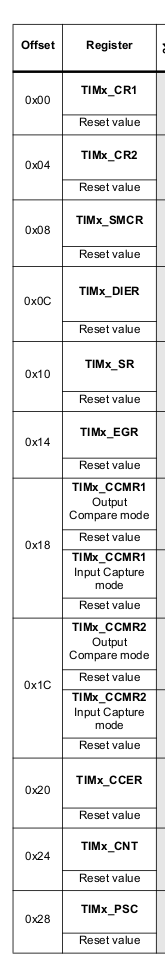

# WEEK9 0520

질문

1. TIM2에 주소 설정하는 #define에서 다 사용하지 않고 일부만 사용했는데 그걸 어떻게 정하셨는지? 
2. TIM2_CR1 = 0; 찌거기 값 없애고 그냥 바로 0으로 초기화. 찌거기 값이 들어 갔는지 어떻게 아는가?
3. `TIM2_EGR    |= 1<<0;` Event Generate Register?

4. `TIM2_SR &= 0x00000000;` 초기화 하는 이유


## 궁금한 점 해결

RCC_APB1ENR와 RCC_AHB1ENR의 차이점? 


### ARM의 BUS 종류

BUS란 CPU에서 메모리나 입출력 기기에 데이터를 송출하거나 반대로 메모리나 입출력 기기에서 CPU에 데이터를 읽어들일 때 필요한 전송로이다. CPU와 메모리는 입출력 기기 간에 어떤 곳으로도 데이터를 전송할 수 있으므로 쌍방향 버스라고 한다. 

**AHB(Advanced High Performance Bus)** 

- 고속으로 동작하는 장치들이 연결되는 버스
- Multiplex Bus 기반이다. 이는 주소라인과 제어라인 그리고 데이터 라인까지 모두 공유하는 것을 의미한다. 처음에 주소를 전송한 다음에 데이터를 전송해준다. 이는 주소, 제어 

**APB(Advanced Peripheral Bus)**  

- 비교적 느린 속도의 주변장치를 제어하고, 전력소모를 줄이기 위해 간단한 인터페이스를 갖는다. 


### [Timer/Counter](https://m.blog.naver.com/PostView.naver?blogId=scw0531&logNo=220722370837&proxyReferer=https:%2F%2Fwww.google.com%2F)

- 일정시간을 측정하는 것으로 많이 사용하는 방법은 소프트웨어로 시간지연을 하는 sleep()함수라던가, delay()함수가 있는데, **이는 소프트웨어로 시간지연을 하는 것이기 때문에 정확한 시간을 잴수 없다.**
  임베디드 시스템에서는 정확한 시간재기는 필수적인 요소이다. 정확한 시간지연이 필요할 경우 임베디드에선 타이머/카운터를 사용한다.

- MCU에서 타이머/카운터는 일정한 개수만큼의 클럭을 세어 정해진 시간이 되면 인터럽트를 발생시키는 역할을 하게 된다. 소프트웨어 시간지연 함수가 일정 시간동안 MCU에게 엉뚱한 작업을 시킴으로써 MCU의 동작을 정지시키는 반면 타이머는 필요한 시간을 미리 레지스터에 설정하고, **다른 작업과 병행하게 타이머가 동작하고, 설정한 조건에서 인터럽트 발생하게 함으로써 MCU의 효율을 극대화시킬수 있다.** 

- 디지털회로에서 **클록은 주어진 일을 순서대로 정확하게 처리하기 위해 사용**된다. 클록은 시계의 역할을 하고, 일정한 시간 간격으로 0과 1의 값이 번갈아 가게 나타나게 되어있다. 

- **주기 :** 0과 1이 번갈아 한 번 나타나는 시간
  **주파수 :** 1초 당 몇 번이나 0과 1이 변화되는가 

  입력 신호가 Clock이 주기적으로 발생되고 있고 카운터 시작이 된다면 클럭당 Count++가 된다. 그리고 샘플 클럭의 상승 Edge에서 counter값을 읽어 온다.
  

- 카운터는 클록을 세는 장치이다. 클록이 하나 발생할 때마다, 카운터는 1씩 증가하게 된다. 
  8bit counter이면 2^8 = 256, 즉 0~255까지 셀 수 있다. 원하는 시간을 얻기 위해 그 카운터를 시작시킬 조건과 끝낼 조건이 필요하다.  

- **타이머 : **MCU내부에서 발생 클록을 세는 장치
  **카운터 : ** MCU외부에서 입력되는 클록(Event)을 세는 장치

- **Timer/Counter의 동작**

  1. 동작모드가 결정

  2. 타이머에 사용할 클럭 소스와 Prescaler가 결정된다. 클럭은 내부 클럭과 외부 클럭을 사용할 수 있으며, 내부 클럭을 사용하는 경우 Prescaler를 사용할 수 있다. 클럭 소스와 Prescaler가 결정되면 Timer/Counter에 사용될 타이머 클럭의 주파수가 결정된다.
     
  3. 원하는 타이머 주기가 결정되고, 그 주기동안의 시간을 정확히 세기 위한 타이머 클럭의 수가 결정된다.
     (1주기당 타이머 클럭 개수 = 타이머 클럭 주파수 * 타이머 시간)
  4. 필요한 타이머 클럭 수가 결정되면 카운터 레지스터의 카운터 시작 값을 설정한다. 
     8비트 타이머/카운터의 경우 255까지 세고 0으로 넘어갈 때 오버플로우 인터럽트가 발생하는 것이다.


## 1. Timer를 사용하여 ADC 데이터량 제한 (Timer 목차 17)

```c
void ADC1_IRQHandler() {
    if(ADC1_SR & 1<<1){
        adc_val = ADC1_DR & 0xFF;

        if(adc_val > 100)
        {
            a = adc_val/100;
            buf[0] = a + '0';
            b = (adc_val % 100)/10;
            buf[1] = b +'0';
            c = (adc_val % 100) % 10;
            buf[2] = c +'0';
            buf[3] = '\n';
            len = 4;
        }

        else if(adc_val < 100)
        {
            a = adc_val/10;
            buf[0] = a + '0';
            b = adc_val % 10;
            buf[1] = b +'0';
            buf[2] = '\n';
            len = 3;
        }

        //len = sprintf(buf, "%3d\n", adc_val);
        sendStr(buf, len); 
    }
    ADC1_CR2    |= 1<<30;                   //IRQ Start again
}

```

원래 코드를 확인해보면 ADC1_SR의 flag가 활성화되면 adc값을 받아오고, 모니터에 전송한 다음,
`ADC1_CR2 |= 1<<30`를 통해 IRQ를 다시 시작했다. 

바로 IRQ를 다시 시작했다는 뜻은 최대 resource 사용해서 adc를 제일 우선순위로 돌아가게 만든 것이다.
그래서 adc데이터가 serial plotter로 너무 빨리 전송되서 데이터를 제대로 확인하지 못했다.**그래서 Timer사용해서 0.5s마다 interrupt를 발생시켜 ADC를 시작하게 만든다.**  


#### Timer Setting

1. ADC폴더 카피해서 Timer 폴더 만들었다. 

2. 평소 ADC, USART를 세팅했던 것처럼 헤더파일에 Timer 구조체를 만든다. 

   우리는 타이머2를 사용할 것이다. 구조체를 만들기 위해서는 TIM1&TIM8 목차 맨 마지막에 있는 register map를 참고해서 선언하면 된다. 

   ```c
   typedef volatile struct{
   	unsigned int rCR1;
   	unsigned int rCR2;
   	unsigned int reserved1;
   	unsigned int rDIER;
   	unsigned int rSR;
   	unsigned int rEGR;
   	unsigned int rCCMR1;
   	unsigned int rCCMR2;
   	unsigned int rCCER;
   	unsigned int rCNT;
   	unsigned int rPSC;
   	unsigned int rARR;
   	unsigned int reserved2;
   	unsigned int rCCR1;
   	unsigned int rCCR2;
   	unsigned int rCCR3;
   	unsigned int rCCR4;
   	unsigned int reserved3;
   	unsigned int rDCR;
   	unsigned int rDMAR;
   }TIM2to5;
   ```

   

   

   

   

3.  주소 설정은 목차 2.3 Memory map를 확인하면 된다.  Memory Map에서 TIM2 register map으로 바로 연결되어 있기 때문에 참고하면 좋을거 같다. 

   ```c
   #define TIM2_BASE 0x40000000
   #define TIM2 ((TIM2to5*)TIM2_BASE)
   
   #define TIM2_CR1		(TIM2->rCR1)
   #define TIM2_DIER		(TIM2->rDIER)
   #define TIM2_SR			(TIM2->rSR)
   #define TIM2_EGR		(TIM2->rEGR)
   #define TIM2_CNT		(TIM2->rCNT)
   #define TIM2_PSC		(TIM2->rPSC)
   #define TIM2_ARR		(TIM2->rARR)
   ```

   

   

4. main문에 set_timer2함수 설정

   ```c
   void set_timer2() {
       RCC_APB1ENR |= 1<<0;
       TIM2_CR1     = 0;                   //Initialize to 0
   
       TIM2_PSC     = 84-1;
       TIM2_ARR     = 1000-1;
       TIM2_DIER   |= 1<<0;
       TIM2_EGR    |= 1<<0;
       TIM2_CR1    |= 1<<0;
   
       NVIC_ISER0  |= 1<<28;
   }
   ```

   1. 항상 궁금했던거지만 RCC_APB1ENR일때가 있고, RCC_AHB1ENR일때가 있는데 왜 그런걸까? register 맵을 자세히보니 어떤 버스에 연결되어 있는지 적혀 있었다. Bus가 APB1에 연결되어 있다는 것을 확인하고 바로 세팅하면 될거 같다. 그리고 **RCC_APB1 peripheral clock enable register**에 들어가서 TIM2의 위치를 확인하니 0 bit에 위치해 있어서 그것을 1로 세팅. 
      `RCC_APB1ENR |= 1<<0;`
      

   2. 이것은 TIM2_CR1안에 있는 찌거기 값을 없애고 0으로 초기화 시킨것이다.
      연산은 |=이 아니라 =를 사용한 이유는 or연산을 사용한다면 찌거기 값이 제대로 사라지지 않는다.
      `TIM2_CR1 = 0;`

   3. TIM2_PSC = 84-1; 타이머는 클락 베이스로 동작하는데 보드가 84Mhz이면 주기는 1/84M, 한 클락이 라이즈에서 폴링할때, Clock 모듈에서 84MHz를 Timer에 넣어준다.
      PSC는 Prescaler, f라는 주파수가 있다면 f/TIM_PSC+1 = TimerCounter 주기의(CNT) +1 
   f/84-1+1 = cnt +1 (cnt+1인 이유는 cnt_en 클럭 후에 신호를 주기 때문에 PSC에는 1을 뺀 값을 넣는다)
      f/84 = cnt +1
      f= 84Mhz로 설정해줫으니(void clock에서), 1Mhz이다. 1/1Mhz = 1us
      `TIM2_PSC     = 84-1;`
      
      
      
   4. TIM2_ARR = 1000-1;, AutoReward. cnt(counter)에 들어갈때 999+1 = 1000이란 값이 레지스터에 들어간다. 카운터가 1us에 1개씩 올라가다가 1000이라는 값에 도달하면 interrupt 조건에 걸리게 된다. 
      1us * 1000 = 1ms, 이 경우 타이머는 1ms마다 조건이 발생하게 된다.
       `TIM2_ARR     = 1000-1;`
      84MHz/84/1000 = 1MHz, 주기는 1ms이다. 그래서 타이머가 1ms마다 조건이 발생하게 된다.

      

   5. Update Interrupt Enable를 통해 1ms가 되면 interrupt 발생시킨다.
      `TIM2_DIER   |= 1<<0;`
      

   6. 1000에서 0으로 점점 빼지다가 다시 0에서 1000으로 더하면서 채워진다. 
      `TIM2_EGR    |= 1<<0;`
      
      

   7. Counting을 시작한다. 
      `TIM2_CR1 |= 1<<0;`
      

   8. Vector Table의 타이머 인터럽트의 번호가 28번이니 28번을 enable해준다. 
      `NVIC_ISER0  |= 1<<28;`

5. set_timer2()를 메인문에 선언하였다.

6. startup 파일에 ADC1_IRQHandler가 Vector Table에서 18번이니 28번인 TIM2_IRQHandler를 10개 밑으로 내려가서 선언해줬다.

7. TIM2_IRQHandler() 함수를 정의했다.

   ```c
   void TIM2_IRQHandler() {
       TIM2_SR &= 0x00000000;
       tim2tick++;
       if(tim2tick == 100)            //1000ms = 1s LED Toggle
       {
           GPIOD_ODR ^= 1<<13;         //LED Orange Blink
           ADC1_CR2  |= 1<<30;
           tim2tick = 0;        
       }
   }
   ```

   1. Interrupt status register에서 flag발생해서이니 clear부터 하고 사용.
      `TIM2_SR &= 0x00000000;`
   2. 원래 1ms가 평소 주기기 때문에 만약 인터럽트 걸릴때마다 데이터 값을 출력하게 된다면 1ms마다 데이터가 PC모니터로 ADC한 값을 보낼텐데, 
      tim2tick이라는 변수를 선언함으로써 100ms = 0.1s마다 ADC를 진행하도록 하였다. 


6. 실행해본 결과 잘 되었다. adc_val 일의 자리 값을 받는 루틴은 설정을 안 했어서 다시 설정해 줬다.

   
   ADC에 아무것도 연결되어 있지 않기 때문에 저번에는 50이 나왔었는데 이번에는 5가 나온다? 딱히 연관이 없다. 


## 2. 실습2 gnuplot

1. txt에 어떤 값이 적혀있으면 프로그램을 통해 그래프로 바꿔주는 것이다.

2. `sudo apt-get install gnuplot`
   

3. gnuplot이 제대로 설치되어 있는지 확인하였다, `gnuplot`

   

4. 폴더 구조 codes, output 그리고 Makefile를 생성

5. codes 폴더 안에 hello.c파일 생성 (우리가 만들려는 프로그램은 text파일의 값을 그래프에 적을려고 한다.)

   ```c
   #include <stdio.h>
   
   int main(void){
       
       FILE* file_out;
       file_out = fopen("out.txt", "w");
       
       int y;
   
       for(int i = 0; i < 100; i++) {                  //x = i y = y
           y= 5 * i + 10;
           fprintf(file_out, "%d \t %d \n", i, y);
       }
   
       return 0;
   }
   ```

   

6. 두 개의 열이 x, y나올 수 있게 c언어 코드를 생성하고 codes에 Makefile를 만들었고

   ```makefile
   codes/Makefile
   
   all:
   	gcc -o ../output/hello hello.c
   ```

   바깥쪽 폴더의 output 폴더에 실행파일을 만들어야 하기 때문에 경로 설정 후 gcc -o를 해줬다.

   ```makefile
   Makefile
   
   all:
   	(cd codes ; make all)
   	(cd output ; ./hello)
   	(cd output ; gnuplot bar.bat)
   ```

   바깥쪽 폴더 Makefile에서는 make all를 하게 되면 codes로 들어가서 make all이라는 커멘드를 수행하도록 만들었고, 그 다음 cd output ; ./hello를 통해 실행파일 실행하도록 만들었다. 

   `(cd output ; gnuplot bar.bat)`를 추가한 이유는 gnuplot의 명령어를 그래프를 띄울때마다 사용하지 않고 bar.bat이라는 bash파일 설정을 통해 make all만 치면 그래프가 나올 수 있도록 세팅한 것이다.

   

7. out.txt가 만들어진 것을 확인하였고 gnuplot를 통해 그래프를 보여준다. 
   output 폴더에 들어가서 `gnuplot`실행
   `plot "out.txt" using 1:2 title "Example" with lines` 를 치면 나온다.
   1:2는 1열 2열을 사용한다는 뜻이고 타이틀은 Example이고 라인으로 보여준다고 생각하면 된다.

8. gnuplot를 그래프 보고 싶을때마다 치기는 힘드니 bar.bat이라는 bat파일을 생성한 후 그대로 gnuplot에서 써야하는 것을 bar.bat에 넣는다.
   `plot ""out.txt" using 1:2 title "Example" with lines lw 3` 

   xlabel과 ylabel에 이름을 x, y로 설정해준다. 

   ```bash
   set xlabel "x"
   set ylabel "y"
   
   plot "out.txt" using 1:2 title "Example" with lines lw 3
   
   pause mouse any "Any key or button will terminate window"
   ```

   그래프가 바로 꺼지기 때문에 `pause mouse any "Any key or button will terminate window"`라는 명령어를 넣어줬다. shell처럼 되어 있어서 batch는 한번 실행되면 바로 끝나서 pause를 걸어준 것이다. 
   
   

## 교수님 실습

### [Fourier Transform이란?](https://darkpgmr.tistory.com/171) 

푸리에 변환은 신호처리, 음성, 통신 분야에서 뿐만 아니라 영상처리에서도 매우 중요한 개념으로 다양한 응용을 가지고 있다. 영상을 주파수 성분으로 변환하여 다양한 분석 및 처리를 할 수 있고 임의의 필터링 연산을 FFT(Fast Fourier Transform)을 이용하여 고속으로 구현할 수 있다. 


1. 푸리에 변환(Fourier Transform) 

   - 푸리에 변환을 직관적으로 설명하면, 푸리에 변환은 **임의의 입력 신호를 다양한 주파수를 갖는 주기함수들의 합으로 분해하여 표현**하는 것이다.
   - 푸리에 변환에서 사용하는 주기함수는 sin, cos 삼각함수이며 푸리에 변환은 **고주파부터 저주파까지 다양한  주파수 대역의 sin, cos 함수들로 원본 신호를 분해하는 것이다.**
   - 아래 그림(그림 1)의 예를 보자. 맨 앞의 붉은 색 신호는 입력 신호이고 뒤의 파란색 신호들은 푸리에 변환(Fourier transform)을 통해 얻어진 (원본 신호를 구성하는) 기성분으로 분ㅋ주기함수 성분들이다. 각각의 주기함수 성분들은 고유의 주파수(frequency)와 강도(amplitude)를 가지고 있으며 **이들을 모두 합치면 원본 붉은색 신호**가 된다.
     
   - 통신 분야에서의 푸리에 변환은 time domain에서 frequency domain
   - 푸리에 변환(Fourier transform)의 대단한 점은 입력 신호가 어떤 신호이든지 관계없이 임의의 입력 신호를 sin, cos 주기함수들의 합으로 항상 분해할 수 있다는 것이다. 그리고 그 과정을 수식으로 표현한 것이 푸리에 변환식이다.

2. 푸리에 변환(Fourier Transform) - 수식적 이해

   - 

   - 여기서 *j*는 허수단위 , f(x)는 원본 입력 신호, ej2πux는 주파수 u인 주기함수 성분, F(u)는 해당 주기함수 성분의 계수(coefficient)를 나타낸다.

   - 식 (1)을 보게 되면 입력 신호 f(x)가 ej2πux들의 합으로 표현(분해)된다는 의미이다. (적분은 합한다는 의미를 가진다.)

   - 식 (2)를 보게 되면 f(x)를 주기함수 성분으로 분해했을 때의 계수(coefficient) F(u)가 식 (2)로 주어진다는 의미이다.  

   - 앞서 그림 1과 연관해 보면 ej2πux는 f(x)를 구성하는 (파란색의 주파수 u인) 주기함수 성분들이고 F(u)는 해당 주기함수 성분의 강도(amplitude)를 나타낸다.

   - 식 (1) - Inverse Fourier Transform
     식 (2) - Fourier Transfrom

   - 오일러 공식을 통해 ej2πux는 이렇게 전개된다.

     
     식 (1)에서의 ej2πux는 실수부가 cos(2πux), 허수부가 sin(2πux)인 주기함수임을 알 수 있다.

     여기서 cos(2πux), sin(2πux) 모두 주기(period)가 1/u, 주파수(frequency) u인 주기함수이므로 결국 ej2πux는 **주파수 u인 정현파(sinusoidal wave)의 복소지수함수 표현임을 알 수 있다.**

3. 


### 11_harmonics

```c
#include <stdio.h>
#include <stdlib.h>
#include <math.h>

#define F 200       //Frequency
#define T 1/F       //Period
#define A 5.0       //Amplitude

#define PI 3.14

int main(void){
    
    FILE* file_out;
    file_out = fopen("out.txt", "w");
    
    int hi = 1;     //Harmonics 1 Hz

    for(int i = 0; i < 100; i++) {                  //x = i y = y
        float signal = (float)A*sin(2*PI*hi*T*i);
        fprintf(file_out, "%d \t %.2f \n", i, signal);
    }

    return 0;
}
```

gcc로 컴파일 한 결과 sin math.h와 연결이 안됬다고 했는데 g++로 변경하니 되었다. 

gcc에서 math.h를 사용하고 싶다면 gcc -o ../output/hello hello.c -lm로 -lm(link math);를 추가해줘야 한다. 


왜 반 개만 나왔는가? 한 펄스가 다 안나오고 

- 200hz가 F인데, 1 step, i = 100라는 것은 pi만큼만 갔다는 거다. 그래서 2pi까지 보여줄려면 i= 200,

- 200 point Sampling하겠다는 for (int i = 0; i<200; i++)에서 i범위를 바꿔주면 된다. 매우 중요하다 i<200

- T는 얼마나 내가 빠르게 보겠다는거고 adc에서 결정나는 것이다. 

- Nyquist 정리에 따르면 모든 신호는 그 신호에 포함된 가장 높은 진동수의 2배에 해당하는 빈도로 일정한 간격으로 샘플링하면 원래의 신호를 완벽하게 기록할 수 있다고 한다.
  그래서 관찰하고자 하는 스피드보다 2배 빠르게 샘플링 해줘야 한다.  

- T= 1/200로 샘플링하고 있다는거고 내가 몇 포인트 볼꺼냐다 i<200은, 매우 중요하다. 주파수 샘플링과 다른것이다. 우리가 얼마나 보겠다는 것이다. 


i < 200 설정 후


i < 400 설정 후 


4Pi까지 간다. 샘플링은 바뀌지 않았지만. 

```c
    for(int i = 0; i < 400; i++) {                  //x = i y = y
        float signal = (float)A*sin(2*PI*hi*T*i);
        fprintf(file_out, "%d \t %.2f \n", i, signal);
    }
```


Sampling speed가 200hz가 아닌 400hz로 바뀐다면? T= 1/400 더 정밀하게 본다.

```c
#include <stdio.h>
#include <stdlib.h>
#include <math.h>

#define F 400       //Frequency
#define T 1/F       //Period
#define A 5.0       //Amplitude

#define PI 3.14

int main(void){
    
    FILE* file_out;
    file_out = fopen("out.txt", "w");
    
    int hi = 1;     //Harmonics 1 Hz

    for(int i = 0; i < 400; i++) {                  //x = i y = y
        float signal = (float)A*sin(2*PI*hi*T*i);
        fprintf(file_out, "%d \t %.2f \n", i, signal);
    }

    return 0;
}
```


이번엔 bar.bat에 with lines가 아니라 impulses lw 2로 바꿔서 확인 한다. 그만큼 샘플링 많이 한다. 


샘플링 speed는 400에 보는 횟수 400이니까 2PI*F이다.

Harmonics를 1이 아닌 2로 바꾼다면? 4PI가 된다. 

```c
#include <stdio.h>
#include <stdlib.h>
#include <math.h>

#define F 400       //Frequency
#define T 1/F       //Period
#define A 5.0       //Amplitude

#define PI 3.14

int main(void){
    
    FILE* file_out;
    file_out = fopen("out.txt", "w");
    
    int hi = 2;     //Harmonics 1 Hz

    for(int i = 0; i < 400; i++) {                  //x = i y = y i<400(Sample Depth)
        float signal = (float)A*sin(2*PI*hi*T*i);
        fprintf(file_out, "%d \t %.2f \n", i, signal);
    }

    return 0;
}
```

4PI가 되기 때문에 2개의 펄스가 나온다. 데이터는 유한하지만 무한대로 보이는 것처럼 보이는건 연산이 매우 빠르게 되어 빨리 처리되기 때문이다. 내가 두는 adc speed는 내두고 Sample Speed(Frequency) 내두고, 보는 횟수(Sample Depth) 외부에서 들어오는 신호 1hz에서 2hz로 바뀌면 바뀐만큼 2배해서 보인다는 뜻이다. 


이제 f(t) = Summation(0 to Inf)aksin2pifkt


### Sin들의 합으로 Rectangular Pulse를 만들수 있다. Rectangular Pulse는 자연계에서 존재 할 수 없다.

```c
#include <stdio.h>
#include <stdlib.h>
#include <math.h>

#define F 200       //Sampling Frequency(Speed)
#define T 1/F       //Sampling Period
#define A 5.0       //Amplitude
#define N 200       //Number of sample Depth

#define PI 3.14

int main(void){
    
    FILE* file_out;
    file_out = fopen("out.txt", "w");
   
    float polynomial[400];
    
    //signal generation (sum of harmonics)
    for(int i = 0; i <N; i++)           //time advance 
    {                  
        int hi = 1;     //Harmonics 1 Hz
        polynomial[i] = 0;
        
        for(int j=0; j<32; j++)     //frequency
        {
            float signal = (float)(A/hfi)*sin(2*PI*hi*T*i);
            polynomial[i] += signal;
            hi = hi + 2;                                //1,3,5,7,9
        }
    }

    //plot!
    for(int i=0; i<N; i++)
    {
        fprintf(file_out, "%d \t %.2f \n", i, polynomial[i]);
    }

    // fourier analysis
    int probe_freq = 2;
    float freq_component = 0;
    for (int i=0; i<N; i++) //fourier analysis one time
    {
        float probe = (float)(A)*sin(2*PI*probe_freq*T*i);
        freq_component += probe * polynomial[i];
    }
    printf("%d Hz component strength is %.1f\n", probe_freq, freq_component);
    return 0;
}

```

```c
    for (int j=0; j<H; j++)
    {
        float freq_component = 0;
        int probe_freq = j;
        for (int i=0; i<N; i++) //fourier analysis one time
        {
            float probe = (float)(A)*sin(2*PI*probe_freq*T*i);
            freq_component += probe * polynomial[i];
        }
    printf("%d Hz component strength is %.1f\n", probe_freq, freq_component);
    }
```


polynomial


Spectrum Analyzer를 만드는 것.


입력 신호 200개 1spectrum 분석한 것이고 

그 다음 입력신호 200개 2번째 spectrum 분석한 것이고

분석(마지막 것 ) -> USART -> Plot


퓨리에 트랜스폼 처리과정이 MCU안에서 돌아가야 하는것이고, 우분투에서는 PC로 plot하는 것이다. 

2주뒤에 Spectrum Analyzer 만드는 것이고 (오늘 미션) PC에서 plot, 계획 뭐 할지 발표하는 것

그다음 2주뒤에는 발표 


과제


```c
#include "STM32FDiscovery.h"
#include <stdio.h>
#include <stdlib.h>
#include <math.h>

#define F 200       //Sampling Frequency(Speed)
#define T 1/F       //Sampling Period
#define A 5.0       //Amplitude
#define N 200       //Number of sample Depth
#define H 32        //Number of harmonics
#define PI 3.14

unsigned char adc_val;
unsigned char rec;
unsigned int count = 0;
unsigned int i, j, k, a, b, c;
unsigned int l = 0;
float buf[8];        //Space for ADC string
unsigned int len;   //Space for ADC string len

char polynomial[400];

unsigned int tim2tick;  //Timer Variable:

unsigned int uart_data[423]= {
32, 32, 32, 32, 32, 32, 32, 32, 32, 32, 
32, 95, 95, 95, 95, 95, 32, 32, 32, 32, 
32, 32, 95, 95, 95, 95, 95, 32, 95, 95, 
95, 32, 32, 32, 32, 32, 32, 32, 32, 95, 
95, 95, 95, 95, 32, 32, 32, 95, 32, 32, 
32, 32, 32, 32, 32, 32, 32, 32, 32, 32, 
32, 32, 32, 95, 95, 95, 95, 32, 32, 10, 
32, 32, 32, 32, 32, 47, 92, 32, 32, 32, 
124, 95, 32, 32, 32, 95, 124, 32, 32, 32, 
32, 47, 32, 95, 95, 95, 95, 124, 95, 95, 
32, 92, 32, 32, 32, 32, 32, 32, 47, 32,
95, 95, 95, 95, 124, 32, 124, 32, 124, 32, 
32, 32, 32, 32, 32, 32, 32, 47, 92, 32,
32, 32, 124, 32, 32, 95, 32, 92, 32, 10, 
32, 32, 32, 32, 47, 32, 32, 92, 32, 32,
32, 32, 124, 32, 124, 95, 95, 95, 95, 95,
124, 32, 40, 95, 95, 95, 32, 32, 32, 32,
41, 32, 124, 95, 95, 95, 32, 124, 32, 124, 
32, 32, 32, 32, 32, 32, 124, 32, 124, 32, 
32, 32, 32, 32, 32, 32, 47, 32, 32, 92, 
32, 32, 124, 32, 124, 95, 41, 32, 124, 10, 
32, 32, 32, 47, 32, 47, 92, 32, 92, 32, 
32, 32, 124, 32, 124, 95, 95, 95, 95, 95,
95, 92, 95, 95, 95, 32, 92, 32, 32, 47, 
32, 47, 47, 32, 95, 32, 92, 124, 32, 124, 
32, 32, 32, 32, 32, 32, 124, 32, 124, 32, 
32, 32, 32, 32, 32, 47, 32, 47, 92, 32, 
92, 32, 124, 32, 32, 95, 32, 60, 32, 10, 
32, 32, 47, 32, 95, 95, 95, 95, 32, 92, 
32, 95, 124, 32, 124, 95, 32, 32, 32, 32, 
32, 95, 95, 95, 95, 41, 32, 124, 47, 32, 
47, 124, 32, 40, 95, 41, 32, 124, 32, 124, 
95, 95, 95, 95, 32, 32, 124, 32, 124, 95, 
95, 95, 95, 32, 47, 32, 95, 95, 95, 95, 
32, 92, 124, 32, 124, 95, 41, 32, 124, 10, 
32, 47, 95, 47, 32, 32, 32, 32, 92, 95, 
92, 95, 95, 95, 95, 95, 124, 32, 32, 32, 
124, 95, 95, 95, 95, 95, 47, 124, 95, 95, 
95, 95, 92, 95, 95, 95, 47, 32, 92, 95, 
95, 95, 95, 95, 124, 32, 124, 95, 95, 95, 
95, 95, 95, 47, 95, 47, 32, 32, 32, 32, 
92, 95, 92, 95, 95, 95, 95, 47, 32, 10,
10, 10, 10};                                //to Send data to computer


void sendStr(char buf[], int max);

void clk(void)
{
	RCC_CR = 0;
	RCC_PLLCFGR = 0;
	RCC_CFGR = 0;
		
	RCC_CR |= (1<<16); // HSE set
	while( (RCC_CR & ( 1<<17) ) == 0 ); // wait until HSE ready
	
	RCC_PLLCFGR |= 8;//0x00000008; // set PLLM
	RCC_PLLCFGR |= (336<<6);//|= (336<<6); // 		set PLLN
	RCC_PLLCFGR |= (0<<16); // set PLLP
	RCC_PLLCFGR |= (7<<24);//0x07000000; // set PLLQ

	RCC_PLLCFGR |= (1<<22); // set PLL src HSE
	

	RCC_CR |= (1<<24); // PLL ON
	while( (RCC_CR & (1<<25)) == 0); // wait until PLL ready
	
	FLASH_ACR |= 5;
	RCC_CFGR |= 2; // set PLL to system clock
	
		
	while( (RCC_CFGR & (12) ) != 8); // wait until PLL ready
	
	RCC_CFGR |= (1<<12) | (1<<10); // set APB1 div 4
	RCC_CFGR |= (1<<15); // set APB2 div2	

    SCB_CPACR |= (3<<20) | (3<<22);
}

void set_uart2() {
    //USART GPIO PIN PA2(TX), PA3(RX)
    RCC_AHB1ENR     |= 1<<0;                //Clock Enable
    GPIOA_MODER     |= (1<<5) | (1<<7);     //Alternative Function Mode Set
    GPIOA_AFRL      |= (7<<8) | (7<<12);    //

    //SET USART2
    RCC_APB1ENR     |= (1<<17);             //USART2 CLK ENABLE
    USART2_CR1      |= (0<<12);             //CONTROL REGISTER CHARACTER 1BYTE SO 8 BIT USE
    USART2_CR2      |= (0<<13) | (0<<12);   //STOP BIT SET 1

    USART2_BRR      |= (unsigned int)(42000000/115200);     //0x115200 -> 42000000

    USART2_CR1      |= (1<<3) | (1<<2);     //TX,RX ENABLE
    USART2_CR1      |= (1<<5);              //ALSO USART CAN USE PULL UP, PULL DOWN, TXE(DATA FLAG, IS IT IN?) RXNE(RX NOT EMPTY FLAG) WHEN THE BUFFER GET THE VALUE, RXNE BECOME 1
    USART2_CR1      |= (1<<13);

    //USART INTERRUPT ENABLE
    NVIC_ISER1      |= 1<<6;                //BECAUSE WE ADD NEW NVIC_ISER1 AND IT START AT 32, SO 38-32 = 6
    
}

// ADC, channel 1, PA1
void set_adc1() {
    RCC_AHB1ENR |= 0x00000001;          //RCC clock Enable
    GPIOA_MODER |= 3<<2;                //PA1 analog mode
    RCC_APB2ENR |= 1<<8;                //ADC1 Clock Enable
    RCC_CFGR    |= 1<<15 | 1<<13;       // set APB2 div4 = 42MHz (no need to know)

    ADC1_CR2    |= 1<<0;                //ADC1 enable

    ADC1_SMPR2  |= 3<<0;                // channel 1 sampling cycle 56 cycle
    ADC1_CR1    |= 2<<24 | 1<<5;        //8-bit resolution
                                        // end of-conversion interrupt enable

    ADC1_CCR    |= 1<<16;               // PCLK2 div 4 no need to know
    ADC1_SQR1   |= 0<<20;               // channel 1 : 1 conversion
    ADC1_SQR3   |= 1<<0;                // 1st conversion : channel

    NVIC_ISER0  |= 1<<18;               // enable intterupt

}

void set_timer2() {
    RCC_APB1ENR |= 1<<0;
    TIM2_CR1     = 0;                   //Initialize to 0

    TIM2_PSC     = 84-1;
    TIM2_ARR     = 1000-1;
    TIM2_DIER   |= 1<<0;
    TIM2_EGR    |= 1<<0;
    TIM2_CR1    |= 1<<0;

    NVIC_ISER0  |= 1<<28;
}

void TIM2_IRQHandler() {
    TIM2_SR &= 0x00000000;
    tim2tick++;
    if(tim2tick == 100)            //1000ms = 1s LED Toggle
    {
        GPIOD_ODR ^= 1<<13;         //LED Orange Blink
        ADC1_CR2  |= 1<<30;
        tim2tick = 0;
        
    }
}

void USART2_IRQHandler() {
    if( USART2_SR & (1<<5) ) 
    {
        rec = USART2_DR;                //Data Register 
       //after getting the input, we return the data to dr and print 
        USART2_DR = rec;
        while( !(USART2_SR & (1<<7)) );
        while( !(USART2_SR & (1<<6)) );
        //GPIOD_ODR ^= 1<<12;              //To see the data is in

        USART2_CR1 |= (1<<5);           //After interrupt SR be 0 and we need to turn the interrupt on

    }
}

void ADC1_IRQHandler() {
    if(ADC1_SR & 1<<1){
        adc_val = ADC1_DR & 0xFF;

        polynomial[l] = adc_val;
        l++;

        if (l == 400)
        {
            for(i = 0; i <N; i++)           //time advance 
            {                  
                int hi = 1;     //Harmonics 1 Hz
        
                for(j=0; j<H; j++)     //frequency
                {
                    float signal = (float)(A/hi)*sin(2*PI*hi*T*i);
                    polynomial[i] += signal;
                    hi = hi + 2;                                //1,3,5,7,9
                }
            }
            // fourier analysis
            //int probe_freq = 2;
            for (j=0; j<H; j++)     //fourier analysis H time (H frequency)
            {
                float freq_component = 0;
                int probe_freq = j;
                for (i=0; i<N; i++) //fourier analysis one time{ 
                {
                    float probe = (float)(A)*sin(2*PI*probe_freq*T*i);
                    freq_component += probe * polynomial[i];    //polynomial get ADCvalue 

                    len = sprintf(buf, "%6f\n", freq_component);
                    sendStr(buf, len); 
                }
            }
            l = 0;
        } 

        //len = sprintf(buf, "%3d\n", adc_val);
        //sendStr(buf, len); 
    }
    //ADC1_CR2    |= 1<<30;                   //IRQ Start again
}

void EXTI0_IRQHandler() {

    GPIOD_ODR ^= 1 << 13;
    GPIOD_ODR ^= 1 << 14;
    GPIOD_ODR ^= 1 << 15;
    EXTI_PR |= 1<<0;    // clear pending bit for EXTI}

}

int main (void)
{
	
	clk();
	
	RCC_CFGR |= 0x04600000;

    /* PORT A */
	RCC_AHB1ENR  |= 1<<0; //RCC clock enable register	
    GPIOA_MODER  |= 0<<0; // input mode
    GPIOA_OTYPER |= 0<<0; // output push-pull
    GPIOA_PUPDR  |= 0<<0; // no pull-up, pull-down

    /* button intr set */
    SYSCFG_EXTICR1 |= 0<<0; //EXTI0 connect to PA0
    EXTI_IMR       |= 1<<0; //Mask EXTI0
    EXTI_RTSR      |= 1<<0; //risign edge trigger enable
    EXTI_FTSR      |= 0<<0; //falling edge trigger disable
    NVIC_ISER0     |= 1<<6; // enable EXTI0 interrupt
	
	/* PORT D */
	RCC_AHB1ENR  |= 1<<3;		// PORTD enable
	GPIOD_MODER  |= 1<<24;		// PORTD 12 general output mode
	GPIOD_MODER  |= 1<<26;		// PORTD 13 general output mode
	GPIOD_MODER  |= 1<<28;		// PORTD 14 general output mode
	GPIOD_MODER  |= 1<<30;		// PORTD 15 general output mode
	GPIOD_OTYPER |= 0x00000000;
	GPIOD_PUPDR	 |= 0x00000000;
	
	GPIOD_ODR |= 1<<12;
    
    set_timer2();
    set_adc1();
    set_uart2();
    while(count < 423)
    {
        USART2_DR = uart_data[count++];
        while( !(USART2_SR & (1<<7)) );
        while( !(USART2_SR & (1<<6)) );
    }                                   //1byte send, when i

    ADC1_CR2    |= 1<<30;   //conversion start, because after usart run, we start the ad conversion

	while(1) 
    {
//        if( GPIOA_IDR & 0x00000001 ) {
//            GPIOD_ODR ^= 1 << 13;
//           GPIOD_ODR ^= 1 << 14;
//            GPIOD_ODR ^= 1 << 15;
//        }
	}
}

void sendStr(char buf[], int max) {                        //1byte send
    int cnt = 0;
    while (cnt < max) 
    {
        USART2_DR = buf[cnt++];
        while( !(USART2_SR & (1<<7)) );
        while( !(USART2_SR & (1<<6)) );
    }
}
	
```


```c
void ADC1_IRQHandler() {
    if(ADC1_SR & 1<<1){
        adc_val = ADC1_DR & 0xFF;

        polynomial[l] = adc_val;
        l++;

        if (l == 400)
        {
            for(i = 0; i <N; i++)           //time advance 
            {                  
                int hi = 1;     			//Harmonics 1 Hz
        
                for(j=0; j<H; j++)    		//frequency
                {
                    float signal = (float)(A/hi)*sin(2*PI*hi*T*i);
                    polynomial[i] += signal;
                    hi = hi + 2;            //1,3,5,7,9
                }
            }
            // fourier analysis
            //int probe_freq = 2;
            for (j=0; j<H; j++)     		//fourier analysis H time (H frequency)
            {
                float freq_component = 0;
                int probe_freq = j;
                for (i=0; i<N; i++) 		//fourier analysis one time{ 
                {
                    float probe = (float)(A)*sin(2*PI*probe_freq*T*i);
                    freq_component += probe * polynomial[i];    
                    						//polynomial get ADCvalue 

                    len = sprintf(buf, "%6f\n", freq_component);
                    sendStr(buf, len); 
                }
            }
            l = 0;
        } 
    }
    //ADC1_CR2    |= 1<<30;                   //IRQ Start again
}
```

- 원래 전 시간 코드에다가 Fast Fourier Transform를 추가하였다. 
- adc_val 데어티 값을 FFT 계산을 수행하여 주파수 대역별 스펙트럼 성분을 확인하였다. 
- 교수님이 가르쳐주신 gnuplot 코드에서 바뀐거라곤 adc_val를 polynomial[i]에 넣어준 것이다. 
- UART 통신으로 PC에 전송하기 위해 이전 수업에 사용했던 몫, 나머지 연산을 통해 구현할려 했지만 양수, 음수도 구분해야하고 float형식이여서 포기하고 sprintf를 사용하였다. 
- 