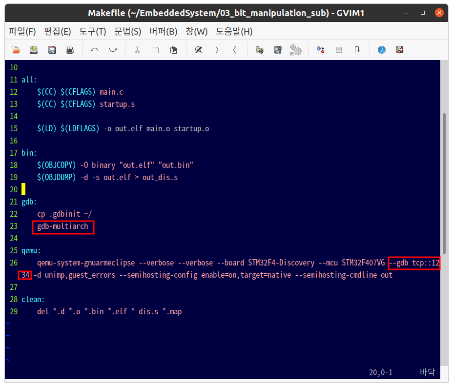

# WEEK5

### gdb를 이용하여 step instruction 추적을 통해 실행과정 분석


## GDB

### 1. gdb란?

gdb라고 부르는 **GNU Debuggeer**는 GNU 소프트웨어 시스템을 위한 기본 디버거이다. GDB는 다양한 유닉스 기반의 시스템에서 동작하는 이식성있는 디버거로, 에이다, C, C++, 포트란 등의 여러 프로그래밍 언어를 지원한다.

GDB는 임베디드 시스템을 디버깅할 때 사용되는 '원격' 모드를 지원하는데, 우리가 사용할 디버깅 방식은 **원격 디버깅 방식**이다. **원격 디버깅 방식은** GDB가 한 머신 상에서 동작하고, 디버그할 프로그램은 다른 머신 상에서 동작하는 것을 말한다. GDB는 GDB 프로토콜을 알고 있는 원격자의 'stub'과 직렬 포트 혹은 TCP/IP를 통해 통신 할 수 있다. 


### 2. gdb 명령어 

**01. 정보보기**

|         명령어         |                            Action                            |
| :--------------------: | :----------------------------------------------------------: |
|     info [명령어]      | 명령어에 대한 정보를 보여준다.<br />ex) info functions -> 현재 실행 파일의 함수들을 보여준다.<br />ex) info break -> 현재 설치된 브레이크 포인트를 보여준다. |
|       p [변수명]       |                   해당 변수의 value를 출력                   |
|    p $[레지스터명]     |                 레지스터에 들어있는 값 출력                  |
| p /[출력형식] [변수명] |                 출력형식에 맞게 변수값 출력                  |
|        출력형식        | t : 2진수<br />o: 8진수<br />d : 부호없는 10진수<br />u: 부호없는 10진수<br />x: 16진수<br />c: 최초 1바이트 값을 문자형으로 출력<br />f: 부동소수점<br />a: 가장 가까운 심볼의 오프셋 출력 |

**02. 소스보기** (l or list)

|         명령어         |                            Action                            |
| :--------------------: | :----------------------------------------------------------: |
|          list          |            main 함수를 기준으로 소스를 출력한다.             |
|      list [정수]       | 정수행을 기준으로 출력한다. ex) list 10 -> 10행을 기준으로 출력 |
|      list 함수명       |                  함수명의 소스를 출력한다.                   |
|         list -         |                 현재 출력된 행의 이전행 출력                 |
| list 파일명.c : 함수명 |               파일명의 함수명 부분을 출력한다.               |

**03. 브레이크 포인트**

|            명령어            |                            Action                            |
| :--------------------------: | :----------------------------------------------------------: |
|         break 함수명         |                함수명에 브레이크 포인트 설치                 |
|         break [정수]         |                정수행에 브레이크 포인트 설치                 |
|    break 파일명.c: 함수명    |         파일명의 함수명 부분에 브레이크 포인트 설치          |
|     break + or - [정수]      |  현재행에서 정수만큼 + 혹은 - 한 곳에 브레이크 포인트 설치   |
|        break *주소값         |                주소값에 브레이크 포인트 설치                 |
|   break [정수] if var == 0   | 정수행에 브레이크 포인트를 설치하는데 var 값이 0일 때 작동한다 |
|              tb              |         break 와 동일, 하지만 1회용 브레이크 포인트          |
| info break -> d [break 번호] |                     브레이크 포인트 해제                     |

**04. 진행 명령어**

|   명령어    |                            Action                            |
| :---------: | :----------------------------------------------------------: |
|   r(run)    |                        프로그램 실행                         |
|   k(kill)   |                        프로그램 종료                         |
|   s(step)   |  하나의 행 수행 후 정지, 함수 호출 시 함수 안으로 들어간다.  |
|  s [정수]   |                       s를 정수번 수행                        |
|     si      | 어셈블리 명령어 단위 수행, s와 동일하게 하나 행 수행 후 정지하지만 어셈블리 명령어 단위에서 한다. |
|      n      | 하나의 행 수행 후 정지, 함수 호출 시 무시하고 다음 행으로 넘어간다. |
|  n [정수]   |                       n을 정수번 수행                        |
|     ni      | 위와 마찬가지, n과 동일하게 하나 행 수행 후 정지하지만 어셈블리 명령어 단위에서 수행 |
| c(continue) |    다음 브레이크 포인트까지 진행한다.(없을경우 r과 동일)     |
|      u      |                      현재 루프 빠져나감                      |
|   finish    |                 현재 함수 수행 후 빠져 나감                  |
|   return    |               현재 함수 수행하지않고 빠져나감                |
| return 123  |              return과 동일, 하지만 리턴 값 지정              |

**05. 스택 상태 검사**

|        명령어        |              Action               |
| :------------------: | :-------------------------------: |
| info f [프레임 번호] |       스택 프레임 내용 출력       |
|      info args       |      함수 호출시 인자를 출력      |
|     info locals      |       함수의 지역변수 출력        |
|      info catch      |       함수 예외 핸들러 출력       |
|          bt          |       전체 스택 프레임 출력       |
|   frame [스택번호]   |   스택번호 스택 프레임으로 이동   |
|          up          |     상위 스택프레임으로 이동      |
|      up [숫자]       | 숫자만큼 상위 스택프레임으로 이동 |
|         down         |     하위 스택프레임으로 이동      |
|     down [숫자]      | 숫자만큼 하위 스택프레임으로 이동 |

**06. 메모리 상태 검사**

\- x/[범위] [출력형식] [범위의단위]	[메모리주소나 함수명]

 - 범위 : 기본 4바이트
 - 출력 형식
   - t : 2진수
   - o : 8진수
   - d : 부호없는 10진수
   - u : 부호없는 10진수
   - x : 16진수
   - c : 최초 1바이트 문자형 출력
   - f : 부동소수점
   - a : 가장 가까운 심볼 오프셋 출력
   - s : 문자열 출력
   - i : 어셈블리 형식 출력범위의 단위
 - 범위의 단위
    - b : 1 byte 단위
    - h : 2 byte 단위
    - w : 4 byte 단위
    - g : 8 byte 단위
 - Example
    - x/10i main :  main 함수로부터 40byte를 어셈블리로 출력
    - x/10 main : main 함수로부터 40byte를 출력
    - x/10b 0x8048200: 주소로부터 10byte를 출력

**07. 기타**

|         명령어          |                       Action                       |
| :---------------------: | :------------------------------------------------: |
|    directory [경로]     |  소스 파일을 탐색하기 위해 경로에 directory 추가   |
|    objectdir [경로]     |                 오브젝트 경로 등록                 |
|     disas [함수명]      |          특정함수의 어셈블리 코드를 출력           |
|   disas [주소] [주소]   |          주소사이의 어셈블리 코드를 출력           |
|   call [함수명(인자)]   |            특정 함수를 인자값으로 호출             |
|      jump *[주소]       |               주소로 강제적으로 분기               |
|      jump [행번호]      |               특정 행으로 강제 분기                |
|      jump [함수명]      |               특정 함수로 강제 분기                |
|      info signals       |                  signal 종류 출력                  |
|    signal [시그널명]    | 디버깅중인 프로세스에 시그널 전달 (signal SIGKILL) |
| set {타입}(주소) = [값] | 특정 메모리에 값을 지정 (set {int}0x8048300 = 100) |
|        info 탭키        |          info 로 확인 가능한 명령어 출력           |
|        info set         |               설정 가능한 내용 출력                |


## ARM Assembly 


우리는 원격 디버깅을 2개의 커멘드 창을 통해 할 예정이다. gdb는 대부분의 Linux 시스템에 사용되는 텍스트 기반의 디버거이다. 리모트 디버깅을 하려면 타켓에는 gdbserver를 실행하고 호스트에는 Cross Debugger gdb를 실행해야 한다. 

그래서 qemu를 target 서버로 만들었고, 다른 1개의 커멘드 창을 gdb-multiarch로 만들어서 확인하였다. 


**기본 절차**

1. 2개의 커멘드 창을 연다.

2. 1개의 커멘드 창에는 make gdb(host), 1개의 커멘드 창에는 make qemu(target)를 통해 가상 STM32F4 보드를 연다.

3. gdb 창에서 밑에 코드와 같이 입력한다.

   ```gdb
   >>>target remote :1234 or target remote 127.0.0.1:1234
   
   >>>file out.elf
   
   >>>load
   
   >>>b main
   
   >>>c
   
   >>>n or si			<- n은 code 한 줄 debug, si(step)
   ```

   

#### 2. Subtraction

**main.c**

```c
//#define P0HW_ADDR 0x40000000
//#define POHW (*(unsigned char*)POHW_ADDR) 

int main(){
    char P0;    //char 선언
    char P1;
    char P2;
   
    // clear
    P0 = 0x95;
    P1 = 0x90;

    P2 = P0 - P1
    
    //POHW_ADDR = 0x4F;
    
	while(1);
}
```

 


movs r3, #149 레지스터에 올려주고

strb r3, [r7, #7] 현재 스택포인터와 같다.  r3의 값을 r7레지스터 주소값의 7번지 밑에 내려가서 넣어줘라. 그러면 [,]

현재 c코드 한줄 -> Instruction 2개 

n를 누르면 그래서 Instruction 2개로 넘어가버리니

si를 누르면 Instruction 1개 넘어간다. (step instruction)


db memory watch 0x ffff ffff 0

7번지에 95가 들어갔는걸 확인 할 수 있다. 

코드가 끝났을 때 메모리 7번지에 잇던 0x95 -> 0x85로 바뀐거 알 수 있다. 