# 외장 SSD를 활용한 Ubuntu Dual-Booting

## 1. 준비물

제 노트북의 스펙입니다.

```
CPU : 10세대 인텔® 코어™ i7-10510U 프로세서(코멧레이크)
디스플레이 : 17인치 WQXGA(2560 * 1600)
그래픽 : NVIDIA® GeForce® GTX 1650
메모리 :  DDR4 2666 MHz (8GB x 1)+ 확장 슬롯 1
저장장치(HDD,SSD) : 512 GB (M.2, NVMe™)+ 확장 슬롯 1
OS : Windows 10 Home (64비트)
```

	1. 외장 SSD
	2. 부팅 USB(16기가면 충분하다).
	3. 노트북 또는 컴퓨터
	4. Ubuntu ISO File
	5. Rufus.exe (가장 대표적인 Booting USB)


## 2. 과정

### **2-1. USB에 Ubuntu 20.04 LTS 설치하기**

1.  https://ubuntu.com/download/desktop 접속하여 ISO File 다운로드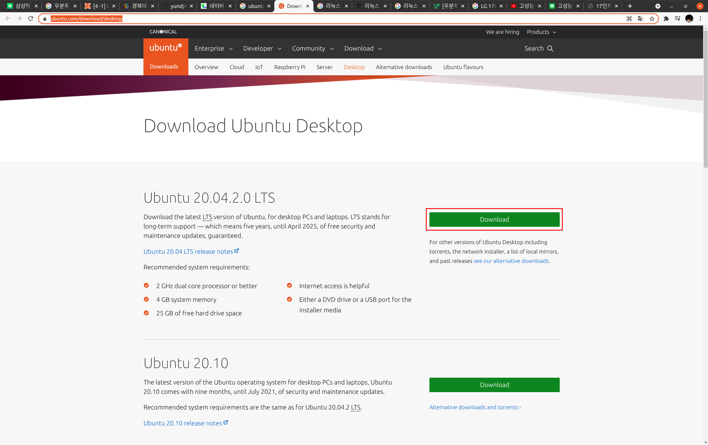

   

2.  https://rufus.ie/ko/ 접속하여 USB Booting Driver 만들기
   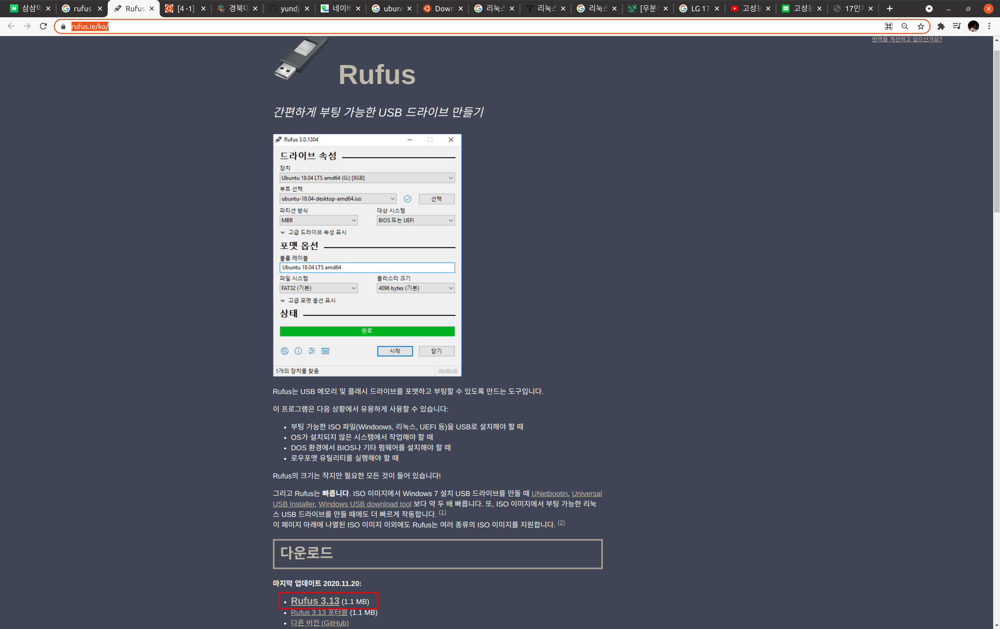

3. GPT 파티션 형식을 선택했다면 파일 시스템은 FAT32를 선택해야 한다. 밑에 그림과 세팅하여 시작 버튼을 누르면 된다. 
   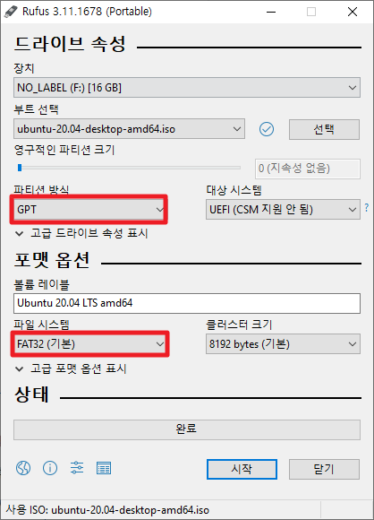


4. OK 버튼을 누르면 된다. 
   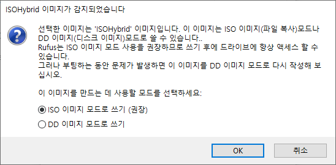


### 2-2. USB Booting Driver Setting 완료 후 외장 SSD 세팅

1. 설치가 완료되면 완료 버튼을 누르고 컴퓨터에 장착된 메인 보드의 지정된 단축키(보통 F2 or Del)를 눌러서 바이오스 모드로 들어간다. 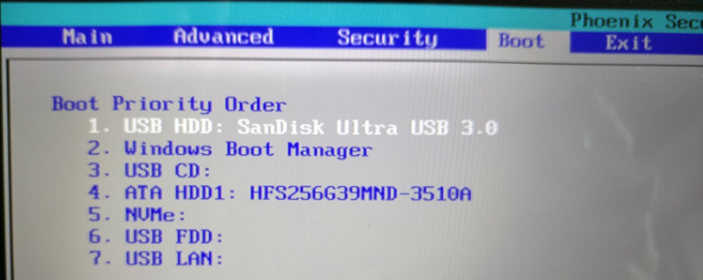
   
2. 재부팅하여 GRUB 창이 뜨는데 Ubuntu 클릭해주면 된다. 
   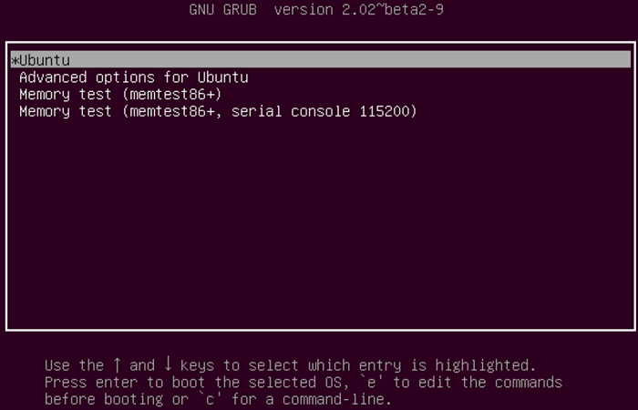

3. 그럼 Ubuntu창이 뜨는데 `sudo gparted`를 통해 파티션 나눌 준비를 한다. 
   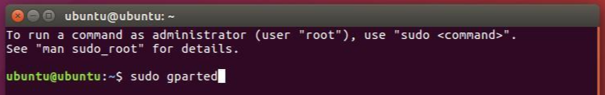


4. `sudo gparted` 를 입력하게 된다면 아래와 같은 화면이 나오고 빨간 네모 박스 위에 있는 /dev/sda에서 자신이 설치할 SSD를 선택해줘야 한다. 현재 sdb가 외장 ssd이기 때문에 sdb를 선택해준다.
   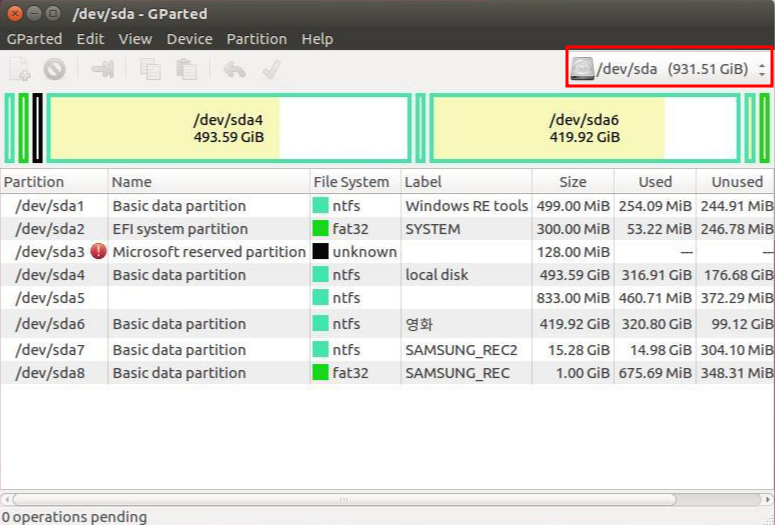

5. 현재 SSD가 순정 상태라 따로 포맷해야 하는 부분이 없는데, 사용자에 따라 SSD가 포맷이 안되어 있을 수 있다. 포맷이 안되어 있는 사용자는 마우스 우클릭 -> Delete하는 것을 매우 추천한다.

   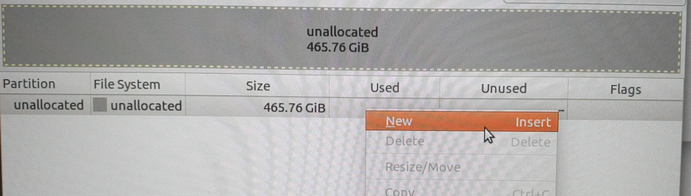

   **첫번째 파티션 : **Ubuntu를 설치할 영역이며, 최소 8192MB(8GB)를 권장합니다. File System: ext4
   **두번째 파티션 : **OS운용을 위한 부가영역인 swap 영역이며, 약 2048MB(2GB)정도면 충분하다. File 						 System은 line-swap
   **나머지 용량들 : **자동으로 저장소가 만들어 지기 때문에 1,2번째 파티션만 설정하면 된다. 

6. 설정 후 "Apply All Operations"를 클릭하면 된다. 
   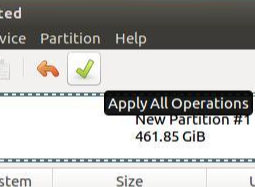


7. 바탕화면의 Install Ubuntu 20.04 LTS를 더블 클릭 후 밑의 화면처럼 나오기 전까지는 계속을 눌러준다. 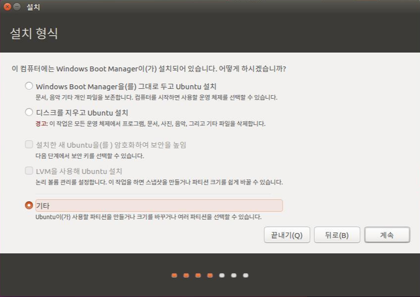

   이 부분이 **매우 매우 매우 매우 중요**하다. 만약 기타가 아닌 다른 것을 체크하면 기존에 있던 windows가 다 날아가버리니 기타를 클릭해야 한다.

   

8. 세팅할 ssd를 찾아서 더블 클릭해준다. 
   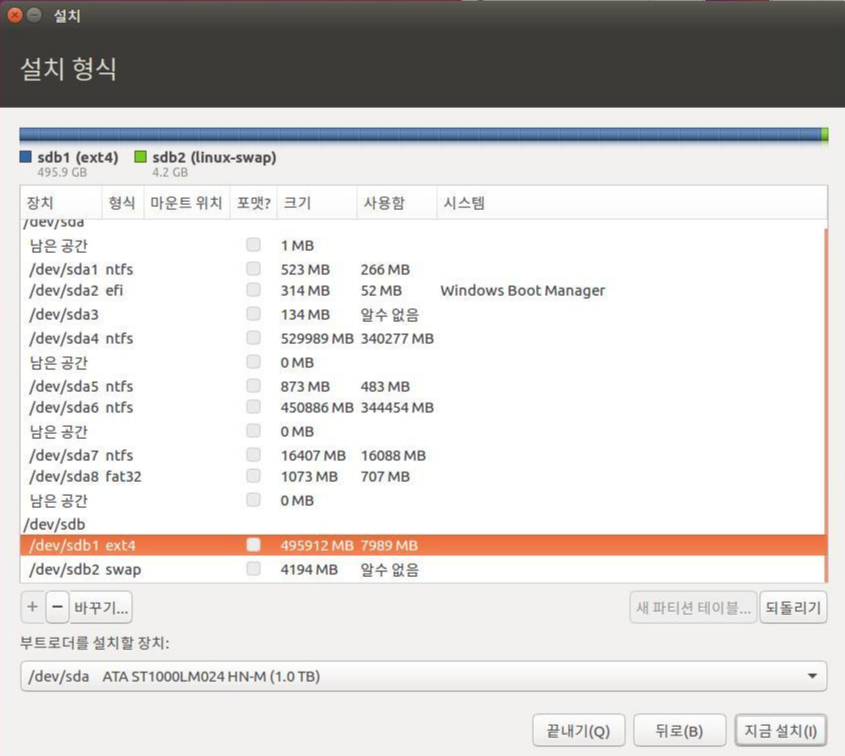

   

9. 더블 클릭하면 이러한 창이 나오는데, 크기는 아까 설정한 그대로 내두고 그림과 같이 설정하면 된다.

   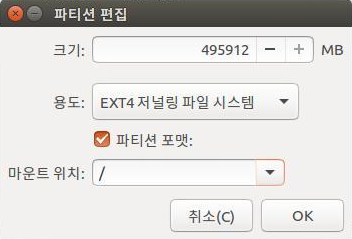

   

10. 여기도 중요하다! 부트로더 설치할 장치가 default 값으로 기본 HDD 혹은 SDD 로 설정되어있는데  **꼭 설치할 SSD 로 설정**해야 한다. 
    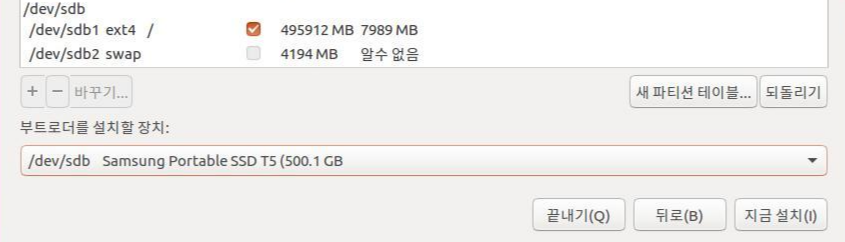

11. 그 이후로는 지역은 Seoul, 키보드 배치는 한국어를 선택 후 101/104호환을 선택하고 계속을 눌러준다. 그리고 사용자 이름과 암호는 **간단하게 하는게** 편하다. 터미널 상에서 암호를 입력할 상황이 빈번하기 때문이다. 
    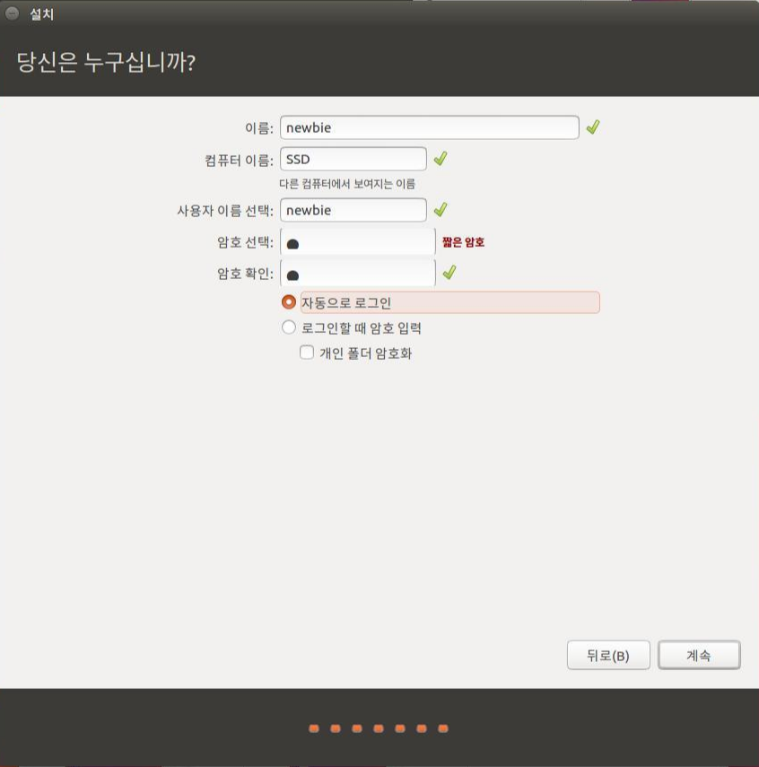

    ### 그럼 끁!!!!!!!!!


### 2-3. NVIDIA 그래픽 드라이버 설치

필자의 컴퓨터 스펙을 보게 된다면 GTX-1650이 있는 걸 볼 수 있다. 필자는 그래픽 드라이버를 설치하지 않아도 처음 리눅스를 부팅할 때는 문제가 없다고 판단을 하였지만, 그 후 재부팅을 하니 로그인 화면까지는 진입이 되었지만 로그인을 하면 바로 블랙 스크린이 무한 로딩 되는 것을 확인하였다. 그래픽 드라이버를 설치를 하지 않아서란걸 알게 되었다.

#### 1. 그래픽 카드 정보 및 드라이버 확인하기

```
그래픽 카드 및  설치가능한 드라이버 확인
$ubuntu-drivers devices
```

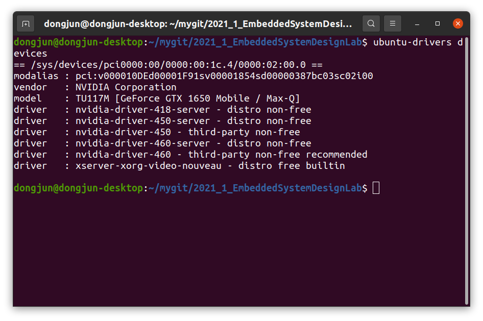

해당 그래픽카드 모델에서 설치 가능한 안정적인 드라이버들을 보여 준다. (필자는 recommended 다운)


#### **2. 드라이버 설치**

드라이버 설치 방법은 2가지이다. 

1. **권장드라이브 자동으로 설치**

   ```
   sudo ubuntu-drivers autoinstall
   ```

2. **원하는 버전 수동으로 설치**

   ```
   sudo apt-get install nvidia-driver-460
   ```

3. **설치 후 reboot**

   ```
   sudo reboot
   ```

   

#### 3. **PPA저장소를 사용하여 자동 설치**

PPA저장소를 사용하면 최신 버전의 베타 그래픽 드라이버를 설치할 수 있다. 아래 명령으로 Graphics-Drivers/PPA 저장소를 시스템에 추가 해 준다. 

```
sudo add-apt-repository ppa:graphics-drivers/ppa

sudo apt update
```

이후의 설치 과정은 위와 동일하다.


**출처**

1. https://developer-thislee.tistory.com/14?category=818795
2. https://pstudio411.tistory.com/entry/Ubuntu-2004-Nvidia%EB%93%9C%EB%9D%BC%EC%9D%B4%EB%B2%84-%EC%84%A4%EC%B9%98%ED%95%98%EA%B8%B0