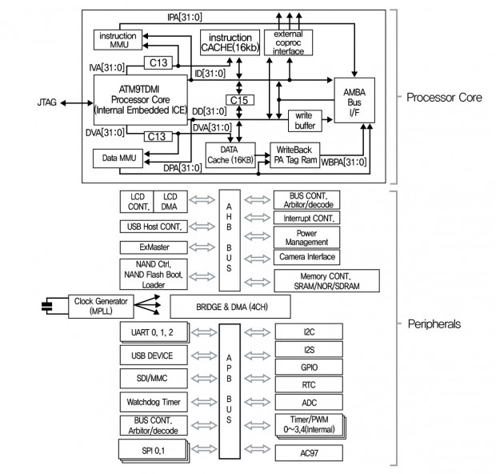

# 1. 임베디드 시스템 소개

### 1.1 Embedded System이란

**임베디드 시스템의 의미**

- 장치에 내장된 Process에 의해 특정한 목적의 기능을 수행하는 하드웨어와 소프트웨어가 조합된 정량화된 시스템.
- 임베디드 시스템은 특정 목적을 지닌 시스템이다. 반대로 PC는 특정 목적이 아닌 범용 목적을 갖는 시스템이다.
- PC는 프로그램 뿐만 아니라 그래픽 작업, 게임 등 범용의 기능을 제공하지만, 임베디드 시스템인 핸드폰은 통신 기능에 특화하여 개발되었고, 게임기도 게임기능에 특화하여 개발된 시스템이다.

**임베디드 시스템의 특징**

1. 기능이 제한적이다. 

   - 특정 기능에 특화된 시스템으로서 지정된 기능 외의 기능은 제공하지 않는다. 

2. 크기에 제약이 있다. 

   - 모바일 제품이 많기 때문에 크기가 작고 가벼워야 한다.

3. 저전력이여야 한다.

   - 배터리 용량의 한계로 전력 사용이 제한적이다.

4. 사용되는 프로세스나 운영체제가 다양하다.

   - 임베디드용으로 사용한다. PC 프로세서와 운영체제는 사용이 불가하다.

5. 실시간성을 제공해야 한다.

   - 의료기기, 공장 자동화 시스템, 군용에서는 한정된 시간 필수

6. 하드디스크(HDD)가 없다.

   - HDD대신 ROM, RAM, Flash 메모리로 구성되어 있다. 

   

### 1.2 Embedded System 구성

컴퓨터는 하드웨어 + 소프트웨어 + 펌웨어로 시스템이 구성된다. 

필자는 소프트웨어가 하드웨어의 반대말이라고 생각하였지만 그게 아니라 하드웨어, 소프트웨어 둘 다 컴퓨터 시스템을 구성하는 요소이기 때문에 상호 보완적 기능을 한다고 생각하면 된다. 반대말이 아니다. 

임베디드 시스템은 크게 **Hardware**와 **Software**로 나뉜다. 

1. **Hardware**

   - **Processor**

     - 정의 :  프로그램의 명령어를 처리하기 위한 장치를 말한다. 종류로는 MCU, MPU, CPU가 있다. 

     - **CPU(Central Processing Unit)**

       - 중앙 처리 장치(ALU + Register)는 컴퓨터 시스템을 통제하고 프로그램의 연산을 실행하고 처리하는 가장 핵심적인 컴퓨터의 제어 장치, 혹은 그 기능을 내장한 칩을 말한다. 
       - 제어장치, 연산장치, 레지스터 세부분으로 구성되어 있고, 주기억 장치를 비롯한 다른 장치들과 시스템 버스로 연결되어 있다. 
       - 제어장치(Control Unit) : 명령어를 해석하여 레지스터나 연산장치를 제어한다.
       - 연산장치(ALU) : 산술연산을 담당하며 제어장치의 제어를 받는다.
       - 레지스터(Register) : 소량의 데이터를 임시저장하는 공간이다. 
       - 밑에서 좀 더 자세하게 알아 볼 것이다. 

     - **MPU(Micro Processing Unit)**

       - CPU를 하나의 단일 IC(Integrated Circuit) 칩에 집적시켜 만든 반도체 소자를 MPU라고 한다. 산술 위주의 CPU라고 생각하면 된다. 
       - CPU의 여러 형태 중 소자가 하나인 종류가 MPU이며, 모든 MPU는 CPU이지만 모든 CPU가 MPU는 아니다. 
       - MPU는 MCU와 달리 ROM, RAM과 같은 저장장치, 입출력 포트 같은 출력장치 등의 주변 장치가 있어야 사용할 수 있다. 
       - MPU는 결국 저장장치, 출력장치와 함계 사용해야하는 연산 목적의 CPU

     - **MCU(Micro Controller Unit)**

       - MCU는 CPU 기능은 물론이고 일정한 용량의 메모리, 입출력 제어 인터페이스, 주변 장치 컨트롤러 회로까지 칩 하나에 내장한 반도체이다.
       - MCU는 PC의 메인보드 전체를 칩 하나에 집적시켜 놓은 것이라고 볼 수 있다. 그래서 기능이 많은 MCU의 경우, 칩에 전원을 연결하고 입출력 장치를 연결하기만 하면 그것 자체로 일종의 작은 컴퓨터가 되기도 한다. 
         
       - MCU는 결국 저장장치와 출력장치가 내장된 단독 사용이 가능한 CPU

     - **DSP(Digital Signal Processing)**

       - DSP는 아날로그 신호를 A/D(아날로그/디지털)변환하여 얻어진 디지털 데이터에 대수적인 연산을 해 필터링이나 스펙트럼분석 등의 신호처리를 하는 것을 말한다. 기본적으로 아날로그 신호의 실시간 디지털 처리를 목적으로 한다. 
       - DSP는 디지털 신호를 수학적으로 빨리 계산할 수 있는 수학 연산 전문 반도체로 마이크로프로세서도 이러한 기능을 수행하지만 수학 연산만 전문으로 하는 DSP에 비해 속도가 느리다. 

       

   - **Memory 장치** 

     - ROM(NOR), RAM(DRAM, SRAM), Storage(NAND, SSD)
     - Temporary Memory(Volatile) : DRAM, SRAM
     - Permanent Memory(Nonvolatile) : ROM, NAND, Flash, EEPROM, SSD, HDD, CDROM

   - **I/O 장치** 

     - Network, LCD, GPIO

   

2. **Software**

   - **System Software:** Firmware(OS 개념이 없음), Device Driver(OS 관점)
   - **OS :** RTOS, Embedded OS
     - **RTOS(Real-Time OS)**
       - 주어진 임의의 작업에 대한 정해진 시간 내에 수행할 수 있도록 하는 환경을 제공
       - 개발시에 주로 운영체제와 Task들이 같이 빌드 된다. 
       - 예) 무인자동차를 운행하는 시스템에서 전방에 장애물이 나타났을 경우 반드시 부딪히기전에 멈춰서거나 피해가야 될 것이다. 어떤 상황(부딪히는 상황)에 대해서 정해진 시간(부딪히기 전)까지 반드시 응답을 주어야 하는 시스템에서 RTOS가 필요하게 된다.
     - **Embedded OS**
       - 여러 복잡한 작업들을 동시에 효율적으로 수행하기 위한 환경 제공
       - 이미 동작 중에 있는 운영체제 상에서 새로운 프로세스를 이식 할 수 있다.
       - Windows CE , Linux, Android, iOS
   - **Middleware :** Network Stack Protocol, File System
   - **Applications**

### 2.1 CPU 내부 동작

### 

1. #### **CPU (Central Processing Unit)**

   - CPU는 중앙 처리 장치로 컴퓨터의 핵심, 사람으로 치면 컴퓨터의 뇌에 해당된다. 

   - CPU의 구성은 ALU, Control Unit, Register, Bus Interface로 이루어 진다.
   - CPU안에 주변장치 (Peripherals), Memory 등을 모두 담고 있는 시스템을 SOC(System-On-Chip)라고 한다.  

   1. **ALU((Arithmetic Logic Unit)**

      - ALU는 CPU 구성 요소 중에서 연산을 담당한다. 

      - 연산 모듈(산술 연산 수행) : ADD, SUB 등 사칙 연산 수행
      - 논리 모듈(논리 연산 수행) : AND, OR, XOR, Shift와 같은 논리 연산 수행
      - Program Status Register Update  : Negative, Zero, Carry, Overflow, Saturation

   2. **Control Unit**

      - Control Unit은 CPU를 제어한다. 컨트롤 유닛은 명령어를 해석하고 레지스터와 ALU 사이의 명령 흐름을 제어한다. ALU는 연산만 담당하는 영역일 뿐, ALU로 들어오는 명령어를 해석하지 못한다. 이 때, 컨트롤 유닛이 이 명령어를 해석하고 연산을 수행할 수 있게끔 ALU에 명령을 내린다. 결과에 따라 다른 영역으로 순차적으로 제어 신호를 내보낸다. 

      - 메모리에서 명령(Instruction)을 인출 한다.
      - 인출된 명령을 분석하여 어떤 명령인지 어떤 레지스터들이 사용되는지를 확인한다.
      - 명령어 실행에 필요한 제어 신호를 만들어 내고 실행한다. 

   3. **Register Set**

      - 레지스터(Register Set)는 임시로 데이터를 기억하는 장치이다. 연산 후에 나오는 임시 데이터를 저장하거나, CPU의 상태, 다음 명령의 메모리 번지수등이 이 레지스터에 기억된다. 레지스터는 하나가 아니며, 상당히 다양하다고 할 수 있다. 이 레지스터는 CPU의 내부 메모리이기에 다른 기억 장치와는 다르게 엑세스 속도가 상당히 빠르디. 예를 들어, ALU가 연산을 수행하고 있고 컨트롤 유닛이 명령을 해석하고 있다면 추가로 들어온 명령을 해석하거나 연산하지 못하므로 레지스터에 임시로 데이터 혹은 다음 명령의 번지값 등이 저장되는 것입니다.
      - 프로세서 코어에 위치하고 있고 프로세서가 접근 가능한 가장 빠른 임시 기억 장치로 ARM 프로세서는 3가지 종류의 레지스터가 있다.
      - General Purpose Register : 프로그램 데이터 처리에 사용된다.
      - Control Register : Stack Pointer, Link Register, Program Counter
        - Stack Pointer : 현재 프로세스 모드의 Stack의 Top 주소를 가르키고 있다.
        - Link Register : 서브루틴 분기시 서르부틴을 끝마치고 복귀 할 주소를 가지고 있다.
        - Program Count : 현재 실행 중인 주소 값이다.
        - Program Status Register : Processor 의 상태정보와 ALU의 결과 정보를 저장하고 있다.
          참고로 일반 레지스터 외에 특별한 레지스터가 있는데 주로 Processor 주위에 있는 주변 장치들을 제어하기 위해서 SFR (Special Function Register) 가 있다. 주로 Memory-Mapped 방식으로 접근이 되고 대부분 bit 단위로 제어가 된다.(AND, OR, EOR … ) 그리고 Memory-Mapped 되어 있다는 말은 SFR은 각 레지스터에 해당하는 주소가 정해져 있어 주소를 통해서 접근이 가능 하다는 이야기이다. S/W 엔지니어가 ARM 펌웨어 프로그램을 한다고 하면 대부분의 작업이 바로 SFR 레지스터를 세팅하고 제어하는 일이다.

   4. **Bus Interface**

      - 버스 인터페이스는 외부의 입출력 버스(I/O Bus)와 연결된다. 즉, CPU의 외부와 연결되어 있으며 외부에서 들어오는 데이터를 받거나, 데이터를 보내는 역할을 담당한다. 즉 명령어를 내보내거나 입출력 버스를 통해 데이터를 받을 수 있다는 말이다. 한마디로 버스 인터페이스는 '외부와 데이터를 주고 받는 통로이다!'라고 기억하면 된다.

      - CPU가 Bus 구조로 이루어져 있는가? 
        직행버스가 아닌 공유하는 버스를 사용하고 있다. 

        - Time Multiplexing한다. 대신 버스 라인 1개만 사용하기 때문에 하드웨어적으로 효율적이다. 
        - 만약 버스로 연결을 안하면 배선이 너무 많아진다. 속도가 빨라지긴 하지만 

        

2. #### **입출력 버스(Input/Output Bus)**

   - 이 입출력 버스는 다른 구성요소의 사이에서 데이터를 교환하기 위해 거치는 통로라고 말할 수 있다.
     위 그림을 보면, CPU와 메모리, 그리고 I/O 장치(키보드, 마우스 등)와 연결되어 있는데 이 구성요소 사이의 데이터를 입출력이 가능한 이유가 이 입출력 버스가 존재하기 때문이다. 전송되는 데이터에 따라 Address Bus, Data Bus, Control Bus로 분류할 수 있다. 
     - Address Bus : CPU가 메모리 혹은 I/O 장치의 번지를 지정할 때 쓰인다. 
     - Data Bus : 현재 CPU의 상태나, 상태 변경을 메모리 혹은 I/O 장치 사이에서 데이터를 전송할 때 쓰인다.
     - Control Bus : 현재 CPU의 상태나, 상태 변경을 메모리 혹은 I/O 장치에 알리는 제어 신호를 전송할 때 쓴다.
     - Data, Control Bus는 양뱡향, Address Bus는 단방향

   - Memory  : Bus Slave
   - Bus는 Address, Control, Data 버스가 있다.
     
     - Address Bus : 데이터의 근원지나 목적지의 일정한 메모리 주소를 전달하는 버스이다. 주소 버스의 width가 메모리 수용능력, 크기를 결정한다. 32개의 주소 버스를 지닌 컴퓨터 시스템은 2^32개의 메모리 위치를 할당할 수 있다. 또한 I/O포트를 지정하기 위해서도 사용되어진다. 
     - Control Bus : 데이터 버스와 주소 버스를 제어하기 위해 사용되어 진다.
     - Data Bus : 시스템 모듈들 간의 데이터 이동 경로를 제공한다. 주로 32, 64, 128 또는 그 이상의 분리된 선들로 구성되어 있으며 선의 수는 한 번에 전송할 수 있는 비트수를 결정지어 주는데 이것은 CPU가 수용할 수 있는 데이터 크기(Word)와 밀접한 연관이 있다. 

내가 짠 코드는 메모리 0x00000000부터 들어가고 프로그램을 실행하기 위해 RAM에 Flash Memory 또는 ROM에 있던 코드를 올린다. 

Vector table of ARM Cortex-M4

1. - **Processor Core**(?????)

- 몌모리 장치로부터 프로그램의 구성 요소인 fetch, decoding, execution하는 동작을 한다. 
- 레지스터(Register), 연산장치(ALU), 제어장치(Control Unit), 버스(Bus), Cache memory(Optional), MMU(Optional) 등으로 구성된다.
- Processor Core의 종류에는 ARM, MIPS, Intel의 Sandy Bridge 등도 Processor Core의 한 종류이다.

